# 基于 YOLO 的智能家居视觉感知与历史物品检索系统

## 摘要

随着智能摄像头、物联网终端与家庭宽带环境的普及，家庭视频数据正在从“被动记录”逐步转向“主动理解”。传统家居监控系统通常只能提供实时预览和录像回放，缺乏对画面中物品类别、位置和出现时间的结构化表达，难以支撑“物品最后出现在哪里”等面向日常生活的检索需求。针对这一问题，本文设计并实现了一套基于 YOLO 的智能家居视觉感知与历史物品检索系统。系统以 YOLO11 目标检测模型为核心，构建面向家居场景的 SmartHome-COCO 数据集，选取 COCO 2017 中 20 类常见室内物体进行迁移训练；后端采用 FastAPI、OpenCV、Ultralytics 与 SQLAlchemy 构建推理服务和数据持久化模块；前端采用 Vue 3、Element Plus 与 ECharts 构建实时监控、历史检索、统计分析和初始化配置界面。

在视频接入方面，系统同时支持服务端网络流拉取和浏览器客户端推流两种模式。服务端拉流模式通过 YOLO `track` 接口与 ByteTrack 跟踪器维护目标 ID，结合连续帧确认、数据库写入节流和快照间隔控制降低遮挡、光照变化和重复写库带来的影响；客户端推流模式利用浏览器 `getUserMedia` 采集本地摄像头或本地视频帧，并通过 WebSocket 将 JPEG 帧发送至云端服务完成无状态单帧推理。实验结果表明，当前部署使用的 YOLO11s 权重在训练日志最后一轮达到 Precision 0.67572、Recall 0.61442、mAP@0.5 0.65508、mAP@0.5:0.95 0.48428，能够满足毕业设计阶段对实时物品检测、历史位置记录和可视化检索的功能验证需求。本文的主要工作在于将轻量级目标检测、多目标跟踪、浏览器推流、关系型数据库检索与前后端可视化系统集成为一个可部署的智能家居视觉记忆平台，为家庭物品数字化管理提供了一种工程实现方案。

**关键词：** 智能家居；目标检测；YOLO11；ByteTrack；WebSocket；历史物品检索

## Abstract

With the widespread adoption of smart cameras, Internet of Things devices, and home broadband networks, household video data is evolving from passive recording toward active semantic understanding. Conventional home surveillance systems mainly provide live preview and video playback, but they rarely transform object categories, spatial positions, and timestamps into structured data. As a result, they cannot effectively answer practical questions such as “where was this object last seen?”. To address this problem, this thesis designs and implements a YOLO-based smart home visual perception and historical object retrieval system. The system uses YOLO11 as the core object detection model and constructs a SmartHome-COCO dataset by extracting 20 common indoor object categories from COCO 2017. The backend is built with FastAPI, OpenCV, Ultralytics, and SQLAlchemy for model inference, video processing, and data persistence, while the frontend is implemented with Vue 3, Element Plus, and ECharts for real-time monitoring, object retrieval, statistical visualization, and system setup.

For video access, the system supports both server-side stream pulling and browser-side stream pushing. In server-side pulling mode, the YOLO `track` interface and ByteTrack are used to maintain object identities across frames, while persistence rules such as consecutive-frame confirmation, database write throttling, and snapshot intervals are introduced to reduce the impact of occlusion, lighting changes, and duplicate writes. In browser-side pushing mode, `getUserMedia` captures local camera or local video frames, and WebSocket transmits JPEG frames to the cloud backend for stateless single-frame inference. According to the training log, the deployed YOLO11s model reaches a precision of 0.67572, recall of 0.61442, mAP@0.5 of 0.65508, and mAP@0.5:0.95 of 0.48428 in the final recorded epoch. These results indicate that the system can support real-time object detection, historical location recording, and visual retrieval in the scope of this graduation project. The main contribution of this work is the integration of lightweight object detection, multi-object tracking, browser-based streaming, relational database retrieval, and full-stack visualization into a deployable smart home visual memory platform.

**Keywords:** smart home; object detection; YOLO11; ByteTrack; WebSocket; historical object retrieval

## 1 绪论

### 1.1 研究背景与意义

智能家居系统的发展经历了从单点设备控制到多设备联动、再到智能感知的演进过程。摄像头作为家庭环境中信息密度较高的传感器，能够同时捕获空间布局、人员活动和物品状态。然而，普通监控系统大多只保存连续视频或短片段事件，用户在查找某个物品时仍需要手动回放大量视频，效率较低。若能够将视频中的物品类别、出现时间、空间位置和截帧快照转化为结构化数据，监控系统即可从“录像工具”升级为“视觉记忆工具”。

目标检测技术为上述能力提供了算法基础。Faster R-CNN 通过区域建议网络提升了两阶段检测器的效率，但其完整流程仍更适合精度优先的离线检测场景。YOLO 将目标检测表述为单阶段回归问题，使模型能够在一次前向传播中直接输出边界框与类别概率，显著提升了实时性。近年来 Ultralytics YOLOv8 与 YOLO11 进一步在模型结构、任务接口和部署工具链上完成工程化整合，使中小规模项目能够以较低成本完成训练、验证、推理与跟踪部署<sup>[1-2]</sup>。

本课题面向家庭物品“看见、记住、可检索”的应用需求，设计并实现基于 YOLO 的智能家居视觉感知与历史物品检索系统。该系统既关注检测模型本身的有效性，也关注模型与视频流、数据库、Web 前端和部署环境之间的工程闭环，具有明确的实用价值和毕业设计研究意义。

### 1.2 国内外研究现状

从检测算法看，早期两阶段检测器通常具有较高精度，但推理速度难以满足连续视频流场景。YOLO 系列模型以端到端、单阶段、实时检测为主要特征，在安防监控、机器人、室内导航和智能零售中被广泛采用。YOLOv8 官方文档指出，该版本采用 anchor-free split head，并在精度与速度之间提供多尺度模型选择<sup>[1]</sup>；YOLO11 系列在 COCO 检测任务上提供 n、s、m、l、x 等不同规模，其中 YOLO11n 约 2.6M 参数，YOLO11s 约 9.4M 参数，适合在轻量部署与精度需求之间进行权衡<sup>[2]</sup>。

从室内场景看，家居环境具有光照变化、遮挡频繁、目标尺度差异大、小物体易漏检等特点。Zhao 等人在智能室内购物场景中改进 YOLOv8n，引入 C2f-ParNet、CARAFE 与 WIoUv3，以提升复杂室内环境下小中型物体和遮挡物体的检测能力<sup>[3]</sup>。Pokuciński 与 Mrozek 研究了 YOLOv5 在室内等距矩形全景图像中的检测适应性，指出室内全景图像虽然包含丰富目标信息，但畸变、高分辨率和光照不连续会增加检测难度<sup>[4]</sup>。这些研究说明，室内视觉感知不只是模型套用问题，还需要结合采集视角、图像质量与系统部署方式进行整体设计。

国内高校的相关研究也为本文系统设计提供了参考。电子科技大学郭磊等针对小目标检测问题改进 YOLOv5，强调数据增强、特征表达与小目标召回能力的提升<sup>[9]</sup>；四川大学章程军等在车辆检测任务中引入 OSA 模块、非局部注意力机制和加权非极大值抑制，验证了特征增强和框筛选策略在复杂光照与密集目标场景中的有效性<sup>[10]</sup>；吉林大学赵畅的硕士论文围绕复杂场景下 YOLOv5 人脸检测展开网络结构和参数优化研究<sup>[11]</sup>；电子科技大学王选的硕士论文则从特征融合、注意力机制和复杂环境目标检测角度分析了小尺度、聚集和图像质量退化等问题<sup>[12]</sup>。上述中文文献虽然应用场景各有差异，但其关于轻量化检测、小目标增强、注意力机制与复杂环境鲁棒性的讨论，与本文面向家居小物品和遮挡场景的技术路线具有较强关联。

从目标跟踪看，单帧检测只能回答“当前帧中有什么”，无法稳定回答“同一物品是否连续出现”。Deep SORT 在 SORT 基础上加入外观特征度量，能够缓解遮挡带来的身份切换，但也引入额外特征提取开销。ByteTrack 则通过关联高、低置信度检测框恢复被遮挡或低分目标轨迹，在 MOT17 上取得 80.3 MOTA、77.3 IDF1，并保持接近实时的处理速度<sup>[5]</sup>。Ultralytics 跟踪文档也提供了 `bytetrack.yaml` 作为内置跟踪器配置，便于与 YOLO 检测模型直接结合<sup>[6]</sup>。

从 Web 流媒体工程看，服务端直接拉取 RTSP/RTMP/HTTP 视频流适合局域网或公网可达摄像头，但在家庭网络中常受 NAT 和设备权限限制。浏览器端 `getUserMedia` 能够请求用户授权并获取摄像头 `MediaStream`，但该 API 在现代浏览器中要求安全上下文，即 HTTPS 或 localhost<sup>[7]</sup>。WebSocket 则提供浏览器与服务端之间的长连接通信能力，可发送文本或二进制数据，适合将视频帧以 JPEG 字节流方式传输到推理服务<sup>[8]</sup>。因此，服务端拉流与浏览器推流的双模式设计能够覆盖更多实际部署场景。

### 1.3 本文主要工作

本文围绕“智能家居视觉记忆”目标完成以下工作：

1. 构建 SmartHome-COCO 数据集处理流程，从 COCO 2017 中提取 20 类常见室内物品并转换为 YOLO 训练格式。
2. 基于 Ultralytics YOLO11 完成模型训练、验证与生产权重接入，并整理训练日志中的总体指标。
3. 设计 FastAPI 后端推理引擎，实现网络流拉取、YOLO 检测、ByteTrack 跟踪、快照保存、MySQL 持久化和统计汇总。
4. 设计浏览器 WebSocket 推流链路，实现本地摄像头或本地视频到云端推理服务的帧级传输。
5. 设计 Vue 3 前端大屏，实现实时检测展示、历史物品检索、中文关键词查询、统计图表、登录鉴权和系统初始化配置。
6. 使用 Docker Compose 组织前端、后端服务，并加入 JWT 鉴权、快照生命周期管理和健康检查等工程化能力。

## 2 相关技术基础

### 2.1 YOLO 目标检测算法

目标检测任务需要同时完成类别判别与边界框定位。Faster R-CNN 等两阶段方法先生成候选区域，再对候选区域分类和回归，能够取得较高精度，但流程较长。YOLO 将检测任务转化为单阶段回归问题，由单个神经网络直接从整幅图像预测边界框和类别概率，因而具有天然的实时性优势。

本文项目采用 Ultralytics YOLO11 体系。YOLO11 提供多种模型规模，能够在不同算力环境下选择部署方案<sup>[2]</sup>。项目中同时保留 YOLO11n 与 YOLO11s 两类训练权重，其中生产配置实际加载 `results-01/runs/train_smarthome_s/weights/best.pt`，即 YOLO11s 权重。相较 YOLO11n，YOLO11s 参数量和权重文件更大，但通常具有更强的特征表达能力，适合毕业设计演示阶段对检测稳定性的需求。

YOLO11 检测模型可从工程应用角度抽象为输入预处理、骨干特征提取、颈部特征融合、检测头输出和后处理五个部分。输入图像首先被缩放至统一尺寸并归一化，随后通过骨干网络提取多尺度语义特征；颈部网络融合高、低层特征以兼顾大目标语义和小目标细节；检测头输出边界框坐标、类别概率和置信度，最后经 NMS 或跟踪器关联得到最终检测结果。图 2-1 为本文采用的 YOLO11 模型抽象结构示意图，该图用于说明系统中的模型调用逻辑，并非官方逐层网络结构图。

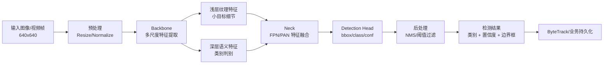
```mermaid
flowchart LR
    A[输入图像/视频帧<br/>640x640] --> B[预处理<br/>Resize/Normalize]
    B --> C[Backbone<br/>多尺度特征提取]
    C --> C1[浅层纹理特征<br/>小目标细节]
    C --> C2[深层语义特征<br/>类别判别]
    C1 --> D[Neck<br/>FPN/PAN 特征融合]
    C2 --> D
    D --> E[Detection Head<br/>bbox/class/conf]
    E --> F[后处理<br/>NMS/阈值过滤]
    F --> G[检测结果<br/>类别 + 置信度 + 边界框]
    G --> H[ByteTrack/业务持久化]
```

### 2.2 多目标跟踪与 ByteTrack

在视频场景中，同一物品可能连续出现在多个帧中。若将每一帧检测结果都直接写入数据库，会产生大量重复记录；若只做单帧检测，又无法判断检测目标是否稳定出现。ByteTrack 的核心思想是关联每个检测框，而不只保留高置信度检测框。其先使用高置信度检测框进行第一轮匹配，再利用低置信度检测框恢复被遮挡或模糊的轨迹，从而减少轨迹碎片化<sup>[5]</sup>。

本系统在服务端拉流模式下调用 `model.track(..., tracker="bytetrack.yaml", persist=True)`，使检测结果带有 `track_id`。在应用层，系统进一步维护 `track_id -> 连续出现帧数` 的内存计数，只有当目标连续出现帧数达到阈值后才进入持久化流程。该策略将算法层跟踪结果与业务层去抖规则结合，能够降低单帧误检和短暂遮挡对历史记录的干扰。

### 2.3 WebSocket 推流与浏览器媒体采集

家庭摄像头往往处于内网环境，公网服务器直接拉取 RTSP 流存在网络可达性问题。为增强系统适配性，本文设计了浏览器客户端推流模式。前端通过 `navigator.mediaDevices.getUserMedia` 请求摄像头权限，或者读取本地视频文件，以固定分辨率将视频帧绘制到 Canvas，再使用 `canvas.toBlob` 编码为 JPEG。随后前端通过 WebSocket 将二进制帧发送到后端 `/api/video/ws/push` 接口，后端完成单帧 YOLO 推理后返回带检测框的 Base64 图像与结构化检测列表。

该方案的优点是无需摄像头暴露公网地址，且能够直接利用用户浏览器的设备权限；不足是每帧推理相互独立，无法天然维护跨帧 TrackID。因此，系统在推流模式下采用写库节流和快照间隔策略，以控制数据库压力和磁盘占用。

## 3 系统需求分析

### 3.1 功能需求

系统面向智能家居场景，需要实现以下核心功能：

1. 实时物品检测：识别家庭画面中的椅子、沙发、电视、笔记本电脑、鼠标、遥控器、手机、书籍等 20 类物品。
2. 视频接入：支持网络流地址输入，同时支持浏览器本地摄像头和本地视频文件推流。
3. 历史记录：将检测类别、置信度、归一化边界框、时间戳、摄像头标识和快照路径写入数据库。
4. 最后出现位置：维护每类物品最近一次出现的位置和快照，支持快速查询。
5. 统计分析：按日期、小时和类别聚合检测次数，并以图表展示。
6. 系统初始化：首次部署后可通过图形化页面配置 MySQL 连接并创建数据表。
7. 安全访问：通过管理员密码登录和 JWT Token 保护关键接口及 WebSocket 推流接口。

### 3.2 非功能需求

系统还需要满足以下非功能需求：

1. 实时性：视频流推理、检测结果返回和前端渲染需要保持可交互体验。
2. 可部署性：前后端、推理服务和持久化目录应能通过 Docker Compose 部署。
3. 可维护性：配置、路由、数据库模型、推理引擎和前端组件应保持模块化。
4. 数据安全性：数据库密码不应明文写入代码仓库，公网环境关键接口需要鉴权。
5. 存储可控性：检测快照应具备生命周期清理机制，防止长期运行导致磁盘占满。

### 3.3 系统用例分析

从用户角色看，本系统当前采用单管理员模式，主要参与者为“管理员/家庭用户”；从外部系统看，浏览器摄像头、网络摄像头或视频流、YOLO 推理引擎、MySQL 数据库共同参与业务闭环。系统核心用例包括登录认证、系统初始化、启动检测、客户端推流、实时监控、历史检索、统计分析和快照清理。

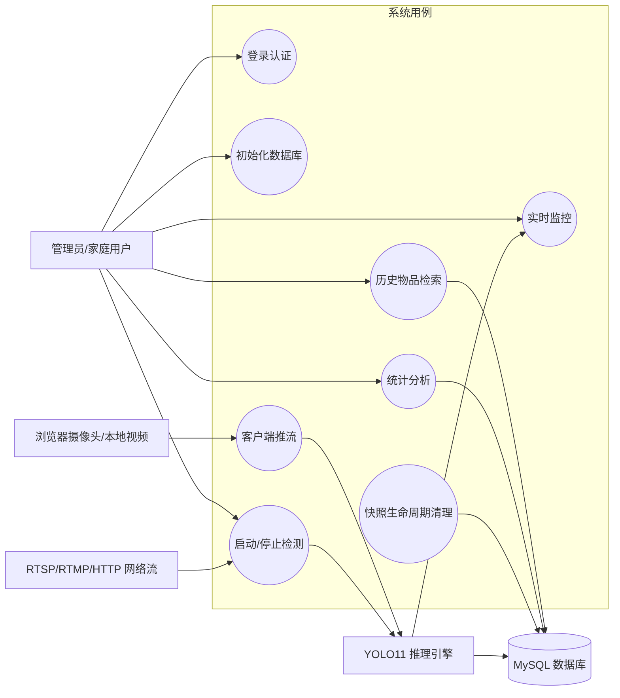
```mermaid
flowchart LR
    user[管理员/家庭用户]
    cam[浏览器摄像头/本地视频]
    netcam[RTSP/RTMP/HTTP 网络流]
    db[(MySQL 数据库)]
    yolo[YOLO11 推理引擎]

    subgraph UC[系统用例]
        login((登录认证))
        setup((初始化数据库))
        start((启动/停止检测))
        push((客户端推流))
        monitor((实时监控))
        search((历史物品检索))
        stats((统计分析))
        clean((快照生命周期清理))
    end

    user --> login
    user --> setup
    user --> start
    user --> monitor
    user --> search
    user --> stats
    cam --> push
    netcam --> start
    push --> yolo
    start --> yolo
    yolo --> monitor
    yolo --> db
    search --> db
    stats --> db
    clean --> db
```

### 3.4 业务流程分析

系统业务流程以“视频接入、模型推理、结构化存储、用户检索”为主线。管理员登录后可选择网络流、本地摄像头或本地视频作为输入源。网络流由后端主动拉取，浏览器本地源则由前端采集并通过 WebSocket 推送。后端统一完成 YOLO 推理、检测框绘制、数据清洗、快照保存和数据库写入，前端根据实时返回结果展示画面和检测列表。

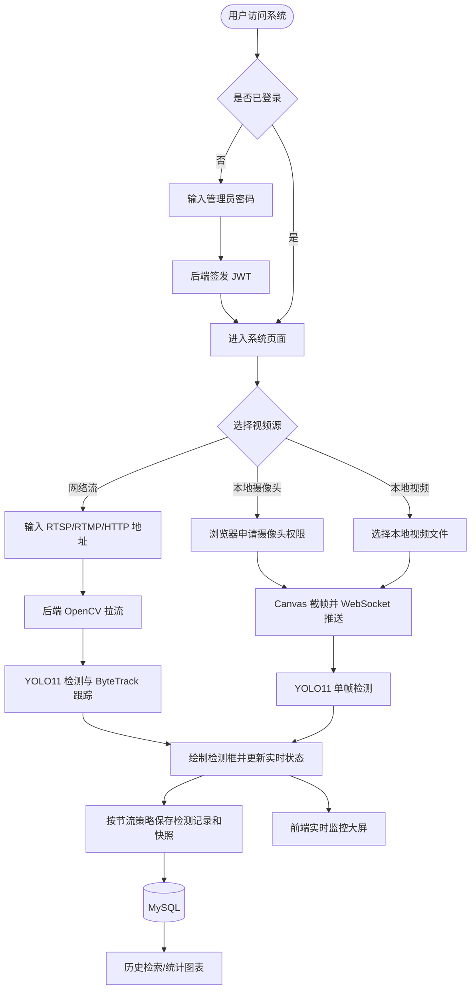
```mermaid
flowchart TD
    A([用户访问系统]) --> B{是否已登录}
    B -- 否 --> C[输入管理员密码]
    C --> D[后端签发 JWT]
    D --> E[进入系统页面]
    B -- 是 --> E
    E --> F{选择视频源}
    F -- 网络流 --> G[输入 RTSP/RTMP/HTTP 地址]
    F -- 本地摄像头 --> H[浏览器申请摄像头权限]
    F -- 本地视频 --> I[选择本地视频文件]
    G --> J[后端 OpenCV 拉流]
    H --> K[Canvas 截帧并 WebSocket 推送]
    I --> K
    J --> L[YOLO11 检测与 ByteTrack 跟踪]
    K --> M[YOLO11 单帧检测]
    L --> N[绘制检测框并更新实时状态]
    M --> N
    N --> O[按节流策略保存检测记录和快照]
    O --> P[(MySQL)]
    P --> Q[历史检索/统计图表]
    N --> R[前端实时监控大屏]
```

### 3.5 数据流分析

数据流方面，系统将非结构化视频帧转化为结构化检测结果。输入数据包括网络视频流、浏览器推送帧和初始化配置；处理过程包括认证、推理、跟踪、聚合去重和统计汇总；输出数据包括标注后画面、实时检测 JSON、历史记录、最后出现位置、统计图表和快照文件。

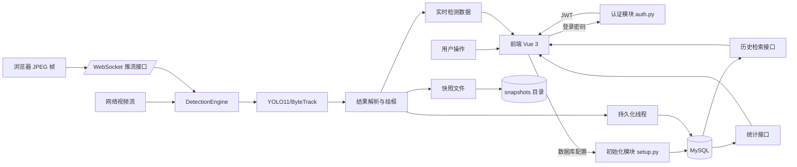
```mermaid
flowchart LR
    U[用户操作] --> A[前端 Vue 3]
    A -- 登录密码 --> Auth[认证模块 auth.py]
    Auth -- JWT --> A
    A -- 数据库配置 --> Setup[初始化模块 setup.py]
    Setup --> DB[(MySQL)]

    Cam1[网络视频流] --> Engine[DetectionEngine]
    Cam2[浏览器 JPEG 帧] --> WS[/WebSocket 推流接口/]
    WS --> Engine
    Engine --> Model[YOLO11/ByteTrack]
    Model --> Parse[结果解析与绘框]
    Parse --> Live[实时检测数据]
    Parse --> Snapshot[快照文件]
    Parse --> Persist[持久化线程]
    Persist --> DB
    Snapshot --> Disk[(snapshots 目录)]
    DB --> Search[历史检索接口]
    DB --> Stat[统计接口]
    Search --> A
    Stat --> A
    Live --> A
```

## 4 系统总体设计

### 4.1 总体架构

系统采用前后端分离的 B/S 架构，整体分为数据层、算法层、后端服务层、前端展示层和部署层。

数据层由 SmartHome-COCO 数据集和 MySQL 数据库组成。数据集用于模型训练，数据库用于保存检测记录、最后出现位置和统计汇总。算法层由 YOLO11 目标检测模型、ByteTrack 跟踪器和 OpenCV 图像处理逻辑组成。后端服务层基于 FastAPI，提供认证、检测、视频、统计、初始化和快照访问接口。前端展示层基于 Vue 3，提供实时监控大屏、历史检索页、统计分析页、登录页和系统初始化页。部署层使用 Dockerfile 与 Docker Compose 组织服务，并通过 Nginx 托管前端静态资源及代理后端接口。

### 4.2 后端模块设计

后端主要模块如下：

1. `detection_engine.py`：系统核心推理引擎，负责模型加载、视频源打开、帧循环、YOLO 推理、ByteTrack 跟踪、检测框绘制、快照保存和数据库写入。
2. `models.py`：定义 `DetectionRecord`、`ObjectLastSeen` 和 `DetectionStat` 三张核心数据表。
3. `routers/video.py`：提供 MJPEG 视频流、实时检测 WebSocket、客户端推流 WebSocket、启动检测和停止检测接口。
4. `routers/detection.py`：提供类别列表、中文关键词检索、最后出现位置查询和历史记录分页查询接口。
5. `routers/stats.py`：提供概览统计、类别分布和时间分布接口。
6. `auth.py`：实现单管理员登录、JWT 签发和 HTTP/WebSocket 鉴权。
7. `snapshot_cleaner.py`：后台定时清理超过保留天数的快照文件。

核心数据表设计如下：

| 表名 | 作用 | 关键字段 |
| --- | --- | --- |
| `detection_records` | 保存每次检测记录 | `object_class`、`confidence`、`bbox_x/y/w/h`、`track_id`、`snapshot_path`、`detected_at` |
| `object_last_seen` | 保存每类物品最后出现位置 | `object_class`、`last_bbox_x/y/w/h`、`last_snapshot_path`、`last_seen_at`、`total_count` |
| `detection_stats` | 保存小时级统计 | `stat_date`、`stat_hour`、`object_class`、`detection_count` |

### 4.3 前端模块设计

前端以 Vue 3 单页应用形式实现，主要页面包括：

1. `DashboardView.vue`：实时监控大屏，展示 FPS、当前物品数、今日累计检测、活跃物品种类、视频画面和检测列表。
2. `LocalStreamer.vue`：浏览器本地摄像头和本地视频推流组件，负责采集帧、编码 JPEG、发送 WebSocket、接收推理结果图。
3. `SearchView.vue`：历史物品检索页面，支持类别筛选、中文关键词查询和快照查看。
4. `StatsView.vue`：统计分析页面，使用 ECharts 展示类别分布和时间趋势。
5. `SetupView.vue`：系统初始化页面，用于配置数据库连接并完成建表。
6. `LoginView.vue`：管理员登录页面，登录后将 JWT Token 保存到本地并用于后续接口请求。

前端与后端交互统一通过 `api/` 目录中的封装模块完成，便于维护接口地址、Token 注入和异常处理逻辑。

### 4.4 系统功能结构设计

系统功能结构按照“基础配置、视频感知、历史检索、统计展示、系统安全与运维”划分。基础配置用于完成数据库初始化和模型参数配置；视频感知负责不同来源的视频接入和推理；历史检索负责最后出现位置与明细记录查询；统计展示负责面向用户的数据可视化；安全与运维模块负责认证、快照清理和健康检查。

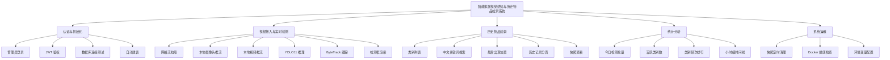
```mermaid
flowchart TD
    S[智能家居视觉感知与历史物品检索系统]
    S --> A[认证与初始化]
    S --> B[视频接入与实时检测]
    S --> C[历史物品检索]
    S --> D[统计分析]
    S --> E[系统运维]

    A --> A1[管理员登录]
    A --> A2[JWT 鉴权]
    A --> A3[数据库连接测试]
    A --> A4[自动建表]

    B --> B1[网络流拉取]
    B --> B2[本地摄像头推流]
    B --> B3[本地视频推流]
    B --> B4[YOLO11 推理]
    B --> B5[ByteTrack 跟踪]
    B --> B6[检测框渲染]

    C --> C1[类别列表]
    C --> C2[中文关键词搜索]
    C --> C3[最后出现位置]
    C --> C4[历史记录分页]
    C --> C5[快照查看]

    D --> D1[今日检测总量]
    D --> D2[活跃类别数]
    D --> D3[类别频次排行]
    D --> D4[小时级时间线]

    E --> E1[快照定时清理]
    E --> E2[Docker 健康检查]
    E --> E3[环境变量配置]
```

### 4.5 技术架构设计

系统采用前后端分离加容器化部署方式。前端由 Vue 3 构建单页应用，生产环境经 Nginx 提供静态资源服务，并代理 `/api`、`/snapshots` 与 WebSocket 请求。后端由 FastAPI 提供 REST API、MJPEG 和 WebSocket 服务，推理部分调用 Ultralytics YOLO 与 OpenCV，持久化部分通过 SQLAlchemy 访问 MySQL。训练与评估脚本独立位于 `model_training/`，数据集处理脚本独立位于 `data_pipeline/`。

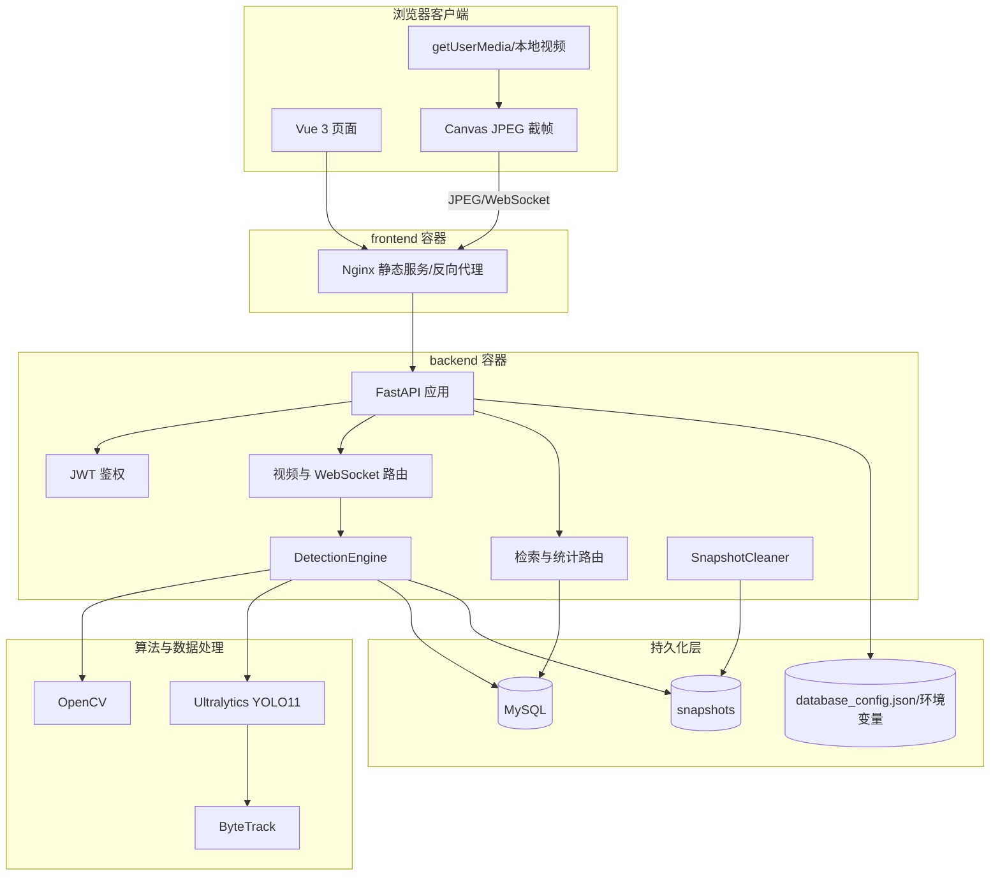
```mermaid
flowchart TB
    subgraph Client[浏览器客户端]
        UI[Vue 3 页面]
        Media[getUserMedia/本地视频]
        Canvas[Canvas JPEG 截帧]
    end

    subgraph Frontend[frontend 容器]
        Nginx[Nginx 静态服务/反向代理]
    end

    subgraph Backend[backend 容器]
        FastAPI[FastAPI 应用]
        Auth[JWT 鉴权]
        VideoAPI[视频与 WebSocket 路由]
        DetectAPI[检索与统计路由]
        Engine[DetectionEngine]
        Cleaner[SnapshotCleaner]
    end

    subgraph Algorithm[算法与数据处理]
        YOLO[Ultralytics YOLO11]
        Track[ByteTrack]
        OpenCV[OpenCV]
    end

    subgraph Storage[持久化层]
        MySQL[(MySQL)]
        Snap[(snapshots)]
        Config[(database_config.json/环境变量)]
    end

    UI --> Nginx
    Media --> Canvas
    Canvas -- JPEG/WebSocket --> Nginx
    Nginx --> FastAPI
    FastAPI --> Auth
    FastAPI --> VideoAPI
    FastAPI --> DetectAPI
    VideoAPI --> Engine
    Engine --> OpenCV
    Engine --> YOLO
    YOLO --> Track
    Engine --> MySQL
    Engine --> Snap
    DetectAPI --> MySQL
    Cleaner --> Snap
    FastAPI --> Config
```

### 4.6 数据库设计

本系统数据库设计围绕“检测明细、最后出现位置、统计聚合”三类数据展开。`detection_records` 保存完整检测流水，便于追溯每次识别结果；`object_last_seen` 维护每个类别的最新位置，便于快速回答“某物品最后出现在哪里”；`detection_stats` 保存小时级聚合统计，便于前端图表快速加载。当前实现为单摄像头演示场景，`object_last_seen.object_class` 设置为唯一字段；若扩展多摄像头，建议将唯一约束调整为 `(camera_id, object_class)`。

数据库 E-R 图如下。

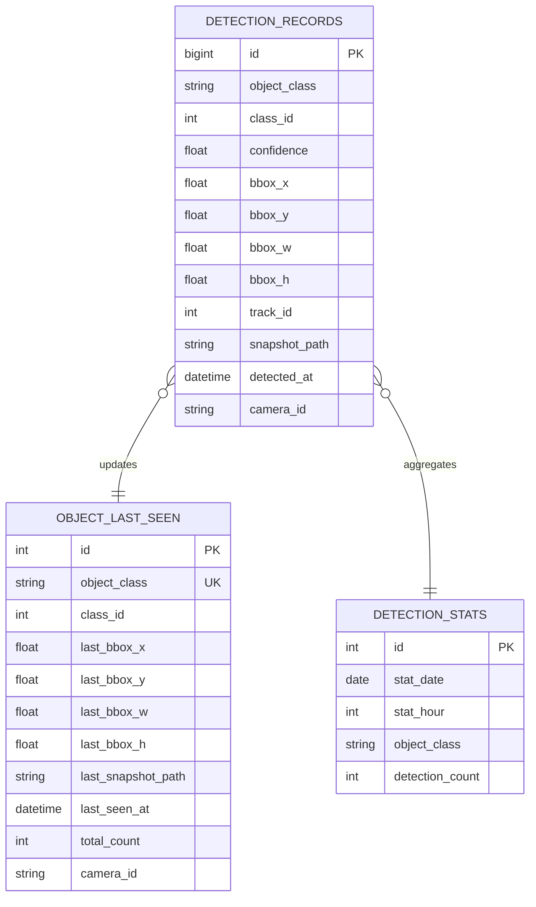
```mermaid
erDiagram
    DETECTION_RECORDS {
        bigint id PK
        string object_class
        int class_id
        float confidence
        float bbox_x
        float bbox_y
        float bbox_w
        float bbox_h
        int track_id
        string snapshot_path
        datetime detected_at
        string camera_id
    }
    OBJECT_LAST_SEEN {
        int id PK
        string object_class UK
        int class_id
        float last_bbox_x
        float last_bbox_y
        float last_bbox_w
        float last_bbox_h
        string last_snapshot_path
        datetime last_seen_at
        int total_count
        string camera_id
    }
    DETECTION_STATS {
        int id PK
        date stat_date
        int stat_hour
        string object_class
        int detection_count
    }
    DETECTION_RECORDS }o--|| OBJECT_LAST_SEEN : updates
    DETECTION_RECORDS }o--|| DETECTION_STATS : aggregates
```

数据库表结构图如下，随后给出字段说明表。

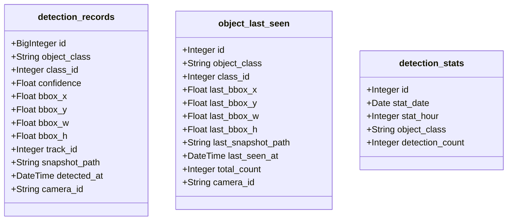
```mermaid
classDiagram
    class detection_records {
        +BigInteger id
        +String object_class
        +Integer class_id
        +Float confidence
        +Float bbox_x
        +Float bbox_y
        +Float bbox_w
        +Float bbox_h
        +Integer track_id
        +String snapshot_path
        +DateTime detected_at
        +String camera_id
    }
    class object_last_seen {
        +Integer id
        +String object_class
        +Integer class_id
        +Float last_bbox_x
        +Float last_bbox_y
        +Float last_bbox_w
        +Float last_bbox_h
        +String last_snapshot_path
        +DateTime last_seen_at
        +Integer total_count
        +String camera_id
    }
    class detection_stats {
        +Integer id
        +Date stat_date
        +Integer stat_hour
        +String object_class
        +Integer detection_count
    }
```

| 表名 | 字段 | 类型 | 约束/说明 |
| --- | --- | --- | --- |
| `detection_records` | `id` | BigInteger | 主键，自增 |
| `detection_records` | `object_class` | String(50) | 物品英文类别，索引 |
| `detection_records` | `class_id` | Integer | YOLO 类别编号 |
| `detection_records` | `confidence` | Float | 检测置信度 |
| `detection_records` | `bbox_x/y/w/h` | Float | 归一化边界框中心与宽高 |
| `detection_records` | `track_id` | Integer | ByteTrack ID，可为空 |
| `detection_records` | `snapshot_path` | String(255) | 截帧快照路径，可为空 |
| `detection_records` | `detected_at` | DateTime | 检测时间，建立类别-时间联合索引 |
| `detection_records` | `camera_id` | String(50) | 摄像头标识 |
| `object_last_seen` | `id` | Integer | 主键，自增 |
| `object_last_seen` | `object_class` | String(50) | 物品英文类别，当前为唯一约束 |
| `object_last_seen` | `class_id` | Integer | YOLO 类别编号 |
| `object_last_seen` | `last_bbox_x/y/w/h` | Float | 最近一次出现边界框 |
| `object_last_seen` | `last_snapshot_path` | String(255) | 最近一次出现快照 |
| `object_last_seen` | `last_seen_at` | DateTime | 最近一次出现时间，建立索引 |
| `object_last_seen` | `total_count` | Integer | 累计出现次数 |
| `object_last_seen` | `camera_id` | String(50) | 摄像头标识 |
| `detection_stats` | `id` | Integer | 主键，自增 |
| `detection_stats` | `stat_date` | Date | 统计日期 |
| `detection_stats` | `stat_hour` | Integer | 统计小时 |
| `detection_stats` | `object_class` | String(50) | 物品英文类别 |
| `detection_stats` | `detection_count` | Integer | 检测次数 |
| `detection_stats` | `(stat_date, stat_hour, object_class)` | UniqueConstraint | 防止同一小时同一类别重复聚合 |

## 5 数据集构建与模型训练

### 5.1 SmartHome-COCO 数据集构建

COCO 数据集包含复杂日常场景中的常见物体，并提供实例级标注，适合用于目标检测模型训练和迁移学习。本文项目基于 COCO 2017 构建 SmartHome-COCO 子集，选择与智能家居场景关系较强的 20 类物品：

`chair`、`couch`、`potted plant`、`bed`、`dining table`、`toilet`、`tv`、`laptop`、`mouse`、`remote`、`keyboard`、`cell phone`、`microwave`、`oven`、`toaster`、`sink`、`refrigerator`、`book`、`clock`、`vase`。

数据处理脚本 `data_pipeline.py` 使用 `pycocotools` 读取 COCO 标注文件，根据目标类别筛选图像和标注，并将 COCO `[x_min, y_min, width, height]` 边界框转换为 YOLO 归一化格式 `[class_id, center_x, center_y, width, height]`。最终生成符合 Ultralytics 训练要求的 `images/train`、`images/val`、`labels/train` 和 `labels/val` 目录结构，并由 `smarthome.yaml` 指定训练集、验证集和类别名称。

数据集构建流程如图 5-1 所示。该流程保证训练阶段使用的类别顺序与后端 `config.py` 中的 `CLASS_NAMES` 保持一致，避免模型输出类别编号与前端中文显示映射不一致。

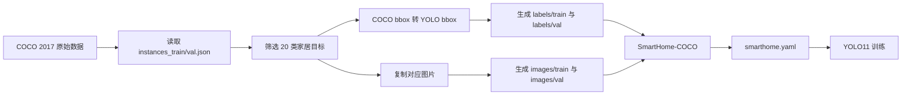
```mermaid
flowchart LR
    A[COCO 2017 原始数据] --> B[读取 instances_train/val.json]
    B --> C[筛选 20 类家居目标]
    C --> D[复制对应图片]
    C --> E[COCO bbox 转 YOLO bbox]
    E --> F[生成 labels/train 与 labels/val]
    D --> G[生成 images/train 与 images/val]
    F --> H[SmartHome-COCO]
    G --> H
    H --> I[smarthome.yaml]
    I --> J[YOLO11 训练]
```

训练过程中生成的数据集标签分布图和训练样例图如下，可用于论文定稿时说明数据集类别覆盖和标注格式。若后续重新训练模型，应同步替换为最新训练目录中的可视化结果。

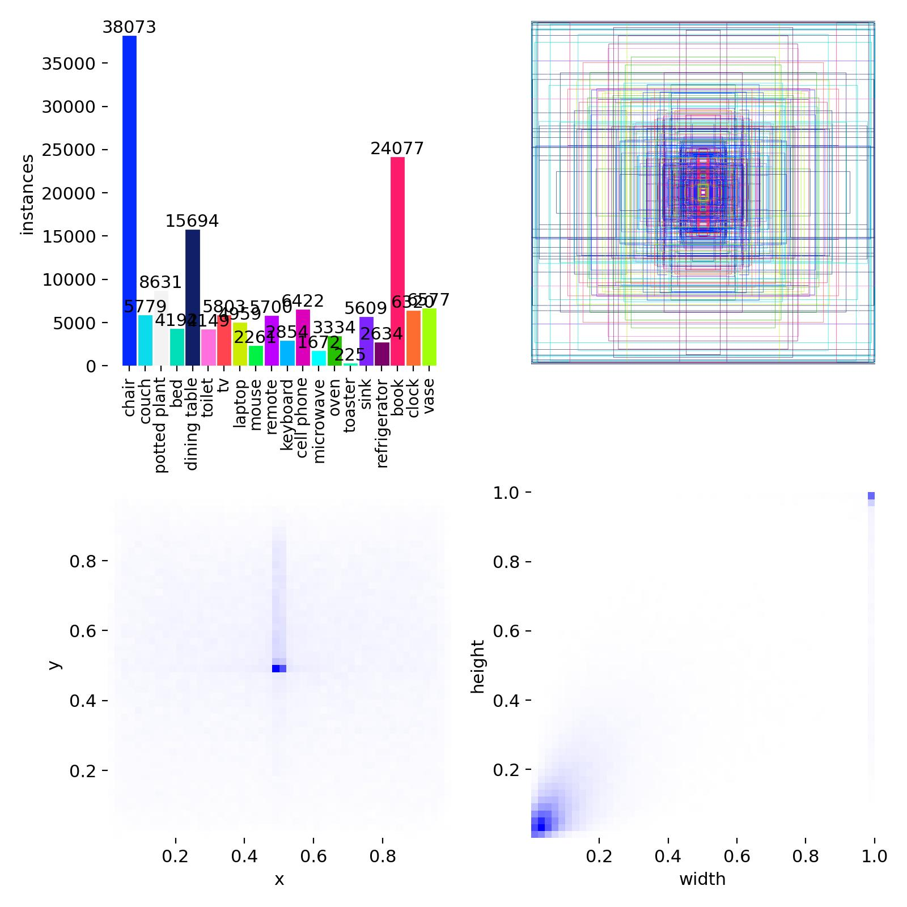

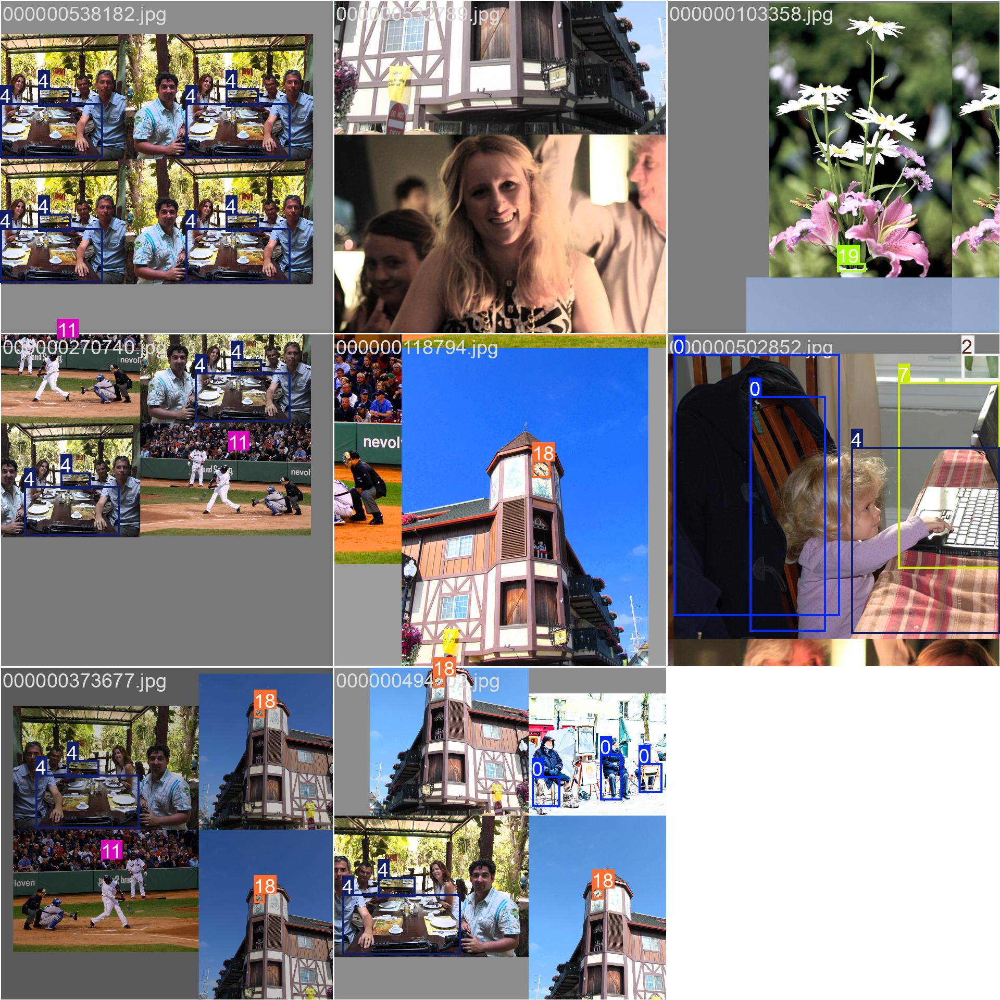

### 5.2 模型训练配置

训练脚本基于 Ultralytics `YOLO` Python API 实现。初始脚本以 `yolo11n.pt` 预训练权重为起点，设置 `epochs=100`、`imgsz=640`、`batch=32`、`device=0` 和自动混合精度训练。当前生产推理实际采用 `results-01/runs/train_smarthome_s/weights/best.pt`，即 YOLO11s 训练产物。后端 `config.py` 通过 `WEIGHTS_PATH` 指定该权重路径，并设置置信度阈值 `0.25`、NMS IoU 阈值 `0.5` 和输入尺寸 `640`。

模型训练与验证流程如图 5-2 所示。训练阶段以预训练权重为初始参数，在 SmartHome-COCO 数据集上进行迁移学习；验证阶段依据 Precision、Recall、mAP@0.5 和 mAP@0.5:0.95 选择最佳权重；部署阶段由后端加载 `best.pt`，并通过统一推理接口服务于网络流拉取和浏览器推流两种业务模式。

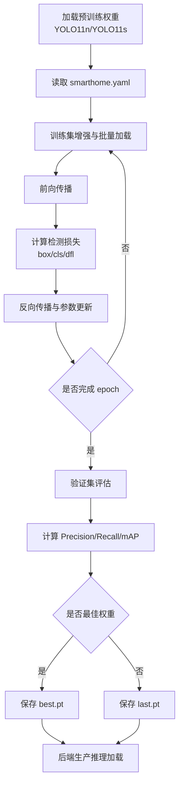
```mermaid
flowchart TD
    A[加载预训练权重<br/>YOLO11n/YOLO11s] --> B[读取 smarthome.yaml]
    B --> C[训练集增强与批量加载]
    C --> D[前向传播]
    D --> E[计算检测损失<br/>box/cls/dfl]
    E --> F[反向传播与参数更新]
    F --> G{是否完成 epoch}
    G -- 否 --> C
    G -- 是 --> H[验证集评估]
    H --> I[计算 Precision/Recall/mAP]
    I --> J{是否最佳权重}
    J -- 是 --> K[保存 best.pt]
    J -- 否 --> L[保存 last.pt]
    K --> M[后端生产推理加载]
    L --> M
```

### 5.3 训练结果

根据 `results-01/runs/train_smarthome_s/results.csv`，训练日志记录至第 66 轮，最后一轮主要指标如下：

| 指标 | 数值 |
| --- | ---: |
| Precision | 0.67572 |
| Recall | 0.61442 |
| mAP@0.5 | 0.65508 |
| mAP@0.5:0.95 | 0.48428 |

从指标看，模型已具备对 20 类室内常见物品的可用检测能力。mAP@0.5 高于 0.65，说明在较宽松 IoU 阈值下具有较稳定的定位与分类效果；mAP@0.5:0.95 为 0.48428，表明在更严格定位标准下仍有优化空间。后续可通过真实家庭场景数据补充、小目标类别增强、提高输入分辨率和继续训练等方式进一步提升系统对遥控器、鼠标、手机等小目标的召回率。

为进一步补充论文所需的模型评估证据，本文在本地 CPU 环境下运行 `model_training/val.py` 对 YOLO11s 最佳权重进行验证集复评。评估数据为 SmartHome-COCO 验证集，共 1899 张图片、6962 个实例。复评结果如下：

| 指标 | 数值 |
| --- | ---: |
| Precision | 0.6775 |
| Recall | 0.6144 |
| mAP@0.5 | 0.6552 |
| mAP@0.5:0.95 | 0.4849 |

验证阶段生成的混淆矩阵、归一化混淆矩阵、PR 曲线、F1 曲线和验证集预测样例如下。混淆矩阵用于观察不同类别之间的误检关系；PR 曲线反映不同置信度阈值下查准率与召回率的平衡；F1 曲线用于观察综合查准率和召回率后的较优置信度区间。

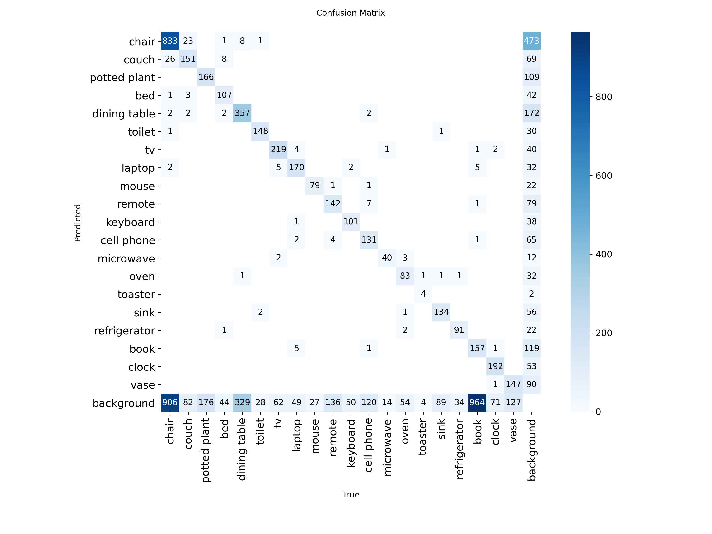

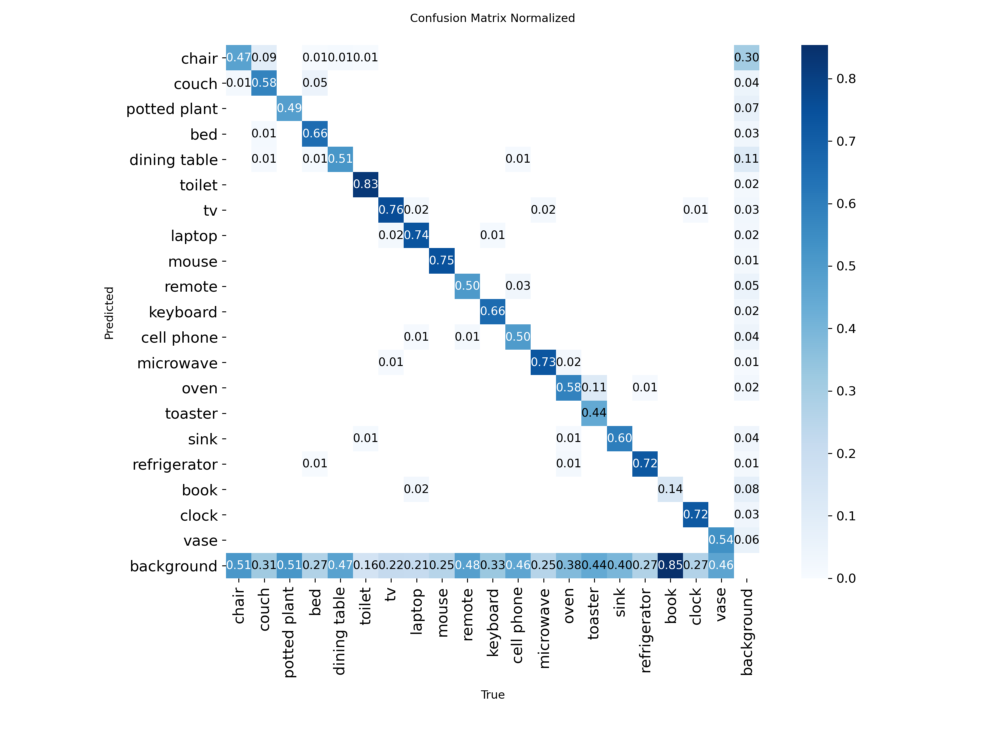

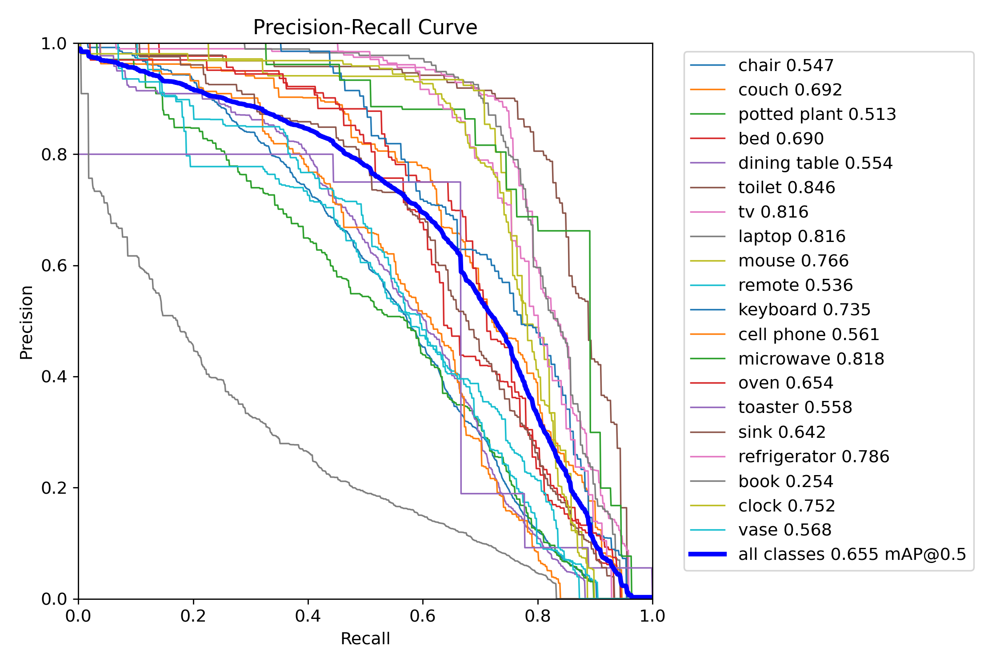

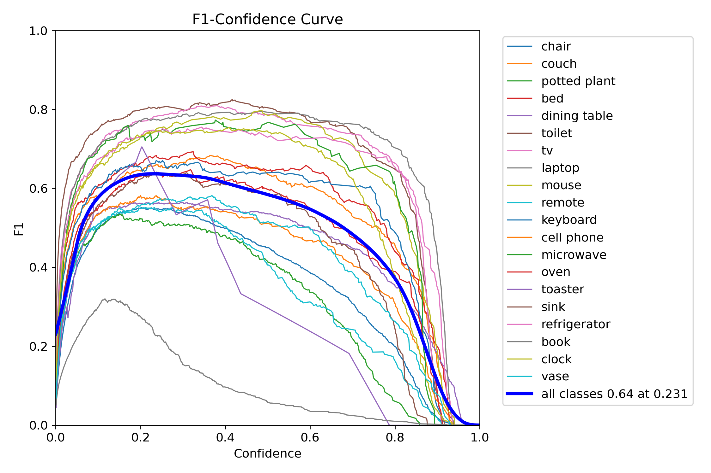

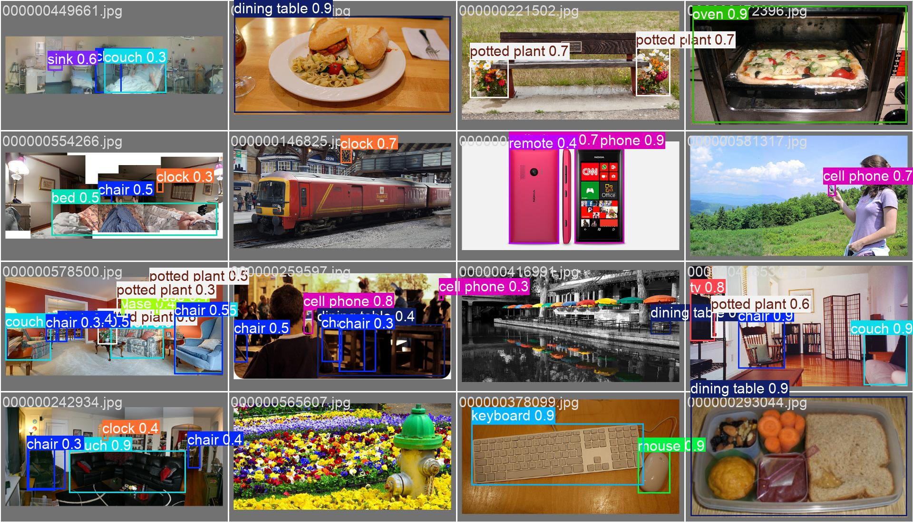

YOLO11s 每类 AP 指标如下，完整表格文件同步保存于 [docs/pics/yolo11s_per_class_ap.md](pics/yolo11s_per_class_ap.md)。

| 类别 | AP@0.5 | AP@0.5:0.95 |
| --- | ---: | ---: |
| chair | 0.5471 | 0.3584 |
| couch | 0.6917 | 0.5365 |
| potted plant | 0.5130 | 0.3142 |
| bed | 0.6897 | 0.5269 |
| dining table | 0.5541 | 0.4130 |
| toilet | 0.8459 | 0.6796 |
| tv | 0.8161 | 0.6336 |
| laptop | 0.8163 | 0.6838 |
| mouse | 0.7661 | 0.5930 |
| remote | 0.5364 | 0.3406 |
| keyboard | 0.7350 | 0.5585 |
| cell phone | 0.5615 | 0.3952 |
| microwave | 0.8180 | 0.6692 |
| oven | 0.6537 | 0.4655 |
| toaster | 0.5580 | 0.3906 |
| sink | 0.6419 | 0.4285 |
| refrigerator | 0.7859 | 0.6466 |
| book | 0.2541 | 0.1373 |
| clock | 0.7516 | 0.5307 |
| vase | 0.5679 | 0.3967 |

从类别级指标看，`toilet`、`tv`、`laptop`、`microwave`、`refrigerator` 等形态较稳定、尺度相对较大的类别 AP 较高；`book` 的 AP 明显偏低，说明书籍在 COCO 子集中存在尺度小、遮挡多、外观差异大和密集摆放等问题。`remote`、`potted plant`、`chair` 等类别也存在一定漏检空间，后续可通过真实家庭场景补样本和小目标增强策略继续优化。

本文进一步运行 `model_training/benchmark.py` 对 YOLO11n 与 YOLO11s 进行同验证集对比。对比表保存于 [docs/pics/yolo11n_vs_yolo11s_benchmark.md](pics/yolo11n_vs_yolo11s_benchmark.md)，结果如下：

| 指标 | YOLO11n | YOLO11s |
| --- | ---: | ---: |
| 参数量 | 2.59M | 9.44M |
| 文件大小 | 15.2 MB | 54.4 MB |
| Precision | 0.6964 | 0.6775 |
| Recall | 0.5230 | 0.6144 |
| mAP@0.5 | 0.6013 | 0.6552 |
| mAP@0.5:0.95 | 0.4384 | 0.4849 |
| 评估耗时 | 109.7s | 275.7s |

对比结果表明，YOLO11n 参数量和文件大小显著小于 YOLO11s，CPU 验证耗时也更低，适合低算力或速度优先场景；YOLO11s 在 Recall、mAP@0.5 和 mAP@0.5:0.95 上均高于 YOLO11n，更适合作为当前系统的生产推理模型。考虑到本系统更关注历史检索场景下的漏检控制，生产配置采用 YOLO11s 权重是较合理的工程取舍。需要说明的是，上述耗时是在 CPU 环境下得到，若部署 GPU、TensorRT 或 ONNX Runtime，绝对耗时会发生变化，但同一硬件环境下的相对比较仍具有参考价值。

## 6 系统实现

### 6.1 服务端拉流检测流程

服务端拉流模式由 `DetectionEngine.start()` 启动。系统根据输入源类型判断其为网络流或视频文件，再使用 OpenCV `VideoCapture` 打开视频源。推理循环中，系统读取每一帧并调用：

```python
results = self.model.track(
    frame,
    conf=config.CONFIDENCE_THRESHOLD,
    iou=config.IOU_THRESHOLD,
    imgsz=config.INPUT_SIZE,
    tracker=config.TRACKER_TYPE,
    persist=True,
    verbose=False
)
```

随后 `_parse_results()` 将模型输出转换为前端和数据库可直接使用的结构，包括类别 ID、英文类别、中文类别、置信度、像素坐标、归一化中心点与宽高、`track_id` 等字段。`_draw_detections()` 在帧上绘制边界框、中文标签、置信度和 FPS，最终供 MJPEG 流和快照保存使用。

持久化逻辑采用“跟踪稳定性 + 写库节流 + 快照间隔”的组合策略。系统维护每个 `track_id` 的连续出现计数，当目标短暂消失时逐步扣减而不是立刻删除，以容忍单帧漏检。只有达到 `TRACK_PERSIST_FRAMES` 的目标才写入数据库；同时通过 `DB_WRITE_INTERVAL` 控制写库最小间隔，通过 `SNAPSHOT_INTERVAL` 控制快照保存最小间隔。数据库写入在后台线程中执行，避免阻塞推理主循环。

模型推理结果到业务数据的转换流程如图 6-1 所示。YOLO 输出的原始张量并不直接写入数据库，而是经过类别映射、坐标归一化、中文名称补全、跟踪 ID 读取、稳定性判断和节流控制后，才转化为可供前端展示与历史检索使用的业务字段。

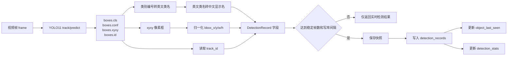
```mermaid
flowchart LR
    A[视频帧 frame] --> B[YOLO11 track/predict]
    B --> C[boxes.cls<br/>boxes.conf<br/>boxes.xyxy<br/>boxes.id]
    C --> D[类别编号转英文类名]
    D --> E[英文类名转中文显示名]
    C --> F[xyxy 像素框]
    F --> G[归一化 bbox_x/y/w/h]
    C --> H[读取 track_id]
    E --> I[DetectionRecord 字段]
    G --> I
    H --> I
    I --> J{达到稳定帧数和写库间隔}
    J -- 否 --> K[仅返回实时检测结果]
    J -- 是 --> L[保存快照]
    L --> M[写入 detection_records]
    M --> N[更新 object_last_seen]
    M --> O[更新 detection_stats]
```

### 6.2 客户端推流检测流程

客户端推流模式由 `LocalStreamer.vue` 实现。启动摄像头时，前端调用 `navigator.mediaDevices.getUserMedia({ video: { width: 640, height: 480 } })` 获取本地视频流；启动本地视频模式时，前端读取用户选择的视频文件并用 `<video>` 元素播放。采集定时器每 200 ms 将视频画面绘制到 640×480 的 Canvas，并以 JPEG 质量 0.75 编码为 Blob，然后通过 WebSocket 二进制消息发送至后端。

后端 `/api/video/ws/push` 接口首先通过 query 参数中的 JWT Token 完成鉴权，然后接收 JPEG 字节并调用 `infer_single_frame()`。该方法使用 `cv2.imdecode` 解码图像，调用 `model.predict()` 完成单帧推理，绘制检测框后返回 Base64 图像与检测结果列表。由于推流模式没有 TrackID，系统通过统一的写库节流和快照间隔策略降低高频重复数据。

### 6.3 历史检索与统计实现

历史检索模块围绕 `object_last_seen` 和 `detection_records` 两张表实现。用户可按英文类别或中文关键词查询物品最后出现位置。例如输入“笔记本”时，后端会在中文映射表中匹配 `laptop`，再查询该类别在 `object_last_seen` 中的最新记录。历史记录接口支持按类别、起止时间和分页参数查询 `detection_records`，便于展示某类物品在一段时间内的出现轨迹。

统计模块通过 `detection_stats` 表维护小时级聚合数据。每次写入检测记录时，后端同步更新当前日期、当前小时和当前类别对应的检测次数。前端统计页以图表方式展示类别分布和时间趋势，使用户能够了解家中物品在不同时间段的出现频率。

### 6.4 安全与部署实现

系统加入单管理员 JWT 鉴权。登录接口校验环境变量 `ADMIN_PASSWORD` 指定的管理员密码并签发 Token，后续关键 HTTP 接口通过 `Authorization: Bearer <token>` 访问，WebSocket 推流接口通过 query 参数传递 Token 并调用 `verify_ws_token()` 验证。数据库密码处理方面，系统优先读取 `DB_PASSWORD` 环境变量，初始化页面输入的密码只保存在运行时内存中，避免继续向 JSON 文件明文写入敏感信息。

部署方面，系统使用 `Dockerfile.backend`、`Dockerfile.frontend` 和 `docker-compose.yml`。后端容器挂载 `backend/data` 和 `backend/snapshots` 以持久化配置和快照，前端容器由 Nginx 托管并监听 `10080` 端口。Compose 文件为前后端配置 healthcheck，后端通过访问 `/api/health` 检查服务健康，前端通过 `wget --spider` 检查 Nginx 静态服务可用性。

### 6.5 核心类与模块关系设计

系统后端采用面向模块的设计方式，其中 `DetectionEngine` 是运行时核心单例对象，路由层负责输入校验与接口暴露，模型层负责数据库实体映射，认证模块负责 Token 生成与验证。前端页面通过 API 封装模块访问后端，实时推流组件通过 WebSocket 与视频路由交互。

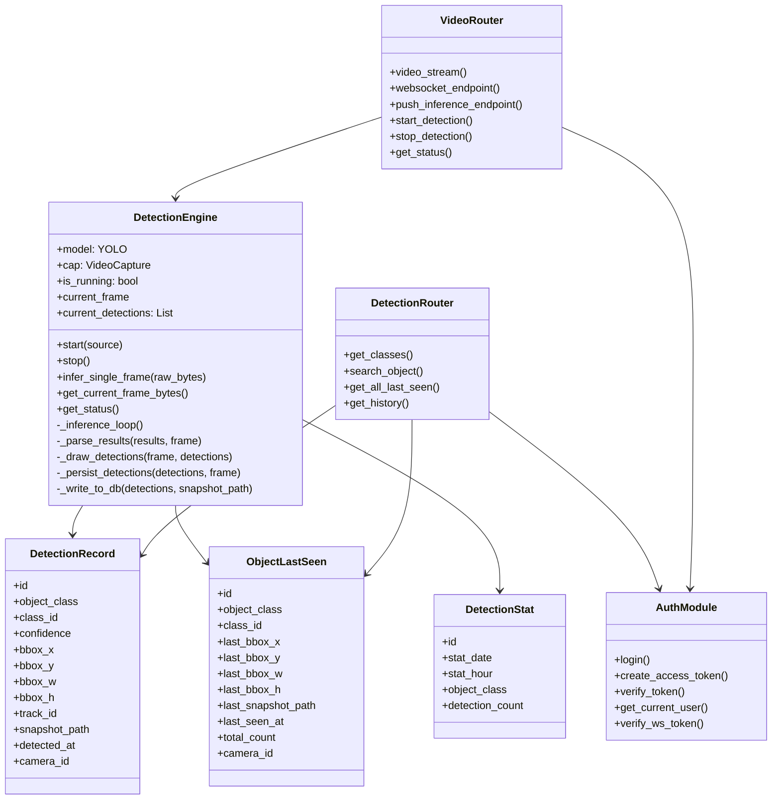
```mermaid
classDiagram
    class DetectionEngine {
        +model: YOLO
        +cap: VideoCapture
        +is_running: bool
        +current_frame
        +current_detections: List
        +start(source)
        +stop()
        +infer_single_frame(raw_bytes)
        +get_current_frame_bytes()
        +get_status()
        -_inference_loop()
        -_parse_results(results, frame)
        -_draw_detections(frame, detections)
        -_persist_detections(detections, frame)
        -_write_to_db(detections, snapshot_path)
    }

    class DetectionRecord {
        +id
        +object_class
        +class_id
        +confidence
        +bbox_x
        +bbox_y
        +bbox_w
        +bbox_h
        +track_id
        +snapshot_path
        +detected_at
        +camera_id
    }

    class ObjectLastSeen {
        +id
        +object_class
        +class_id
        +last_bbox_x
        +last_bbox_y
        +last_bbox_w
        +last_bbox_h
        +last_snapshot_path
        +last_seen_at
        +total_count
        +camera_id
    }

    class DetectionStat {
        +id
        +stat_date
        +stat_hour
        +object_class
        +detection_count
    }

    class VideoRouter {
        +video_stream()
        +websocket_endpoint()
        +push_inference_endpoint()
        +start_detection()
        +stop_detection()
        +get_status()
    }

    class DetectionRouter {
        +get_classes()
        +search_object()
        +get_all_last_seen()
        +get_history()
    }

    class AuthModule {
        +login()
        +create_access_token()
        +verify_token()
        +get_current_user()
        +verify_ws_token()
    }

    VideoRouter --> DetectionEngine
    DetectionRouter --> ObjectLastSeen
    DetectionRouter --> DetectionRecord
    DetectionEngine --> DetectionRecord
    DetectionEngine --> ObjectLastSeen
    DetectionEngine --> DetectionStat
    VideoRouter --> AuthModule
    DetectionRouter --> AuthModule
```

### 6.6 关键时序设计

客户端推流模式是本系统较有代表性的交互流程。前端组件负责采集本地视频帧，后端完成鉴权、解码、推理、绘框和持久化。该模式解决了公网服务器难以直接访问家庭摄像头的问题。

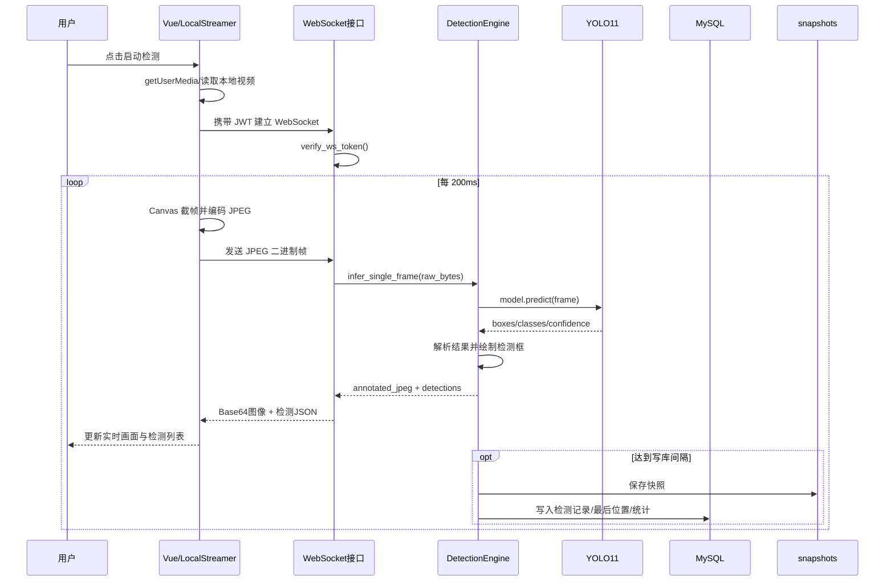
```mermaid
sequenceDiagram
    participant U as 用户
    participant V as Vue/LocalStreamer
    participant W as WebSocket接口
    participant E as DetectionEngine
    participant M as YOLO11
    participant D as MySQL
    participant S as snapshots

    U->>V: 点击启动检测
    V->>V: getUserMedia/读取本地视频
    V->>W: 携带 JWT 建立 WebSocket
    W->>W: verify_ws_token()
    loop 每 200ms
        V->>V: Canvas 截帧并编码 JPEG
        V->>W: 发送 JPEG 二进制帧
        W->>E: infer_single_frame(raw_bytes)
        E->>M: model.predict(frame)
        M-->>E: boxes/classes/confidence
        E->>E: 解析结果并绘制检测框
        E-->>W: annotated_jpeg + detections
        W-->>V: Base64图像 + 检测JSON
        V-->>U: 更新实时画面与检测列表
        opt 达到写库间隔
            E->>S: 保存快照
            E->>D: 写入检测记录/最后位置/统计
        end
    end
```

### 6.7 活动图设计

从系统内部活动看，检测流程需要先判断视频来源，再进入不同的采集链路；推理完成后统一进入结果解析、画面渲染和持久化判断。

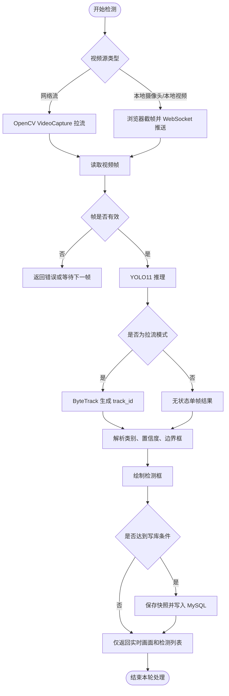
```mermaid
flowchart TD
    A([开始检测]) --> B{视频源类型}
    B -- 网络流 --> C[OpenCV VideoCapture 拉流]
    B -- 本地摄像头/本地视频 --> D[浏览器截帧并 WebSocket 推送]
    C --> E[读取视频帧]
    D --> E
    E --> F{帧是否有效}
    F -- 否 --> G[返回错误或等待下一帧]
    F -- 是 --> H[YOLO11 推理]
    H --> I{是否为拉流模式}
    I -- 是 --> J[ByteTrack 生成 track_id]
    I -- 否 --> K[无状态单帧结果]
    J --> L[解析类别、置信度、边界框]
    K --> L
    L --> M[绘制检测框]
    M --> N{是否达到写库条件}
    N -- 否 --> O[仅返回实时画面和检测列表]
    N -- 是 --> P[保存快照并写入 MySQL]
    P --> O
    O --> Q([结束本轮处理])
```

### 6.8 状态图设计

推理引擎的运行状态可抽象为未加载、空闲、运行、停止中和错误五类。当前代码在应用启动时加载模型，启动检测后进入后台线程循环，停止检测时释放视频源并清空实时状态。

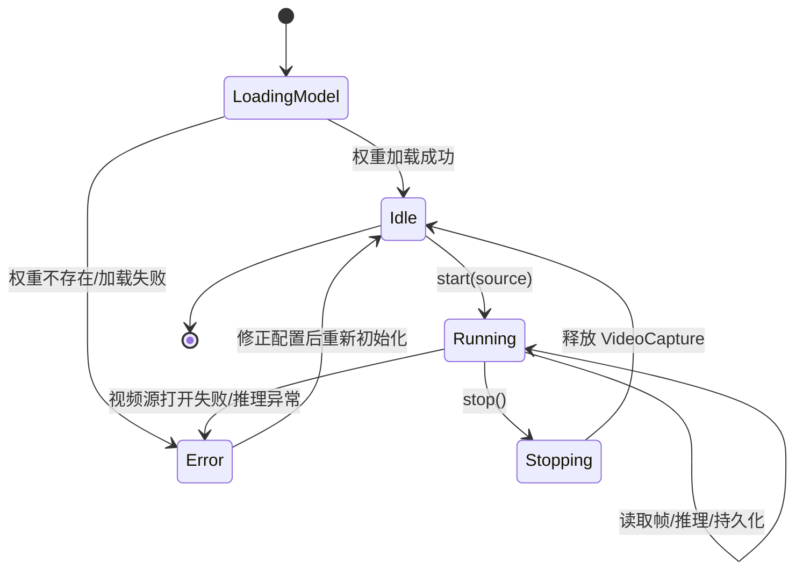
```mermaid
stateDiagram-v2
    [*] --> LoadingModel
    LoadingModel --> Idle: 权重加载成功
    LoadingModel --> Error: 权重不存在/加载失败
    Idle --> Running: start(source)
    Running --> Running: 读取帧/推理/持久化
    Running --> Stopping: stop()
    Stopping --> Idle: 释放 VideoCapture
    Running --> Error: 视频源打开失败/推理异常
    Error --> Idle: 修正配置后重新初始化
    Idle --> [*]
```

### 6.9 系统界面截图说明

论文定稿阶段建议补充真实运行截图，以增强系统实现的可信度。当前仓库中未提供已导出的界面截图文件，本次修订未启动完整 Docker、数据库和浏览器运行环境，因此无法直接嵌入真实截图。后续可在本地 WSL2 Docker 或生产环境启动系统后，按下表补充截图并替换为实际图片路径。

| 图号 | 建议截图 | 对应页面/组件 | 截图内容 |
| --- | --- | --- | --- |
| 图 6-x | 登录界面截图 | `LoginView.vue` | 管理员登录入口、密码输入与登录按钮 |
| 图 6-x | 系统初始化界面截图 | `SetupView.vue` | MySQL 连接配置、测试连接、初始化按钮 |
| 图 6-x | 实时监控大屏截图 | `DashboardView.vue` | 视频画面、FPS、当前物品数、实时检测列表 |
| 图 6-x | 本地推流检测截图 | `LocalStreamer.vue` | 浏览器摄像头/本地视频推流后的检测框画面 |
| 图 6-x | 历史物品检索截图 | `SearchView.vue` | 中文关键词检索、最后出现时间、快照结果 |
| 图 6-x | 统计分析截图 | `StatsView.vue` | 类别频次图、时间线图和检测概览 |

无法直接完成的内容说明：真实界面截图依赖运行中的前后端服务、可用数据库连接、模型权重加载和浏览器交互权限。本文当前先给出截图插入位置和截图内容说明，后续运行系统后补图即可。

## 7 实验与分析

### 7.1 功能验证

根据当前项目代码和文档，系统已完成从模型训练到前后端联调的主流程。功能验证覆盖以下方面：

1. 网络流模式：用户输入 RTSP/RTMP/HTTP 地址后，后端打开视频源并返回 MJPEG 标注画面，同时通过 WebSocket 推送检测列表。
2. 本地摄像头模式：浏览器获取摄像头权限后，以约 5 FPS 推送帧至后端，后端返回标注图并同步前端检测面板。
3. 本地视频模式：用户选择本地视频文件后，系统以相同 WebSocket 推流链路完成检测演示。
4. 历史检索：系统按类别保存最后出现位置，支持中文关键词查询并返回快照、时间和归一化坐标。
5. 统计分析：系统按日期、小时和类别累计检测次数，并在前端展示总量和类别分布。
6. 安全控制：启动/停止检测、状态查询、检索和推流等关键接口均已接入 JWT 鉴权。

### 7.2 测试用例图与测试用例设计

系统测试围绕功能正确性、接口稳定性、数据持久化、安全鉴权和部署可用性展开。由于本论文初稿阶段主要依据仓库代码与已有验证记录整理，以下测试用例设计可作为后续联调和答辩前验收清单；具体执行结果可在最终论文中补充“通过/失败”和截图证据。


```mermaid
flowchart TD
    T[系统测试用例]
    T --> A[认证与初始化测试]
    T --> B[视频接入测试]
    T --> C[检测推理测试]
    T --> D[历史检索测试]
    T --> E[统计分析测试]
    T --> F[安全与异常测试]
    T --> G[部署与运维测试]

    A --> A1[密码正确登录]
    A --> A2[密码错误拒绝]
    A --> A3[数据库连接测试]
    A --> A4[初始化建表]

    B --> B1[RTSP/HTTP 网络流启动]
    B --> B2[本地摄像头推流]
    B --> B3[本地视频推流]
    B --> B4[停止检测释放资源]

    C --> C1[YOLO 权重加载]
    C --> C2[返回检测框和类别]
    C --> C3[ByteTrack 生成 track_id]
    C --> C4[无目标帧处理]

    D --> D1[中文关键词查询]
    D --> D2[最后出现位置查询]
    D --> D3[历史记录分页]
    D --> D4[时间范围筛选]

    E --> E1[今日检测总量]
    E --> E2[类别频次排行]
    E --> E3[小时级时间线]

    F --> F1[未登录访问拒绝]
    F --> F2[WebSocket Token 无效拒绝]
    F --> F3[错误视频源提示]

    G --> G1[Docker 构建启动]
    G --> G2[后端 healthcheck]
    G --> G3[前端 healthcheck]
    G --> G4[快照定时清理]
```

| 编号 | 测试模块 | 测试用例 | 输入/操作 | 预期结果 |
| --- | --- | --- | --- | --- |
| TC-01 | 认证 | 管理员登录成功 | 输入正确 `ADMIN_PASSWORD` | 返回 JWT Token，进入系统首页 |
| TC-02 | 认证 | 管理员登录失败 | 输入错误密码 | 返回 401 或错误提示，不签发 Token |
| TC-03 | 初始化 | 数据库连接测试 | 输入 MySQL host、port、user、password、dbname | 返回连接成功或明确错误信息 |
| TC-04 | 初始化 | 数据库建表 | 点击初始化按钮 | 创建三张核心业务表，系统状态为已初始化 |
| TC-05 | 网络流检测 | 启动 RTSP/HTTP 流 | 输入合法流地址并启动检测 | 后端进入运行状态，前端显示检测画面 |
| TC-06 | 本地推流 | 浏览器摄像头推流 | 授权摄像头并启动检测 | WebSocket 建连成功，返回标注帧和检测列表 |
| TC-07 | 本地视频 | 本地文件推流 | 选择视频文件并启动检测 | 系统按固定帧率推送帧并返回检测结果 |
| TC-08 | 持久化 | 检测记录写入 | 检测到稳定目标 | `detection_records` 新增记录，必要时保存快照 |
| TC-09 | 检索 | 中文关键词查询 | 输入“笔记本”“手机”等关键词 | 返回对应英文类别的最后出现位置 |
| TC-10 | 统计 | 类别频次查询 | 打开统计页 | 返回最近 N 天类别排行和图表数据 |
| TC-11 | 安全 | 未携带 Token 访问保护接口 | 直接请求检测/统计接口 | 返回未授权错误 |
| TC-12 | 运维 | 快照清理 | 设置保留天数并等待清理线程 | 超期快照被删除，未超期快照保留 |
| TC-13 | 部署 | Docker 健康检查 | 启动 compose 服务 | 前后端 healthcheck 均为 healthy |

无法直接完成的测试结果说明：当前论文文件修订不等同于完整运行验收，性能压力测试、不同摄像头实测 FPS、长时间运行稳定性和浏览器兼容性数据需要在系统启动后结合实际硬件环境补充。

### 7.3 模型效果分析

当前 YOLO11s 模型的总体指标达到毕业设计演示要求，但仍存在以下特点：

第一，Precision 高于 Recall，说明模型对已检出目标的判断相对可靠，但仍可能漏检部分目标。家居环境中小目标、遮挡目标和低光照目标较多，召回率仍有继续提升空间。

第二，mAP@0.5:0.95 明显低于 mAP@0.5，说明严格定位条件下边界框质量仍需优化。后续可通过提高训练输入尺寸、补充真实家庭数据、增加小目标样本和类别均衡策略改善。

第三，当前数据集来自 COCO 子集，类别覆盖常见家具和电器，但缺少钥匙、钱包、眼镜、耳机、充电器等“找物”强相关类别。若系统面向真实家庭使用，应增加自定义类别并进行人工标注微调。

### 7.4 工程效果分析

从工程角度看，系统的价值不只在于模型推理，而在于形成完整闭环。服务端拉流模式适合固定摄像头和网络可达视频源，能够利用 ByteTrack 维护轨迹连续性；客户端推流模式适合公网部署和临时演示，能够绕开家庭摄像头内网穿透问题。两种模式结合，提高了系统的适用范围。

持久化策略方面，`DetectionRecord` 保存明细，`ObjectLastSeen` 支撑快速检索，`DetectionStat` 支撑统计分析，三类数据各自面向不同查询场景，避免了只依赖单表造成的查询复杂度上升。快照清理、鉴权和健康检查使系统从简单 demo 更接近可长期运行的 Web 应用。

### 7.5 不足与改进方向

当前系统仍存在以下不足：

1. 训练数据主要来自 COCO，真实家庭监控视角、低光照、运动模糊和遮挡样本不足。
2. 浏览器推流模式为无状态单帧推理，尚未维护跨帧 TrackID。
3. `object_last_seen` 当前以 `object_class` 作为唯一约束，尚不适合多摄像头同类物品同时存在的场景。
4. 快照预览尚可进一步叠加检测框坐标，以突出目标区域。
5. 前端 ECharts 与 Element Plus 可继续按需加载，降低生产构建体积。

后续可围绕真实家庭数据微调、小目标专项优化、多摄像头与房间语义建模、WebSocket 丢帧保护、推理耗时回传和自动化 CI/CD 等方向继续完善。

## 8 总结与展望

本文设计并实现了一套基于 YOLO 的智能家居视觉感知与历史物品检索系统。系统以 YOLO11s 为核心检测模型，基于 COCO 2017 构建 20 类家居物品数据集，结合 FastAPI、OpenCV、ByteTrack、MySQL、Vue 3 和 WebSocket 实现实时检测、历史位置记录、快照保存、中文检索、统计分析、登录鉴权和容器化部署。实验和功能验证表明，系统已具备完整的毕业设计作品形态，能够将家庭视频流中的物品转化为可查询的结构化时空数据。

本文工作的创新点主要体现在系统集成层面：一是将目标检测与历史物品检索结合，使监控画面从被动记录转向结构化记忆；二是同时支持服务端拉流与浏览器推流，提升系统对不同网络环境的适应性；三是将跟踪去抖、写库节流、快照生命周期管理和 JWT 鉴权纳入完整工程设计，增强系统可部署性和可维护性。

未来，系统可进一步引入真实家庭数据标注与增量训练，扩展钥匙、钱包、眼镜等更贴近“寻找物品”的类别；在算法层面可尝试更高输入分辨率、模型蒸馏、ONNX/TensorRT 加速与多目标长期重识别；在应用层面可扩展多摄像头、房间语义、物品时间线和自然语言检索，使系统从毕业设计演示平台进一步发展为更完整的智能家居视觉记忆服务。

## 参考文献

[1] Jocher G, Chaurasia A, Qiu J. Ultralytics YOLOv8[EB/OL]. 2023. https://github.com/ultralytics/ultralytics/blob/main/docs/en/models/yolov8.md.

[2] Ultralytics. Ultralytics YOLO11 Model Card[EB/OL]. https://huggingface.co/Ultralytics/YOLO11.

[3] Zhao Y, Yang D, Cao S, Cai B, Maryamah M, Solihin M I. Object detection in smart indoor shopping using an enhanced YOLOv8n algorithm[J]. IET Image Processing, 2024, 18(14): 4745-4759. DOI: 10.1049/ipr2.13284.

[4] Pokuciński S, Mrozek D. Object Detection with YOLOv5 in Indoor Equirectangular Panoramas[J]. Procedia Computer Science, 2023, 225: 2420-2428.

[5] Zhang Y, Sun P, Jiang Y, Yu D, Weng F, Yuan Z, et al. ByteTrack: Multi-Object Tracking by Associating Every Detection Box[C]//European Conference on Computer Vision. 2022.

[6] Ultralytics. Multi-Object Tracking with Ultralytics YOLO[EB/OL]. https://github.com/ultralytics/ultralytics/blob/main/docs/en/modes/track.md.

[7] MDN Web Docs. MediaDevices: getUserMedia() method[EB/OL]. https://developer.mozilla.org/en-US/docs/Web/API/MediaDevices/getUserMedia.

[8] MDN Web Docs. WebSocket[EB/OL]. https://developer.mozilla.org/en-US/docs/Web/API/WebSocket.

[9] 郭磊, 王邱龙, 薛伟, 郭济. 基于改进YOLOv5的小目标检测算法[J]. 电子科技大学学报, 2022, 51(2): 251-258. DOI: 10.12178/1001-0548.2021235.

[10] 章程军, 胡晓兵, 牛洪超. 基于改进YOLOv5的车辆目标检测研究[J]. 四川大学学报(自然科学版), 2022, 59(5): 053001. DOI: 10.19907/j.0490-6756.2022.053001.

[11] 赵畅. 基于YOLOv5改进的人脸检测算法的研究与实现[D]. 长春: 吉林大学, 2022.

[12] 王选. 基于深度学习的水下复杂环境目标检测研究[D]. 成都: 电子科技大学, 2022.
