# 基于 YOLO 的智能家居视觉感知与历史物品检索系统

## 摘要

用户真正缺的不是更多录像，而是能立刻知道某个物品最后出现在哪一帧、画面哪一块。现有家居监控系统大多只留下视频文件，物品类别、时间、位置和快照没有被拆出来。找一次遥控器，用户仍要手动拖进度条。本文围绕这个问题搭建了一套基于 YOLO 的智能家居视觉感知与历史物品检索系统：检测端使用 YOLO11，数据端从 COCO 2017 中抽取 20 类室内物品并构建 SmartHome-COCO，服务端用 FastAPI、OpenCV、Ultralytics 和 SQLAlchemy 完成推理、写库和快照管理，前端用 Vue 3、Element Plus 和 ECharts 提供监控、检索、统计和初始化页面。

系统没有把 YOLO 做成孤立演示，而是把“识别到物品”继续推进到“能查到历史位置”。服务端拉流链路调用 YOLO `track` 接口和 ByteTrack，保留目标 ID；业务层再加 3 帧连续确认、3 秒写库间隔和 5 秒快照间隔，过滤短时误检和重复记录。浏览器推流链路通过 `getUserMedia` 或本地视频读取画面，每 200 ms 推送一帧 640×480 JPEG，后端完成单帧推理。复评结果中，YOLO11s 在 SmartHome-COCO 验证集上得到 Precision 0.6775、Recall 0.6144、mAP@0.5 0.6552、mAP@0.5:0.95 0.4849；相较 YOLO11n，Recall 增加 0.0914，mAP@0.5 增加 0.0539，mAP@0.5:0.95 增加 0.0465。代价也存在：YOLO11s 文件大小为 54.4 MB，CPU 复评耗时 275.7 s，高于 YOLO11n 的 109.7 s。本文最终选择 YOLO11s，是因为历史检索更怕漏检。

**关键词：** 智能家居；目标检测；YOLO11；ByteTrack；WebSocket；历史物品检索

## Abstract

What users need is often not another video clip, but the frame and position where an object last appeared. Most home surveillance systems still store video as video, so object category, timestamp, location, and snapshot are not separated into searchable records. This thesis builds a YOLO-based smart home visual perception and historical object retrieval system for that gap. YOLO11 is used for detection. A SmartHome-COCO dataset is constructed from 20 indoor object classes selected from COCO 2017. The backend uses FastAPI, OpenCV, Ultralytics, and SQLAlchemy for inference, persistence, and snapshot management. The frontend uses Vue 3, Element Plus, and ECharts for monitoring, retrieval, statistics, and setup.

The system links detection to historical search rather than stopping at bounding-box display. In server-side stream pulling, YOLO `track` and ByteTrack keep object IDs across frames. The business layer then applies 3-frame confirmation, a 3-second database write interval, and a 5-second snapshot interval. In browser-side stream pushing, `getUserMedia` or a local video source sends one 640×480 JPEG frame every 200 ms through WebSocket, and the backend runs stateless single-frame inference. On the SmartHome-COCO validation set, YOLO11s reaches 0.6775 precision, 0.6144 recall, 0.6552 mAP@0.5, and 0.4849 mAP@0.5:0.95. Compared with YOLO11n, recall, mAP@0.5, and mAP@0.5:0.95 increase by 0.0914, 0.0539, and 0.0465. The trade-off is clear: YOLO11s uses a 54.4 MB weight file and takes 275.7 s for CPU validation, while YOLO11n takes 109.7 s. This work uses YOLO11s because missed detections are more damaging for historical retrieval.

**Keywords:** smart home; object detection; YOLO11; ByteTrack; WebSocket; historical object retrieval

## 1 绪论

### 1.1 研究背景与意义

一个反直觉的问题是：家里装了摄像头，找东西反而仍然靠人眼回放。原因不在“没有画面”，而在画面没有被拆成可检索的记录。以遥控器、手机、书籍这类物品为例，用户关心的是最后出现时间、位置和截图，而不是一整段连续视频。

这也是本文处理的入口。Faster R-CNN 一类两阶段检测器精度高，但流程长，放在连续视频里压力较大<sup>[13]</sup>。YOLO 把检测压缩成一次前向传播，直接输出边界框和类别概率，更适合做实时帧处理<sup>[14]</sup>。Ultralytics YOLOv8 和 YOLO11 又把训练、验证、推理和跟踪接口打通，中小规模项目不用重新搭一套检测工具链<sup>[1-2]</sup>。

组会上如果要问本文到底做什么，答案很短：让摄像头从“看见”走到“记住”。本系统把 YOLO11 检测、ByteTrack 跟踪、浏览器推流、MySQL 历史记录和 Vue 前端检索接到一起。模型输出边界框后，系统继续保存快照、更新时间和最后位置。后面用户查“笔记本”时，查的是数据库，不是录像进度条。

### 1.2 国内外研究现状

现有研究大致分成四条线。第一条线追求检测器本身的速度和精度。两阶段检测器在离线图像上有优势，但连续视频流更在意延迟；YOLO 系列把检测压成单阶段回归，才成为安防、机器人和室内导航里常见的选择。YOLOv8 的 anchor-free split head 和 YOLO11 的 n、s、m、l、x 多尺度模型给了工程取舍空间，其中 YOLO11n 约 2.6M 参数，YOLO11s 约 9.4M 参数<sup>[1-2]</sup>。问题也在这里：模型规格解决的是“这一帧检得准不准”，没有自然回答“检到以后怎么变成可查记录”。

第二条线试图改检测器结构。YOLOv10 用一致双分配训练和无 NMS 推理减少后处理，Hyper-YOLO 用超图计算描述跨位置视觉关系，YOLO-MS 把注意力放在多尺度表示，RT-DETR 则提示端到端检测不必只走 YOLO 路线<sup>[16-17,19-20]</sup>。这些工作都在提高检测器本身，但家居找物还有另一个断点：钥匙、钱包、眼镜这类类别常不在固定数据集里。YOLO-World 的开放词汇检测给了一个方向<sup>[18]</sup>，但它仍需要和家庭场景的数据管理、权限控制、推流链路接起来。

第三条线集中处理室内场景的麻烦。小目标、遮挡、低光照、全景畸变，都会让检测器在家里变得不稳。智能室内购物场景中的 YOLOv8n 改进（Zhao 等）通过 C2f-ParNet、CARAFE 和 WIoUv3 提高小中型物体检出率<sup>[3]</sup>；室内等距矩形全景图像研究（Pokuciński 与 Mrozek）则把问题指向畸变、高分辨率和光照不连续<sup>[4]</sup>。国内关于小目标增强、注意力机制、复杂环境检测和轻量化压缩的研究也与此相近<sup>[9-12,21]</sup>。不过这些文献多数停在模型或数据层，较少讨论“检测结果如何被用户再次查到”。

第四条线来自跟踪和 Web 工程。单帧检测只能回答当前帧里有什么。Deep SORT 用外观特征缓解遮挡后的身份切换，但额外特征提取会增加开销<sup>[22]</sup>；ByteTrack 同时关联高、低置信度框，在 MOT17 上取得 80.3 MOTA、77.3 IDF1，适合和 YOLO 这类实时检测器配合<sup>[5-6]</sup>。Web 侧又有另一个矛盾：服务端拉 RTSP/RTMP/HTTP 流适合固定摄像头，家庭网络却常被 NAT 和设备权限挡住；浏览器 `getUserMedia` 和 WebSocket 可以绕开一部分网络问题，但它们只负责采集和传输帧<sup>[7-8]</sup>。本文的研究空缺就在这几条线的交叉处：检测器要跑，轨迹要稳，浏览器要能推流，数据库还要留下可检索的历史。

### 1.3 本文主要工作

本文围绕“智能家居视觉记忆”完成以下工作：

1. 构建 SmartHome-COCO 数据集处理流程，从 COCO 2017 中提取 20 类常见室内物品，并转换为 YOLO 训练格式。
2. 基于 Ultralytics YOLO11 完成模型训练、验证和生产权重接入，整理训练日志中的总体指标。
3. 设计 FastAPI 后端推理引擎，实现网络流拉取、YOLO 检测、ByteTrack 跟踪、快照保存、MySQL 持久化和统计汇总。
4. 设计浏览器 WebSocket 推流链路，让本地摄像头或本地视频按帧传到云端推理服务。
5. 设计 Vue 3 前端大屏，实现实时检测展示、历史物品检索、中文关键词查询、统计图表、登录鉴权和系统初始化配置。
6. 使用 Docker Compose 组织前端和后端服务，加入管理员登录、受保护接口鉴权、快照生命周期管理和健康检查。

## 2 相关技术基础

### 2.1 YOLO 目标检测算法

目标检测要同时判断类别和定位边界框。Faster R-CNN 等两阶段方法先生成候选区域，再对候选区域做分类与回归，精度高，但流程偏长<sup>[13]</sup>。YOLO 把检测任务改成单阶段回归，由一个神经网络直接从整幅图像预测边界框和类别概率，实时视频中更容易落地<sup>[14]</sup>。

本文项目采用 Ultralytics YOLO11。YOLO11 提供多种模型规模，可以根据算力条件选择部署方案<sup>[2]</sup>。项目中保留 YOLO11n 和 YOLO11s 两类训练权重，生产配置实际加载 `results-01/runs/train_smarthome_s/weights/best.pt`，即 YOLO11s 权重。YOLO11s 的参数量和权重文件大于 YOLO11n，但特征表达能力更强。本文原型更看重少漏检，因此使用 YOLO11s 作为生产推理模型。

从工程调用角度看，YOLO11 检测模型可拆成五步：输入预处理、骨干特征提取、颈部特征融合、检测头输出和后处理。输入图像先缩放到统一尺寸并归一化；骨干网络提取多尺度语义特征；颈部网络融合高层、低层信息，兼顾大目标语义和小目标细节；检测头输出边界框坐标、类别概率和置信度；最后经 NMS 或跟踪器关联得到检测结果。图 2-1 展示本文使用的 YOLO11 抽象调用流程，用来说明系统逻辑，并不对应官方逐层网络结构。

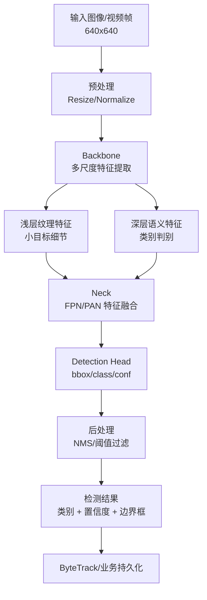
```mermaid
flowchart TB
    A[输入图像/视频帧<br/>640x640] --> B[预处理<br/>Resize/Normalize]
    B --> C[Backbone<br/>多尺度特征提取]
    C --> C1[浅层纹理特征<br/>小目标细节]
    C --> C2[深层语义特征<br/>类别判别]
    C1 --> D[Neck<br/>FPN/PAN 特征融合]
    C2 --> D
    D --> E[Detection Head<br/>bbox/class/conf]
    E --> F[后处理<br/>NMS/阈值过滤]
    F --> G[检测结果<br/>类别 + 置信度 + 边界框]
    G --> H[ByteTrack/业务持久化]
```

### 2.2 多目标跟踪与 ByteTrack

视频里，同一物品会连续出现在很多帧中。如果每一帧检测结果都写入数据库，记录会迅速膨胀；如果只看单帧，又无法判断目标是否真的稳定出现。ByteTrack 的思路是关联每个检测框，而不是只留下高置信度框。它先用高置信度框完成第一轮匹配，再用低置信度框找回被遮挡或模糊的轨迹，从而减少轨迹碎片<sup>[5]</sup>。

本系统在服务端拉流模式下调用 `model.track(..., tracker="bytetrack.yaml", persist=True)`，让检测结果带上 `track_id`。应用层继续维护 `track_id -> 连续出现帧数` 的内存计数。只有目标连续出现帧数达到阈值，系统才把它写入持久化流程。这样做能过滤一部分单帧误检，也能减轻短暂遮挡对历史记录的干扰。

### 2.3 WebSocket 推流与浏览器媒体采集

家庭摄像头常在内网里，公网服务器直接拉 RTSP 流会遇到可达性问题。本文因此设计了浏览器客户端推流模式。前端通过 `navigator.mediaDevices.getUserMedia` 请求摄像头权限，或读取本地视频文件；随后按固定分辨率把视频帧绘制到 Canvas，再用 `canvas.toBlob` 编码为 JPEG。前端通过 WebSocket 把二进制帧发送到后端 `/api/video/ws/push` 接口，后端完成单帧 YOLO 推理，返回带检测框的 Base64 图像和结构化检测列表。

这条链路不要求摄像头暴露公网地址，也能直接使用浏览器已有的设备权限。代价也清楚：每一帧推理互相独立，天然没有跨帧 TrackID。系统在推流模式下用写库节流和快照间隔控制数据库压力与磁盘占用。

## 3 系统需求分析

### 3.1 功能需求

系统面向智能家居场景，需要完成以下功能：

1. 实时物品检测：识别家庭画面中的椅子、沙发、电视、笔记本电脑、鼠标、遥控器、手机、书籍等 20 类物品。
2. 视频接入：支持网络流地址输入，也支持浏览器本地摄像头和本地视频文件推流。
3. 历史记录：将检测类别、置信度、归一化边界框、时间戳、摄像头标识和快照路径写入数据库。
4. 最后出现位置：维护每类物品最近一次出现的位置和快照，并提供快速查询。
5. 统计分析：按日期、小时和类别聚合检测次数，并以图表展示。
6. 系统初始化：首次部署后，用户可通过图形化页面配置 MySQL 连接并创建数据表。
7. 安全访问：通过管理员密码登录和 JWT Token 保护关键接口及 WebSocket 推流接口。

### 3.2 非功能需求

系统还应满足以下要求：

1. 实时性：视频流推理、检测结果返回和前端渲染应保持可交互，启动、停止和查询操作需要及时给出状态反馈。
2. 可部署性：前后端、推理服务和持久化目录可通过 Docker Compose 组织。
3. 可维护性：配置、路由、数据库模型、推理引擎和前端组件分模块管理。
4. 数据安全性：数据库密码不写入代码仓库；公网环境下，关键接口必须经过鉴权。
5. 存储可控性：检测快照需要生命周期清理机制，避免长时间运行后占满磁盘。

### 3.3 系统用例分析

从用户角色看，当前系统采用单管理员模式，主要参与者是“管理员/家庭用户”。从外部系统看，浏览器摄像头、网络摄像头或视频流、YOLO 推理引擎、MySQL 数据库共同构成业务闭环。核心用例包括登录认证、系统初始化、启动检测、客户端推流、实时监控、历史检索、统计分析和快照清理。

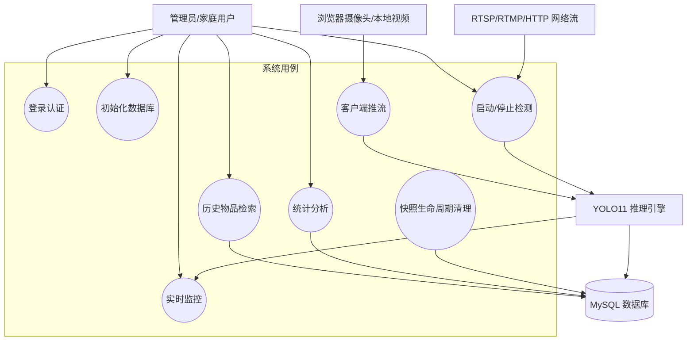
```mermaid
flowchart TB
    user[管理员/家庭用户]
    cam[浏览器摄像头/本地视频]
    netcam[RTSP/RTMP/HTTP 网络流]
    db[(MySQL 数据库)]
    yolo[YOLO11 推理引擎]

    subgraph UC[系统用例]
        direction TB
        login((登录认证))
        setup((初始化数据库))
        start((启动/停止检测))
        push((客户端推流))
        monitor((实时监控))
        search((历史物品检索))
        stats((统计分析))
        clean((快照生命周期清理))
    end

    user --> login
    user --> setup
    user --> start
    user --> monitor
    user --> search
    user --> stats
    cam --> push
    netcam --> start
    push --> yolo
    start --> yolo
    yolo --> monitor
    yolo --> db
    search --> db
    stats --> db
    clean --> db
```

### 3.4 业务流程分析

业务流程从登录开始。用户打开页面后，前端先检查本地是否已有 JWT Token；没有 Token 时，页面停在登录入口。用户输入管理员密码，后端校验 `ADMIN_PASSWORD`，校验通过后签发 24 小时有效的 Token。失败就停下。这里不进入检测流程，也不暴露历史检索和统计接口。

登录后，用户需要选视频源。系统把输入源分成三类：RTSP/RTMP/HTTP 网络流、本地摄像头、本地视频文件。网络流走后端拉流，用户填写地址后，FastAPI 把地址交给 OpenCV `VideoCapture`。如果地址无法打开，前端只显示错误状态，不启动推理线程。本地摄像头和本地视频走浏览器推流，前端先申请设备权限或读取文件，再把画面绘制到 640×480 的 Canvas。每 200 ms 截一帧。帧被压成 JPEG 后，经 WebSocket 发到 `/api/video/ws/push`。

两条检测链路的差别在跟踪。网络流由后端连续读取帧，调用 YOLO11 的 `track` 接口，并接入 ByteTrack，检测结果带 `track_id`。系统要求同一 `track_id` 连续出现 3 帧后才写库，短暂消失时计数减 1，不马上清空。浏览器推流只做单帧 `predict`，没有跨帧 ID。它适合快速接入，但不适合判断同一物品是否连续出现。

检测完成后，后端会把模型输出改成业务字段：英文类别、中文类别、置信度、像素框、归一化中心点、宽高和时间戳。随后绘制检测框，返回给前端。前端刷新视频画面、检测列表、FPS 和当前物品数。用户看到的是一帧带框图像；数据库里留下的是一条可查询记录。

写库不是每帧都写。系统设置 3 秒数据库写入间隔和 5 秒快照间隔。达到条件时，后端保存一张带检测框的快照，并写入 `detection_records`；同一类别的最后位置写入 `object_last_seen`；按日期、小时和类别累加的数据写入 `detection_stats`。如果没有达到写库间隔，系统只返回实时检测结果，不落库。这个处理会丢掉一部分高频重复帧，但能避免一分钟内刷出大量相同记录。

检索流程从数据库反向取数。用户在历史检索页输入“笔记本”时，后端先把中文关键词映射到 `laptop`，再查 `object_last_seen` 和 `detection_records`。统计页读取 `detection_stats`，按类别和小时生成图表。也就是说，实时检测和历史检索不是两个独立功能，中间靠三张表接住。

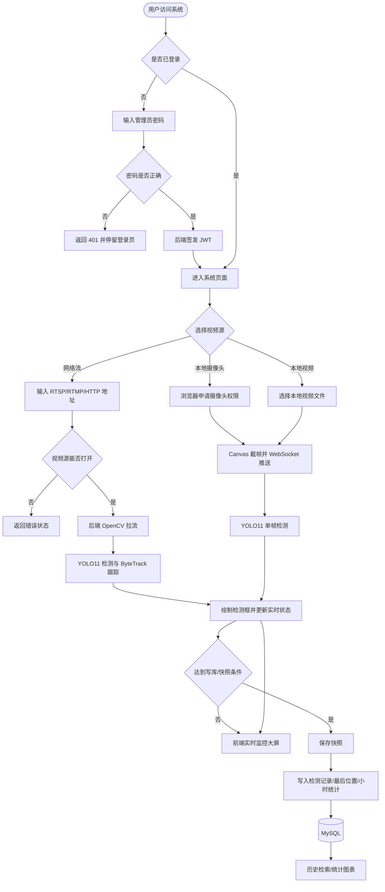
```mermaid
flowchart TD
    A([用户访问系统]) --> B{是否已登录}
    B -- 否 --> C[输入管理员密码]
    C --> C1{密码是否正确}
    C1 -- 否 --> C2[返回 401 并停留登录页]
    C1 -- 是 --> D[后端签发 JWT]
    D --> E[进入系统页面]
    B -- 是 --> E
    E --> F{选择视频源}
    F -- 网络流 --> G[输入 RTSP/RTMP/HTTP 地址]
    F -- 本地摄像头 --> H[浏览器申请摄像头权限]
    F -- 本地视频 --> I[选择本地视频文件]
    G --> G1{视频源能否打开}
    G1 -- 否 --> G2[返回错误状态]
    G1 -- 是 --> J[后端 OpenCV 拉流]
    H --> K[Canvas 截帧并 WebSocket 推送]
    I --> K
    J --> L[YOLO11 检测与 ByteTrack 跟踪]
    K --> M[YOLO11 单帧检测]
    L --> N[绘制检测框并更新实时状态]
    M --> N
    N --> O{达到写库/快照条件}
    O -- 否 --> R[前端实时监控大屏]
    O -- 是 --> O1[保存快照]
    O1 --> O2[写入检测记录/最后位置/小时统计]
    O2 --> P[(MySQL)]
    P --> Q[历史检索/统计图表]
    N --> R[前端实时监控大屏]
```

### 3.5 数据流分析

数据流的核心任务，是把非结构化视频帧转成结构化检测结果。输入包括网络视频流、浏览器 JPEG 帧和初始化配置；处理过程包括认证、推理、跟踪、去重和统计汇总；输出包括标注后画面、实时检测 JSON、历史记录、最后出现位置、统计图表和快照文件。

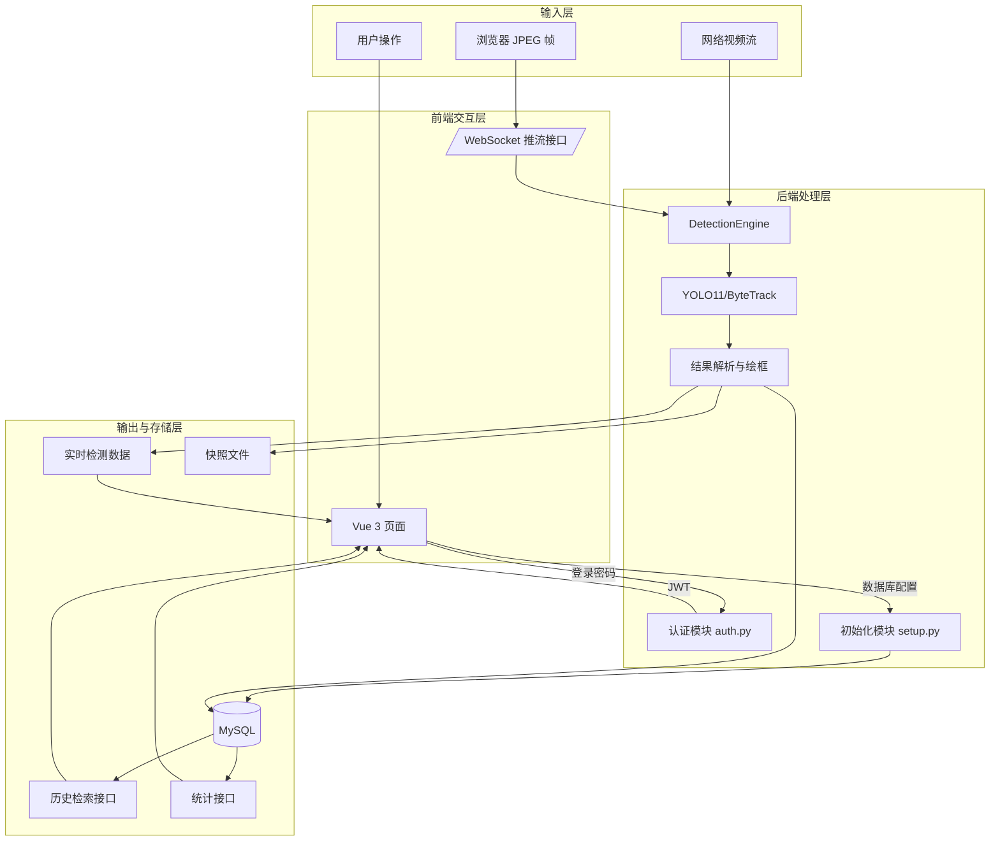
```mermaid
flowchart TB
    subgraph Input[输入层]
        U[用户操作]
        Cam1[网络视频流]
        Cam2[浏览器 JPEG 帧]
    end

    subgraph Front[前端交互层]
        A[Vue 3 页面]
        WS[/WebSocket 推流接口/]
    end

    subgraph Service[后端处理层]
        Auth[认证模块 auth.py]
        Setup[初始化模块 setup.py]
        Engine[DetectionEngine]
        Model[YOLO11/ByteTrack]
        Parse[结果解析与绘框]
    end

    subgraph Output[输出与存储层]
        Live[实时检测数据]
        Snapshot[快照文件]
        DB[(MySQL)]
        Search[历史检索接口]
        Stat[统计接口]
    end

    U --> A
    A -- 登录密码 --> Auth
    Auth -- JWT --> A
    A -- 数据库配置 --> Setup
    Setup --> DB
    Cam1 --> Engine
    Cam2 --> WS --> Engine
    Engine --> Model --> Parse
    Parse --> Live --> A
    Parse --> Snapshot
    Parse --> DB
    DB --> Search --> A
    DB --> Stat --> A
```

## 4 系统总体设计

### 4.1 总体架构

系统采用前后端分离的 B/S 架构，可划分为数据层、算法层、后端服务层、前端展示层和部署层。

数据层包括 SmartHome-COCO 数据集和 MySQL 数据库。前者用于模型训练，后者保存检测记录、最后出现位置和统计汇总。算法层包括 YOLO11 目标检测模型、ByteTrack 跟踪器和 OpenCV 图像处理逻辑。后端服务层基于 FastAPI，提供认证、检测、视频、统计、初始化和快照访问接口。前端展示层基于 Vue 3，提供实时监控大屏、历史检索页、统计分析页、登录页和初始化页。部署层使用 Dockerfile 与 Docker Compose 组织服务，并由 Nginx 托管前端静态资源、代理后端接口。

### 4.2 后端模块设计

后端包含以下模块：

1. `detection_engine.py`：系统核心推理引擎，负责模型加载、视频源打开、帧循环、YOLO 推理、ByteTrack 跟踪、检测框绘制、快照保存和数据库写入。
2. `models.py`：定义 `DetectionRecord`、`ObjectLastSeen` 和 `DetectionStat` 三张核心数据表。
3. `routers/video.py`：提供 MJPEG 视频流、实时检测 WebSocket、客户端推流 WebSocket、启动检测和停止检测接口。
4. `routers/detection.py`：提供类别列表、中文关键词检索、最后出现位置查询和历史记录分页查询接口。
5. `routers/stats.py`：提供概览统计、类别分布和时间分布接口。
6. `auth.py`：实现单管理员登录、JWT 签发、受保护 HTTP 接口依赖和客户端推流 WebSocket Token 校验。
7. `snapshot_cleaner.py`：后台定时清理超过保留天数的快照文件。

核心数据表如下：

| 表名 | 作用 | 关键字段 |
| --- | --- | --- |
| `detection_records` | 保存每次检测记录 | `object_class`、`confidence`、`bbox_x/y/w/h`、`track_id`、`snapshot_path`、`detected_at` |
| `object_last_seen` | 保存每类物品最后出现位置 | `object_class`、`last_bbox_x/y/w/h`、`last_snapshot_path`、`last_seen_at`、`total_count` |
| `detection_stats` | 保存小时级统计 | `stat_date`、`stat_hour`、`object_class`、`detection_count` |

### 4.3 前端模块设计

前端以 Vue 3 单页应用形式实现，主要页面如下：

1. `DashboardView.vue`：实时监控大屏，展示 FPS、当前物品数、今日累计检测、活跃物品种类、视频画面和检测列表。
2. `LocalStreamer.vue`：浏览器本地摄像头和本地视频推流组件，负责采集帧、编码 JPEG、发送 WebSocket、接收推理结果图。
3. `SearchView.vue`：历史物品检索页面，支持类别筛选、中文关键词查询和快照查看。
4. `StatsView.vue`：统计分析页面，使用 ECharts 展示类别分布和时间趋势。
5. `SetupView.vue`：系统初始化页面，用于配置数据库连接并完成建表。
6. `LoginView.vue`：管理员登录页面，登录后将 JWT Token 保存到本地，用于后续接口请求。

前端与后端的交互统一放在 `api/` 目录中的封装模块里，便于维护接口地址、Token 注入和异常处理逻辑。

### 4.4 系统功能结构设计

系统功能按“基础配置、视频感知、历史检索、统计展示、系统安全与运维”划分。基础配置处理数据库初始化和模型参数；视频感知接入不同视频来源并完成推理；历史检索查询最后出现位置和明细记录；统计展示把检测数据转成图表；安全与运维负责认证、快照清理和健康检查。

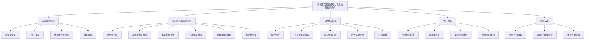
```mermaid
flowchart TD
    S[智能家居视觉感知与历史物品检索系统]
    S --> A[认证与初始化]
    S --> B[视频接入与实时检测]
    S --> C[历史物品检索]
    S --> D[统计分析]
    S --> E[系统运维]

    A --> A1[管理员登录]
    A --> A2[JWT 鉴权]
    A --> A3[数据库连接测试]
    A --> A4[自动建表]

    B --> B1[网络流拉取]
    B --> B2[本地摄像头推流]
    B --> B3[本地视频推流]
    B --> B4[YOLO11 推理]
    B --> B5[ByteTrack 跟踪]
    B --> B6[检测框渲染]

    C --> C1[类别列表]
    C --> C2[中文关键词搜索]
    C --> C3[最后出现位置]
    C --> C4[历史记录分页]
    C --> C5[快照查看]

    D --> D1[今日检测总量]
    D --> D2[活跃类别数]
    D --> D3[类别频次排行]
    D --> D4[小时级时间线]

    E --> E1[快照定时清理]
    E --> E2[Docker 健康检查]
    E --> E3[环境变量配置]
```

### 4.5 技术架构设计

系统采用前后端分离和容器化部署。前端由 Vue 3 构建单页应用，生产环境中由 Nginx 提供静态资源服务，并代理 `/api`、`/snapshots` 和 WebSocket 请求。后端由 FastAPI 提供 REST API、MJPEG 和 WebSocket 服务。推理部分调用 Ultralytics YOLO 与 OpenCV，持久化部分通过 SQLAlchemy 访问 MySQL。训练与评估脚本位于 `model_training/`，数据集处理脚本位于 `data_pipeline/`。

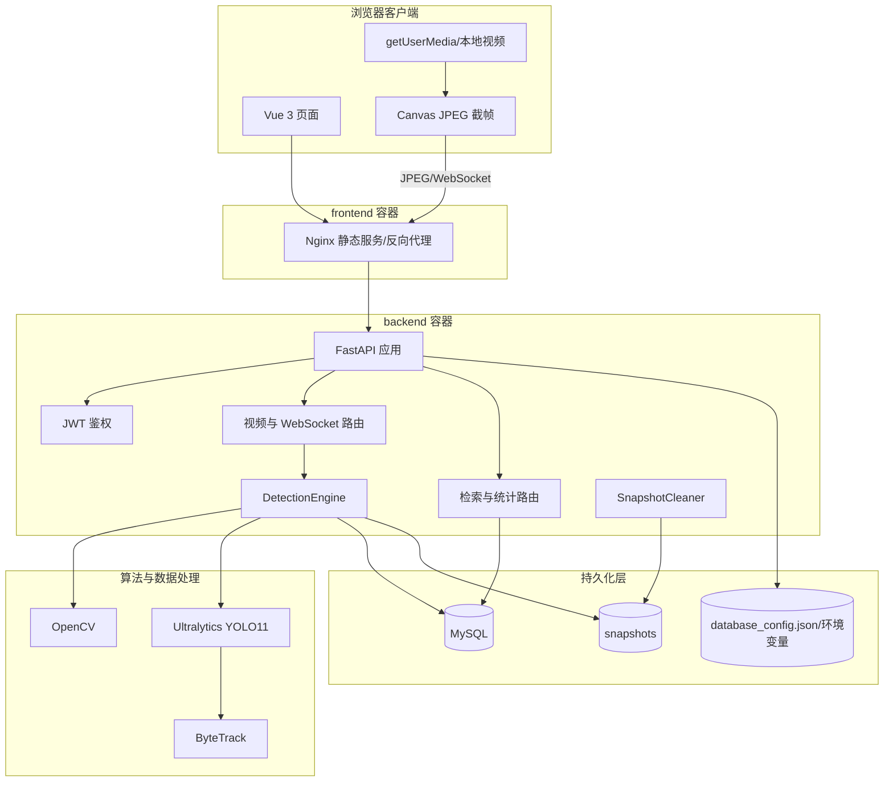
```mermaid
flowchart TB
    subgraph Client[浏览器客户端]
        UI[Vue 3 页面]
        Media[getUserMedia/本地视频]
        Canvas[Canvas JPEG 截帧]
    end

    subgraph Frontend[frontend 容器]
        Nginx[Nginx 静态服务/反向代理]
    end

    subgraph Backend[backend 容器]
        FastAPI[FastAPI 应用]
        Auth[JWT 鉴权]
        VideoAPI[视频与 WebSocket 路由]
        DetectAPI[检索与统计路由]
        Engine[DetectionEngine]
        Cleaner[SnapshotCleaner]
    end

    subgraph Algorithm[算法与数据处理]
        YOLO[Ultralytics YOLO11]
        Track[ByteTrack]
        OpenCV[OpenCV]
    end

    subgraph Storage[持久化层]
        MySQL[(MySQL)]
        Snap[(snapshots)]
        Config[(database_config.json/环境变量)]
    end

    UI --> Nginx
    Media --> Canvas
    Canvas -- JPEG/WebSocket --> Nginx
    Nginx --> FastAPI
    FastAPI --> Auth
    FastAPI --> VideoAPI
    FastAPI --> DetectAPI
    VideoAPI --> Engine
    Engine --> OpenCV
    Engine --> YOLO
    YOLO --> Track
    Engine --> MySQL
    Engine --> Snap
    DetectAPI --> MySQL
    Cleaner --> Snap
    FastAPI --> Config
```

### 4.6 数据库设计

数据库围绕三类数据组织：检测明细、最后出现位置、统计聚合。`detection_records` 保存每一次识别结果，便于追溯；`object_last_seen` 保存每个类别的最新位置，便于快速回答“某物品最后出现在哪里”；`detection_stats` 保存小时级聚合结果，前端图表读取时不必重新扫描明细表。当前系统是单摄像头演示场景，`object_last_seen.object_class` 设置为唯一字段。若扩展到多摄像头，唯一约束应改为 `(camera_id, object_class)`。

数据库 E-R 图如下。

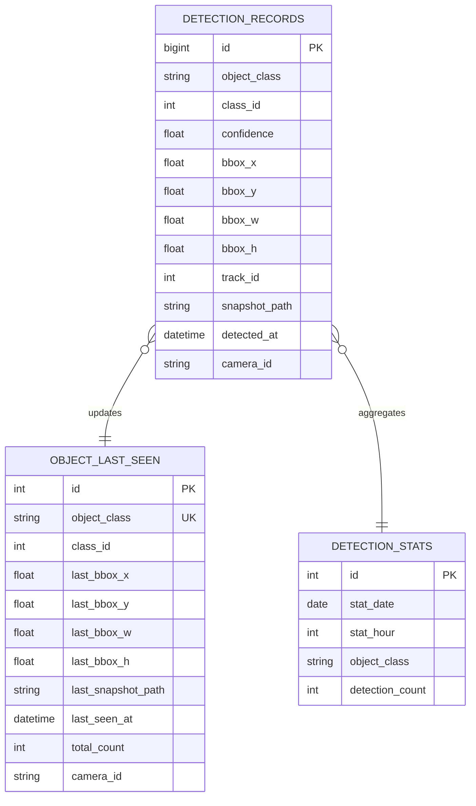
```mermaid
erDiagram
    DETECTION_RECORDS {
        bigint id PK
        string object_class
        int class_id
        float confidence
        float bbox_x
        float bbox_y
        float bbox_w
        float bbox_h
        int track_id
        string snapshot_path
        datetime detected_at
        string camera_id
    }
    OBJECT_LAST_SEEN {
        int id PK
        string object_class UK
        int class_id
        float last_bbox_x
        float last_bbox_y
        float last_bbox_w
        float last_bbox_h
        string last_snapshot_path
        datetime last_seen_at
        int total_count
        string camera_id
    }
    DETECTION_STATS {
        int id PK
        date stat_date
        int stat_hour
        string object_class
        int detection_count
    }
    DETECTION_RECORDS }o--|| OBJECT_LAST_SEEN : updates
    DETECTION_RECORDS }o--|| DETECTION_STATS : aggregates
```

数据库表结构图如下，字段说明见表。

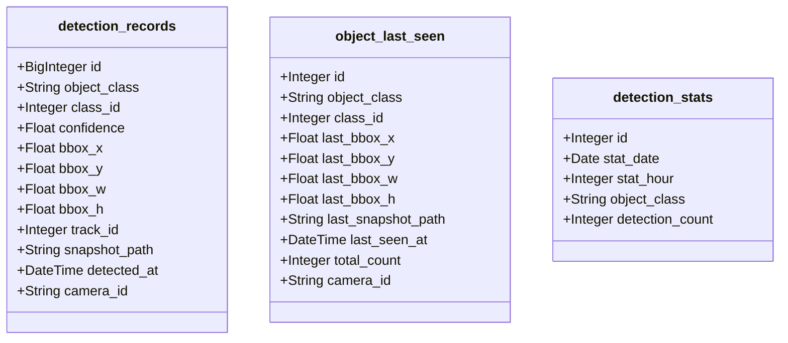
```mermaid
classDiagram
    class detection_records {
        +BigInteger id
        +String object_class
        +Integer class_id
        +Float confidence
        +Float bbox_x
        +Float bbox_y
        +Float bbox_w
        +Float bbox_h
        +Integer track_id
        +String snapshot_path
        +DateTime detected_at
        +String camera_id
    }
    class object_last_seen {
        +Integer id
        +String object_class
        +Integer class_id
        +Float last_bbox_x
        +Float last_bbox_y
        +Float last_bbox_w
        +Float last_bbox_h
        +String last_snapshot_path
        +DateTime last_seen_at
        +Integer total_count
        +String camera_id
    }
    class detection_stats {
        +Integer id
        +Date stat_date
        +Integer stat_hour
        +String object_class
        +Integer detection_count
    }
```

| 表名 | 字段 | 类型 | 约束/说明 |
| --- | --- | --- | --- |
| `detection_records` | `id` | BigInteger | 主键，自增 |
| `detection_records` | `object_class` | String(50) | 物品英文类别，索引 |
| `detection_records` | `class_id` | Integer | YOLO 类别编号 |
| `detection_records` | `confidence` | Float | 检测置信度 |
| `detection_records` | `bbox_x/y/w/h` | Float | 归一化边界框中心与宽高 |
| `detection_records` | `track_id` | Integer | ByteTrack ID，可为空 |
| `detection_records` | `snapshot_path` | String(255) | 截帧快照路径，可为空 |
| `detection_records` | `detected_at` | DateTime | 检测时间，建立类别-时间联合索引 |
| `detection_records` | `camera_id` | String(50) | 摄像头标识 |
| `object_last_seen` | `id` | Integer | 主键，自增 |
| `object_last_seen` | `object_class` | String(50) | 物品英文类别，当前为唯一约束 |
| `object_last_seen` | `class_id` | Integer | YOLO 类别编号 |
| `object_last_seen` | `last_bbox_x/y/w/h` | Float | 最近一次出现边界框 |
| `object_last_seen` | `last_snapshot_path` | String(255) | 最近一次出现快照 |
| `object_last_seen` | `last_seen_at` | DateTime | 最近一次出现时间，建立索引 |
| `object_last_seen` | `total_count` | Integer | 累计出现次数 |
| `object_last_seen` | `camera_id` | String(50) | 摄像头标识 |
| `detection_stats` | `id` | Integer | 主键，自增 |
| `detection_stats` | `stat_date` | Date | 统计日期 |
| `detection_stats` | `stat_hour` | Integer | 统计小时 |
| `detection_stats` | `object_class` | String(50) | 物品英文类别 |
| `detection_stats` | `detection_count` | Integer | 检测次数 |
| `detection_stats` | `(stat_date, stat_hour, object_class)` | UniqueConstraint | 防止同一小时同一类别重复聚合 |

## 5 数据集构建与模型训练

### 5.1 SmartHome-COCO 数据集构建

SmartHome-COCO 不是重新采集的数据集，而是从 COCO 2017 中切出的家居子集。脚本只保留包含目标类别的图像，`iscrowd=True` 的实例不参与转换。本文选取 20 类物品：

`chair`、`couch`、`potted plant`、`bed`、`dining table`、`toilet`、`tv`、`laptop`、`mouse`、`remote`、`keyboard`、`cell phone`、`microwave`、`oven`、`toaster`、`sink`、`refrigerator`、`book`、`clock`、`vase`。

SmartHome-COCO 采用 YOLO 标注格式组织。转换后规模如下。

| 数据划分 | 图片数量 | 标签文件数量 | 目标实例数量 |
| --- | ---: | ---: | ---: |
| 训练集 | 44166 | 44166 | 154967 |
| 验证集 | 1899 | 1899 | 6962 |

数据分布不均。`chair`、`book`、`dining table` 的实例较多；`toaster` 样本少，验证集中只有 9 个实例。后面的类别 AP 差异，和这个长尾分布有直接关系。

数据处理脚本 `data_pipeline.py` 的执行步骤比较硬。先检查 `coco2017/annotations`、`train2017`、`val2017` 是否存在；再用 `pycocotools` 读取 `instances_train2017.json` 和 `instances_val2017.json`；随后按 20 个类别取图像 ID，去重后复制图像。每个 COCO 框 `[x_min, y_min, width, height]` 被转换成 YOLO 格式 `[class_id, center_x, center_y, width, height]`，坐标保留 6 位小数。输出目录固定为 `data_pipeline/SmartHome_COCO/images/train`、`images/val`、`labels/train` 和 `labels/val`。类别顺序按 `TARGET_CLASSES` 写死，与后端 `config.py` 中的 `CLASS_NAMES` 对齐。

图 5-1 展示数据集构建流程。这里最容易出错的是类别编号漂移：训练时第 7 类如果是 `tv`，后端映射也必须把第 7 类解释成 `tv`。

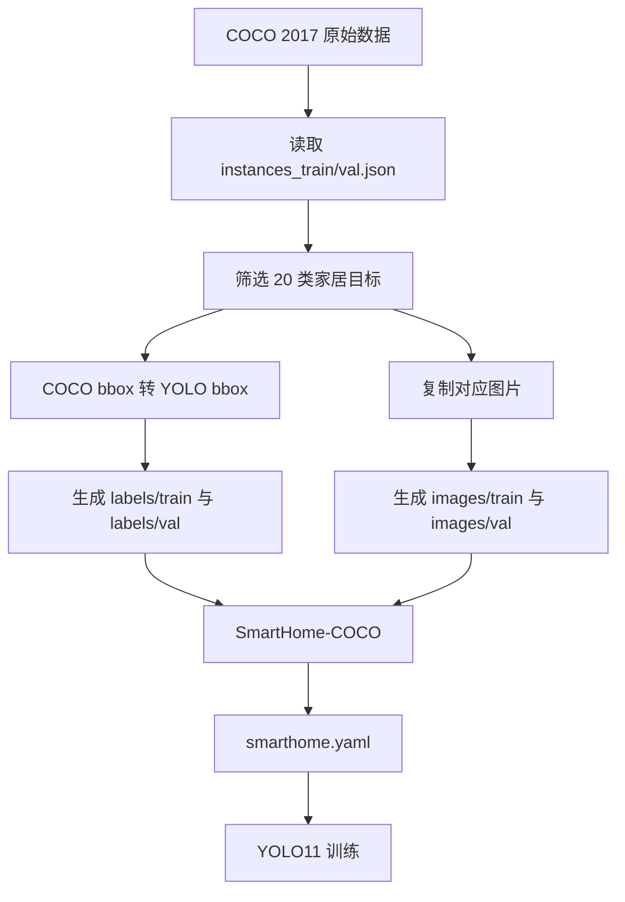
```mermaid
flowchart TB
    A[COCO 2017 原始数据] --> B[读取 instances_train/val.json]
    B --> C[筛选 20 类家居目标]
    C --> D[复制对应图片]
    C --> E[COCO bbox 转 YOLO bbox]
    E --> F[生成 labels/train 与 labels/val]
    D --> G[生成 images/train 与 images/val]
    F --> H[SmartHome-COCO]
    G --> H
    H --> I[smarthome.yaml]
    I --> J[YOLO11 训练]
```

训练过程中生成的数据集标签分布图和训练样例图如下，用来查看类别覆盖、目标尺寸分布和标注格式。

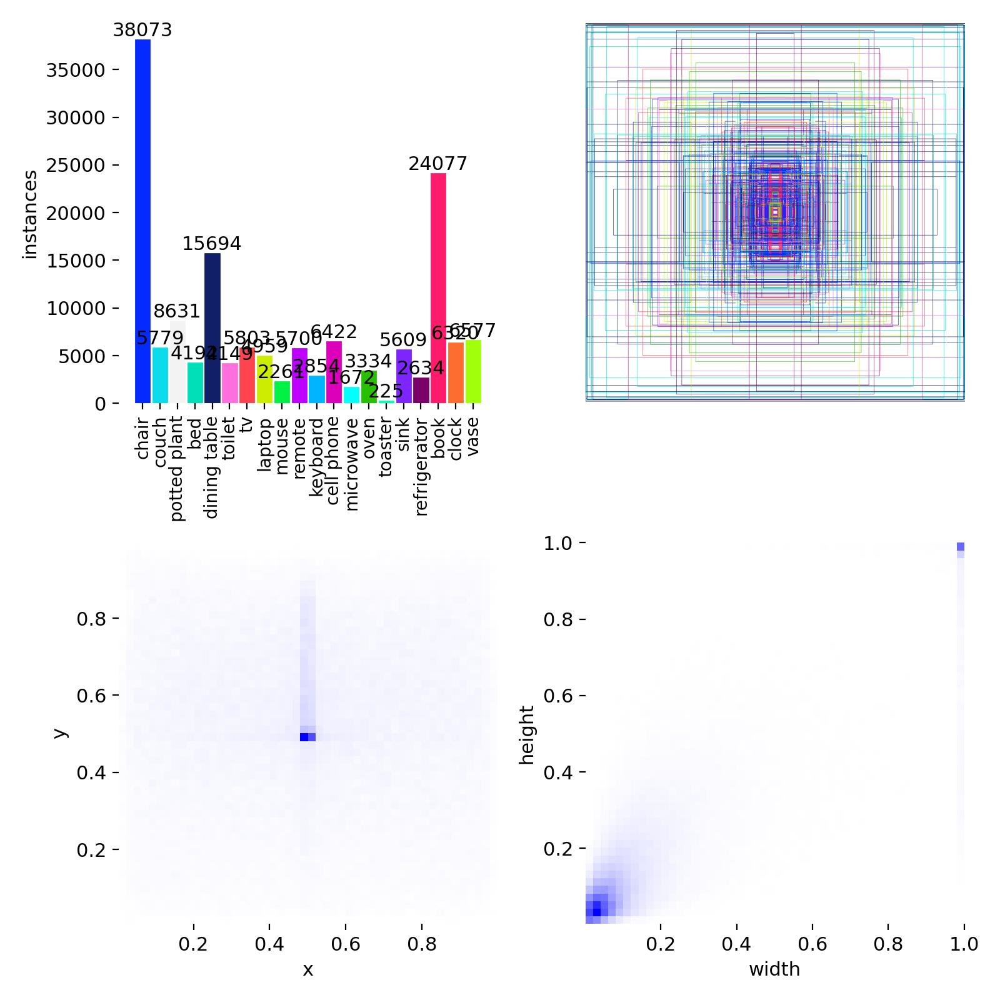

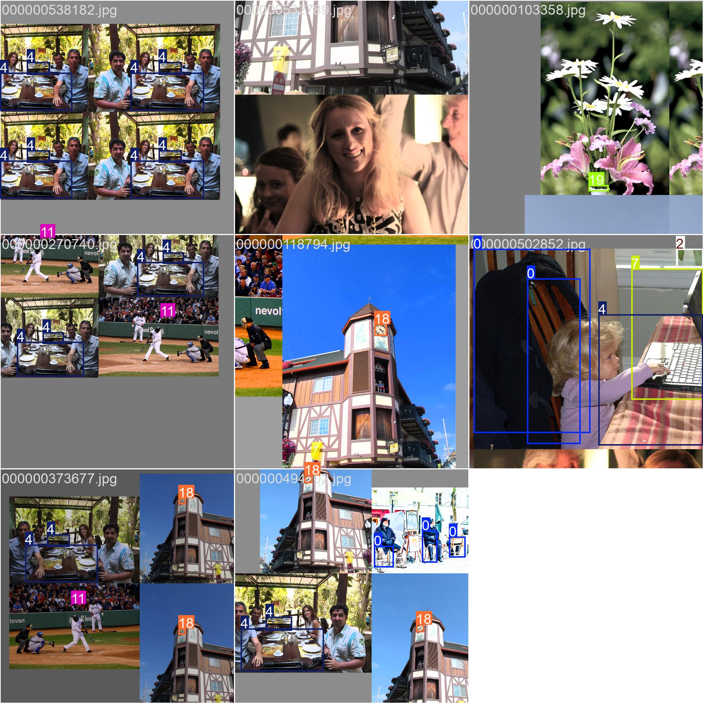

### 5.2 模型训练配置

训练脚本使用 Ultralytics `YOLO` Python API。模型从 `yolo11s.pt` 预训练权重开始，训练配置为 `epochs=100`、`imgsz=640`、`batch=16`、`device="0,1"`、`workers=4`、`save_period=10`、`amp=True`。没有使用梯度累加；如果单卡显存不足，脚本注释中给出的处理方式是把 `batch` 从 16 降到 8。训练结果写入 `results-01/runs/train_smarthome_s`，部署时加载其中的 `weights/best.pt`。

推理配置写在后端 `config.py` 中：`CONFIDENCE_THRESHOLD=0.25`、`IOU_THRESHOLD=0.5`、`INPUT_SIZE=640`、`DEVICE="0"`。拉流跟踪器为 `bytetrack.yaml`，目标连续出现 3 帧后才允许持久化；数据库写入最小间隔为 3 秒，快照保存最小间隔为 5 秒，快照默认保留 7 天。训练和部署用同一套类别顺序，避免出现“模型检出第 11 类，前端显示成另一个物品”的错误。

模型训练与验证流程如图 5-2 所示。训练阶段读取 `data_pipeline/smarthome.yaml`；复评阶段的脚本 `model_training/val.py` 使用 `data_pipeline/smarthome_coco.yaml`，以 `imgsz=640`、`batch=16` 运行，并保存 JSON、混淆矩阵、PR 曲线和 F1 曲线。

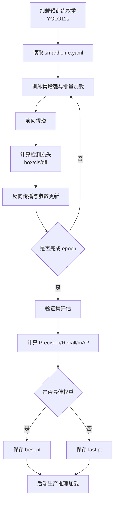
```mermaid
flowchart TD
    A[加载预训练权重<br/>YOLO11s] --> B[读取 smarthome.yaml]
    B --> C[训练集增强与批量加载]
    C --> D[前向传播]
    D --> E[计算检测损失<br/>box/cls/dfl]
    E --> F[反向传播与参数更新]
    F --> G{是否完成 epoch}
    G -- 否 --> C
    G -- 是 --> H[验证集评估]
    H --> I[计算 Precision/Recall/mAP]
    I --> J{是否最佳权重}
    J -- 是 --> K[保存 best.pt]
    J -- 否 --> L[保存 last.pt]
    K --> M[后端生产推理加载]
    L --> M
```

### 5.3 训练结果

根据 `results-01/runs/train_smarthome_s/results.csv`，训练日志记录至第 66 轮。第 66 轮也是 mAP@0.5 与 mAP@0.5:0.95 的最高轮次，主要指标如下：

| 指标 | 数值 |
| --- | ---: |
| Precision | 0.67572 |
| Recall | 0.61442 |
| mAP@0.5 | 0.65508 |
| mAP@0.5:0.95 | 0.48428 |

训练日志显示，第 66 轮达到本次训练中的最高 mAP 记录。mAP@0.5 为 0.65508，mAP@0.5:0.95 为 0.48428。第 56 轮到第 66 轮，mAP@0.5 只增加 0.00702，mAP@0.5:0.95 增加 0.00696，验证集 box loss 下降 0.00303。曲线已经变平，再继续跑满 100 轮的收益不一定大。这里不排除早停或训练中断的情况，论文中按现有日志记录分析第 66 轮。

复评在本地 CPU 环境运行 `model_training/val.py`。输入为 SmartHome-COCO 验证集，共 1899 张图片、6962 个实例；验证参数为 `imgsz=640`、`batch=16`、`save_json=True`、`plots=True`。复评结果如下：

| 指标 | 数值 |
| --- | ---: |
| Precision | 0.6775 |
| Recall | 0.6144 |
| mAP@0.5 | 0.6552 |
| mAP@0.5:0.95 | 0.4849 |

验证阶段生成混淆矩阵、归一化混淆矩阵、PR 曲线、F1 曲线和验证集预测样例。混淆矩阵用于看类别之间的误检；PR 曲线用于看置信度阈值变化时查准率和召回率如何拉扯；F1 曲线用于观察当前 `conf=0.25` 是否偏保守。

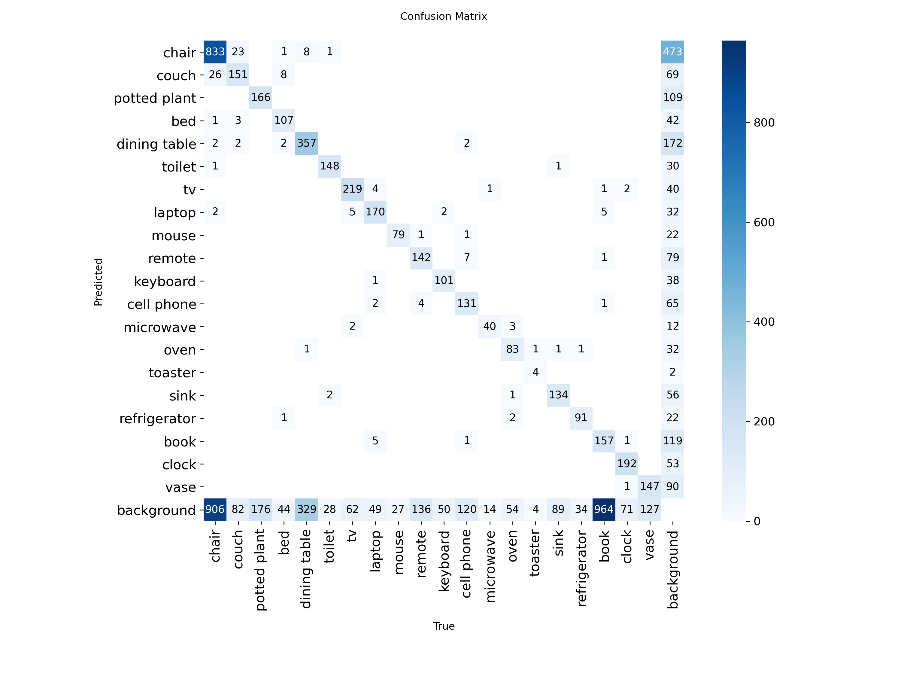

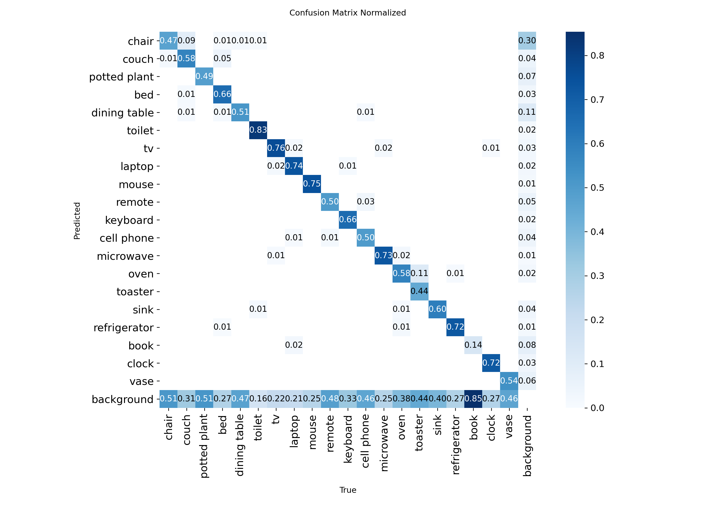

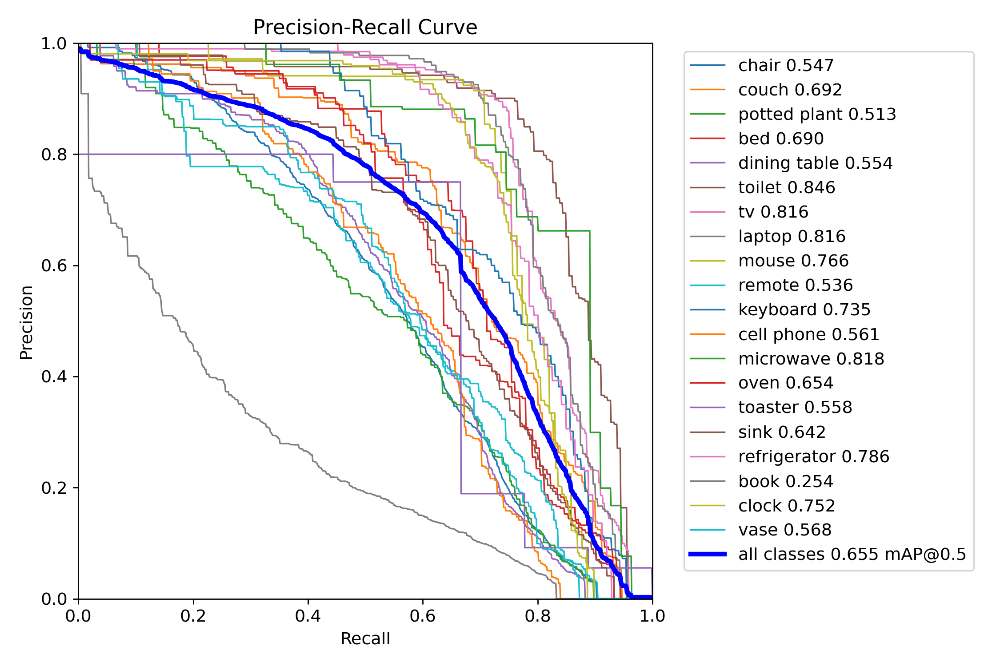

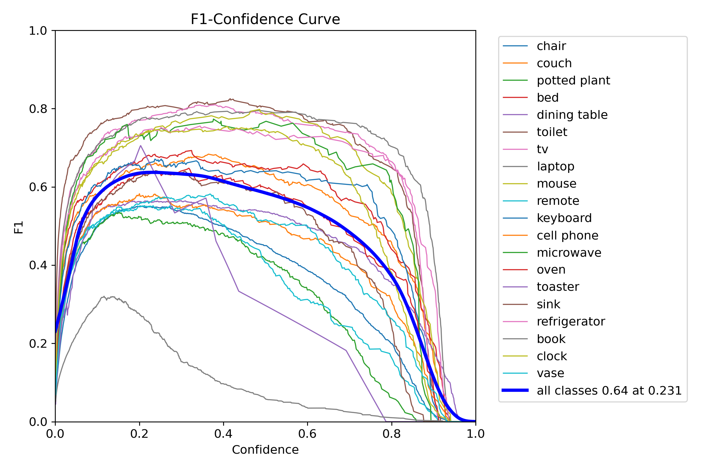

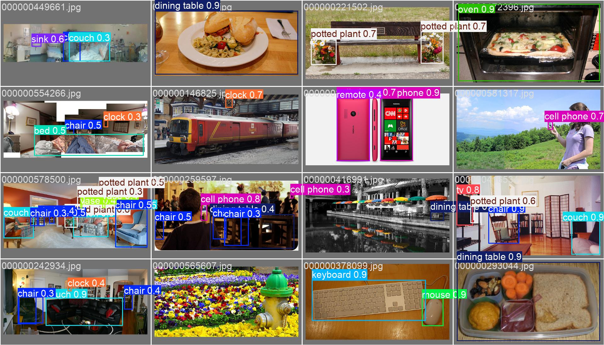

YOLO11s 每类 AP 指标如下。

| 类别 | AP@0.5 | AP@0.5:0.95 |
| --- | ---: | ---: |
| chair | 0.5471 | 0.3584 |
| couch | 0.6917 | 0.5365 |
| potted plant | 0.5130 | 0.3142 |
| bed | 0.6897 | 0.5269 |
| dining table | 0.5541 | 0.4130 |
| toilet | 0.8459 | 0.6796 |
| tv | 0.8161 | 0.6336 |
| laptop | 0.8163 | 0.6838 |
| mouse | 0.7661 | 0.5930 |
| remote | 0.5364 | 0.3406 |
| keyboard | 0.7350 | 0.5585 |
| cell phone | 0.5615 | 0.3952 |
| microwave | 0.8180 | 0.6692 |
| oven | 0.6537 | 0.4655 |
| toaster | 0.5580 | 0.3906 |
| sink | 0.6419 | 0.4285 |
| refrigerator | 0.7859 | 0.6466 |
| book | 0.2541 | 0.1373 |
| clock | 0.7516 | 0.5307 |
| vase | 0.5679 | 0.3967 |

类别级结果不齐。`toilet` 的 AP@0.5 为 0.8459，`laptop` 为 0.8163，`microwave` 为 0.8180，这类目标形态相对固定，画面中通常也不太小。`book` 只有 0.2541，是最低点。推测原因有三种：书在 COCO 图像中常被成排摆放，边界框密集；单本书和书架背景纹理相近；小尺寸书脊在 640 输入下容易被压成少量像素。`toaster` 的验证实例只有 9 个，但 AP@0.5 达到 0.5580，这个数值不宜过度解释，样本量太小会放大偶然性。

本文还运行 `model_training/benchmark.py`，在同一验证集上比较 YOLO11n 与 YOLO11s，结果如下：

| 指标 | YOLO11n | YOLO11s |
| --- | ---: | ---: |
| 参数量 | 2.59M | 9.44M |
| 文件大小 | 15.2 MB | 54.4 MB |
| Precision | 0.6964 | 0.6775 |
| Recall | 0.5230 | 0.6144 |
| mAP@0.5 | 0.6013 | 0.6552 |
| mAP@0.5:0.95 | 0.4384 | 0.4849 |
| 评估耗时 | 109.7s | 275.7s |

对比里出现一个小反常：YOLO11s 的 Precision 为 0.6775，低于 YOLO11n 的 0.6964，但 Recall 从 0.5230 升到 0.6144。也就是说，YOLO11s 倾向于多找出一些目标，同时带来少量误检。历史检索场景更怕漏掉“最后一次出现”，所以本文选择 YOLO11s。代价是 CPU 复评耗时从 109.7 s 增加到 275.7 s，权重文件从 15.2 MB 增加到 54.4 MB。若后续部署 GPU、TensorRT 或 ONNX Runtime，绝对耗时会改变；不过在同一 CPU 环境下，YOLO11s 更重这一点不会消失。

## 6 系统实现

### 6.1 服务端拉流检测流程

服务端拉流模式由 `DetectionEngine.start()` 启动。系统先判断输入源是网络流还是视频文件，再使用 OpenCV `VideoCapture` 打开视频源。每一帧进入模型前不单独做人工裁剪，推理阶段统一使用 `imgsz=640`。核心调用如下：

```python
results = self.model.track(
    frame,
    conf=config.CONFIDENCE_THRESHOLD,
    iou=config.IOU_THRESHOLD,
    imgsz=config.INPUT_SIZE,
    tracker=config.TRACKER_TYPE,
    persist=True,
    verbose=False
)
```

`_parse_results()` 读取 `boxes.cls`、`boxes.conf`、`boxes.xyxy` 和 `boxes.id`，整理出类别 ID、英文类别、中文类别、置信度、像素坐标、归一化中心点与宽高、`track_id`。`_draw_detections()` 在帧上写入边界框、中文标签、置信度和 FPS。MJPEG 输出使用 JPEG 质量 80；客户端推流回传图像使用 JPEG 质量 75。

持久化不按帧无脑写入。系统维护每个 `track_id` 的计数；目标在当前帧消失时，计数减 1，减到 0 才删除。这样可以容忍 25 FPS 视频中的单帧漏检。达到 `TRACK_PERSIST_FRAMES=3` 后才允许写库。写库全局最小间隔为 `DB_WRITE_INTERVAL=3` 秒，快照最小间隔为 `SNAPSHOT_INTERVAL=5` 秒。数据库操作放到 `daemon=True` 的后台线程中执行，避免一次 MySQL 写入阻塞下一帧推理。

图 6-1 展示模型推理结果到业务数据的转换流程。YOLO 输出的原始张量先经过类别映射、坐标归一化、中文名称补全、跟踪 ID 读取、稳定性判断和节流控制，再进入 `detection_records`、`object_last_seen` 和 `detection_stats`。

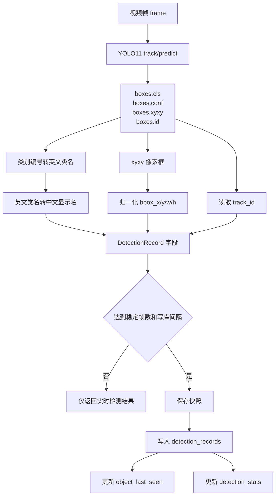
```mermaid
flowchart TB
    A[视频帧 frame] --> B[YOLO11 track/predict]
    B --> C[boxes.cls<br/>boxes.conf<br/>boxes.xyxy<br/>boxes.id]
    C --> D[类别编号转英文类名]
    D --> E[英文类名转中文显示名]
    C --> F[xyxy 像素框]
    F --> G[归一化 bbox_x/y/w/h]
    C --> H[读取 track_id]
    E --> I[DetectionRecord 字段]
    G --> I
    H --> I
    I --> J{达到稳定帧数和写库间隔}
    J -- 否 --> K[仅返回实时检测结果]
    J -- 是 --> L[保存快照]
    L --> M[写入 detection_records]
    M --> N[更新 object_last_seen]
    M --> O[更新 detection_stats]
```

### 6.2 客户端推流检测流程

客户端推流模式由 `LocalStreamer.vue` 实现。摄像头模式调用 `navigator.mediaDevices.getUserMedia({ video: { width: 640, height: 480 } })`；本地视频模式读取用户选择的视频文件，并交给 `<video>` 元素播放。采集定时器固定为 200 ms，也就是约 5 FPS。每次采集时，前端把画面绘制到 640×480 Canvas，再以 JPEG 质量 0.75 编码为 Blob，经 WebSocket 二进制消息发送给后端。

后端 `/api/video/ws/push` 接口先读取 query 参数中的 JWT Token。Token 无效时直接拒绝连接。收到 JPEG 字节后，`infer_single_frame()` 使用 `cv2.imdecode` 解码，再调用 `model.predict(conf=0.25, iou=0.5, imgsz=640)`。推流模式不调用 `track`，避免与拉流引擎的跟踪状态混在一起。缺点也很明确：没有 TrackID，所有检出物品只能按类别节流写库。因此推流模式更适合临时演示和公网接入，不适合做精细轨迹分析。

### 6.3 历史检索与统计实现

历史检索围绕 `object_last_seen` 和 `detection_records` 两张表实现。用户可按英文类别或中文关键词查询物品最后出现位置。例如输入“笔记本”时，后端先在中文映射表中匹配 `laptop`，再查询该类别在 `object_last_seen` 中的最新记录。历史记录接口支持按类别、起止时间和分页参数查询 `detection_records`，便于展示某类物品在一段时间内的出现轨迹。

统计模块通过 `detection_stats` 表维护小时级聚合数据。每次写入检测记录时，后端同步更新当前日期、当前小时和当前类别对应的检测次数。前端统计页用图表展示类别分布和时间趋势，用户可以看到不同时间段里哪些物品更常出现。

### 6.4 安全与部署实现

系统加入单管理员 JWT 鉴权。登录接口校验环境变量 `ADMIN_PASSWORD` 指定的管理员密码并签发 Token；启动检测、停止检测、状态查询、历史检索、统计分析和系统初始化等受保护 HTTP 接口通过 `Authorization: Bearer <token>` 访问；客户端推流接口 `/api/video/ws/push` 通过 query 参数传递 Token，并调用 `verify_ws_token()` 校验。当前代码中的 MJPEG 实时画面接口和实时状态广播 WebSocket 主要服务同域前端展示，接口内部未单独校验 Token。若部署到公网，应在反向代理层增加访问控制，或在接口中补充鉴权。数据库密码处理上，系统优先读取 `DB_PASSWORD` 环境变量；初始化页面输入的密码只保存在运行时内存，避免继续向 JSON 文件明文写入敏感信息。

部署方面，系统使用 `Dockerfile.backend`、`Dockerfile.frontend` 和 `docker-compose.yml`。后端容器挂载 `backend/data` 与 `backend/snapshots`，用于持久化配置和快照。前端容器由 Nginx 托管，监听 `10080` 端口。Compose 文件为前后端配置 healthcheck：后端访问 `/api/health` 检查服务状态，前端通过 `wget --spider` 检查 Nginx 静态服务是否可用。

本文系统的完整代码已托管至 GitHub 仓库，作为项目源码、训练脚本、前后端实现和部署配置的统一存储位置。仓库地址为：`https://github.com/xez014/yolo-smarthome`。

### 6.5 核心类与模块关系设计

系统后端采用按模块组织的设计。`DetectionEngine` 是运行时核心单例对象；路由层负责输入校验和接口暴露；模型层负责数据库实体映射；认证模块负责 Token 生成与验证。前端页面通过 API 封装模块访问后端，实时推流组件通过 WebSocket 与视频路由交互。为避免单张类图过于拥挤，本文将后端模块关系和核心数据实体分开表示。

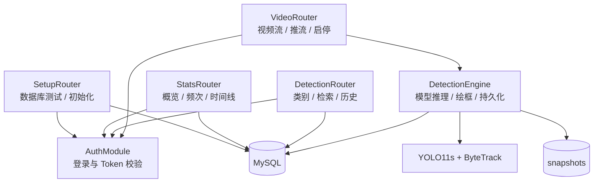
```mermaid
flowchart TB
    Auth[AuthModule<br/>登录与 Token 校验]
    Video[VideoRouter<br/>视频流 / 推流 / 启停]
    Detect[DetectionRouter<br/>类别 / 检索 / 历史]
    Stats[StatsRouter<br/>概览 / 频次 / 时间线]
    Setup[SetupRouter<br/>数据库测试 / 初始化]
    Engine[DetectionEngine<br/>模型推理 / 绘框 / 持久化]
    Model[YOLO11s + ByteTrack]
    DB[(MySQL)]
    Snap[(snapshots)]

    Video --> Auth
    Detect --> Auth
    Stats --> Auth
    Setup --> Auth
    Video --> Engine
    Engine --> Model
    Engine --> DB
    Engine --> Snap
    Detect --> DB
    Stats --> DB
    Setup --> DB
```

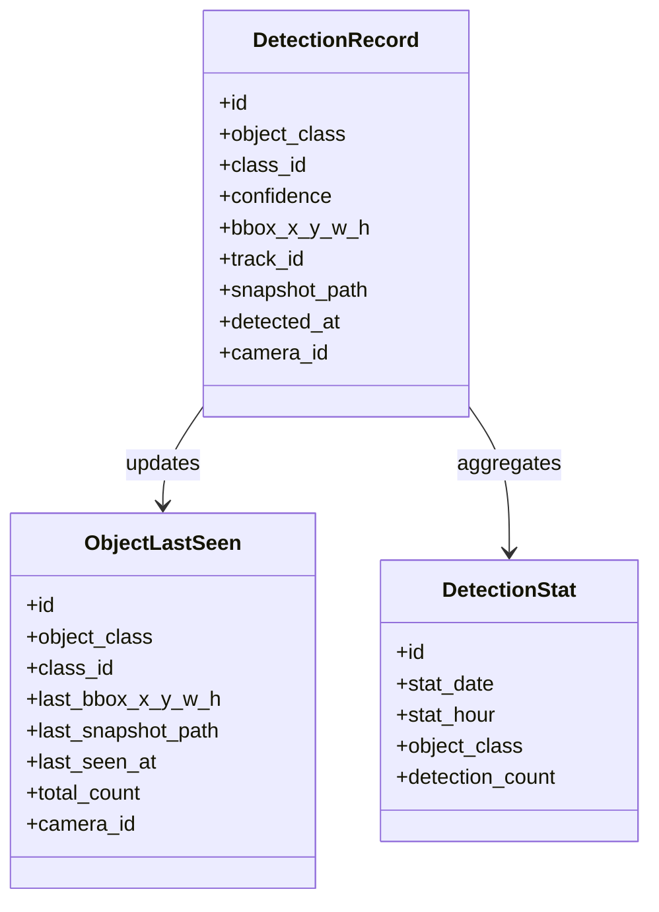
```mermaid
classDiagram
    class DetectionRecord {
        +id
        +object_class
        +class_id
        +confidence
        +bbox_x_y_w_h
        +track_id
        +snapshot_path
        +detected_at
        +camera_id
    }

    class ObjectLastSeen {
        +id
        +object_class
        +class_id
        +last_bbox_x_y_w_h
        +last_snapshot_path
        +last_seen_at
        +total_count
        +camera_id
    }

    class DetectionStat {
        +id
        +stat_date
        +stat_hour
        +object_class
        +detection_count
    }

    DetectionRecord --> ObjectLastSeen : updates
    DetectionRecord --> DetectionStat : aggregates
```

### 6.6 关键时序设计

客户端推流模式最能体现本系统的交互特点。对用户而言，这一过程表现为“选择摄像头或本地视频后点击启动检测”，系统随后持续在页面中返回带检测框的画面；对系统内部而言，它实际上是一条由浏览器、WebSocket 接口、检测引擎、YOLO11 模型、数据库和快照目录共同参与的连续处理链路。该模式的设计重点不是让后端主动去访问用户家中的摄像头，而是由浏览器把已经获得授权的视频帧主动推送给服务器，因此能够避开公网服务器难以直接访问家庭内网摄像头的问题，也更适合临时演示和普通用户的本地设备接入。

在时序上，前端首先完成用户交互和视频采集：用户点击启动检测后，`LocalStreamer` 组件会调用 `getUserMedia` 获取摄像头画面，或者读取用户选择的本地视频文件。随后前端携带登录后获得的 JWT Token 建立 WebSocket 连接，后端在连接建立阶段完成身份校验，避免未登录用户直接推送视频帧。连接通过后，前端不直接上传完整视频文件，而是以约 200 ms 一次的节奏从 Canvas 中截取当前帧，将其编码为 JPEG 二进制数据发送到后端。这样既能保持实时交互，又能控制网络传输和服务器推理压力。

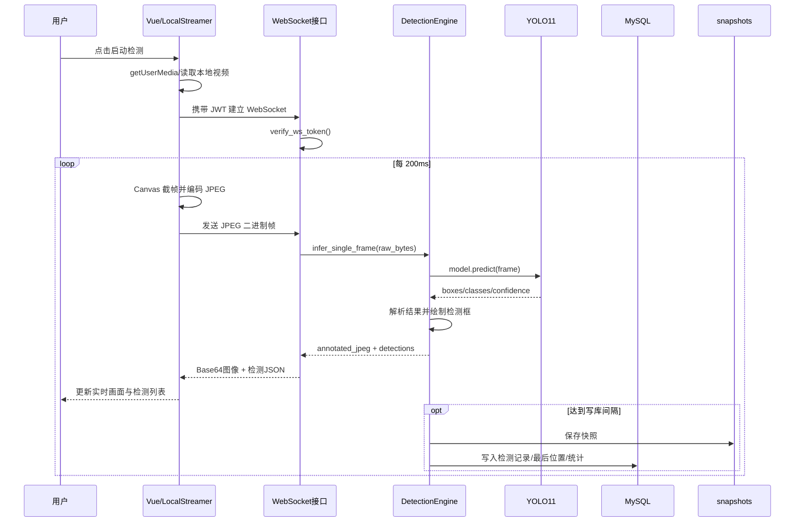
```mermaid
sequenceDiagram
    participant U as 用户
    participant V as Vue/LocalStreamer
    participant W as WebSocket接口
    participant E as DetectionEngine
    participant M as YOLO11
    participant D as MySQL
    participant S as snapshots

    U->>V: 点击启动检测
    V->>V: getUserMedia/读取本地视频
    V->>W: 携带 JWT 建立 WebSocket
    W->>W: verify_ws_token()
    loop 每 200ms
        V->>V: Canvas 截帧并编码 JPEG
        V->>W: 发送 JPEG 二进制帧
        W->>E: infer_single_frame(raw_bytes)
        E->>M: model.predict(frame)
        M-->>E: boxes/classes/confidence
        E->>E: 解析结果并绘制检测框
        E-->>W: annotated_jpeg + detections
        W-->>V: Base64图像 + 检测JSON
        V-->>U: 更新实时画面与检测列表
        opt 达到写库间隔
            E->>S: 保存快照
            E->>D: 写入检测记录/最后位置/统计
        end
    end
```

后端收到单帧图像后，先把 JPEG 字节解码为可供 OpenCV 和模型处理的图像矩阵，再交由 `DetectionEngine` 调用 YOLO11 模型进行推理。模型返回的结果包括目标类别、置信度和边界框坐标，检测引擎会把这些结果转换为前端可读的检测列表，并在图像上绘制标注框。处理完成后，WebSocket 接口把标注后的图像以 Base64 形式返回给前端，同时返回结构化的检测 JSON，前端据此刷新实时画面和右侧检测结果列表。用户看到的是连续变化的检测画面，而系统内部实际是一帧一帧地完成“接收、推理、绘制、返回”的循环。

为了避免数据库被高频视频帧写入拖慢，系统没有把每一帧的检测结果都立即保存，而是设置了写库间隔和快照保存间隔。只有达到持久化条件时，检测引擎才会把检测记录写入 `detection_records`，更新 `object_last_seen` 中对应物品的最后出现位置，并同步累计统计数据；如果达到快照间隔，还会把当前标注帧保存到 `snapshots` 目录，供历史检索页面展示。这样的设计兼顾了用户体验和系统负载：实时画面可以尽快返回，历史数据又不会因为重复帧过多而膨胀。

### 6.7 活动图设计

从系统内部活动看，检测流程并不是一开始就直接调用模型，而是先判断用户选择的视频来源。如果是网络流，系统由后端通过 OpenCV 进行拉流；如果是本地摄像头或本地视频，则由浏览器先截帧，再通过 WebSocket 推给后端。这样做的好处是把两类入口分开处理，但后面的推理、绘框和返回结果仍然走同一套逻辑，系统结构不会因为视频来源不同而变得太散。

图 6-6 展示的就是这一轮检测从开始到结束的大致活动过程。每一帧进入系统后，首先要判断帧是否有效；无效帧不会继续推理，而是返回错误提示或等待下一帧。有效帧才会进入 YOLO11 推理阶段。对于后端拉流模式，系统还会结合 ByteTrack 生成 Track ID，用来判断同一目标是否连续出现；对于浏览器推流模式，则主要处理单帧检测结果。最后，系统会根据写库条件决定是否保存快照和写入 MySQL。如果没有达到条件，就只把实时画面和检测列表返回给前端，保证页面响应足够及时。

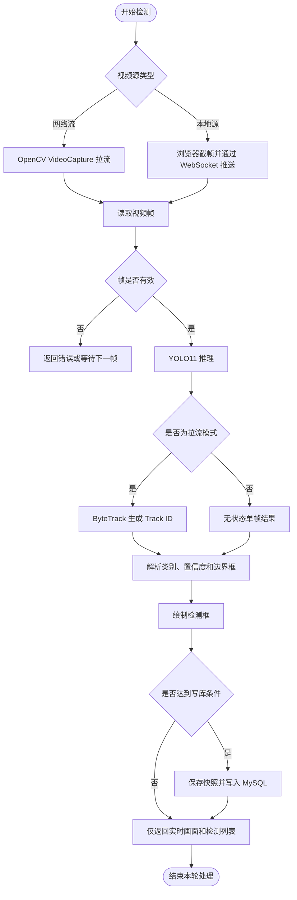
```mermaid
flowchart TD
    A(["开始检测"]) --> B{"视频源类型"}
    B -->|网络流| C["OpenCV VideoCapture 拉流"]
    B -->|本地源| D["浏览器截帧并通过 WebSocket 推送"]
    C --> E["读取视频帧"]
    D --> E
    E --> F{"帧是否有效"}
    F -->|否| G["返回错误或等待下一帧"]
    F -->|是| H["YOLO11 推理"]
    H --> I{"是否为拉流模式"}
    I -->|是| J["ByteTrack 生成 Track ID"]
    I -->|否| K["无状态单帧结果"]
    J --> L["解析类别、置信度和边界框"]
    K --> L
    L --> M["绘制检测框"]
    M --> N{"是否达到写库条件"}
    N -->|否| O["仅返回实时画面和检测列表"]
    N -->|是| P["保存快照并写入 MySQL"]
    P --> O
    O --> Q(["结束本轮处理"])
```

### 6.8 状态图设计

推理引擎的状态图主要用来说明系统在不同运行阶段应该处于什么状态。系统刚启动时，模型权重还没有加载完成，因此先处于“未加载模型”状态；如果权重文件存在并加载成功，就进入“空闲”状态，表示系统已经准备好，只是在等待用户启动检测。如果权重路径错误、模型文件缺失或加载失败，系统会进入“错误”状态，提示用户先修正配置，而不是继续执行后面的检测流程。

当用户点击启动检测后，系统从“空闲”切换到“运行中”。这个状态下，后端会循环读取视频帧、调用模型推理，并按条件保存快照和写入数据库。用户点击停止检测时，系统不会直接结束，而是先进入“停止中”，完成视频源释放、后台线程退出和实时状态清空后，再回到“空闲”状态。这样设计的原因比较直接：摄像头、视频流和模型推理都占用资源，如果不经过停止清理，下一次启动时就可能出现端口占用、视频源未释放或状态显示混乱等问题。

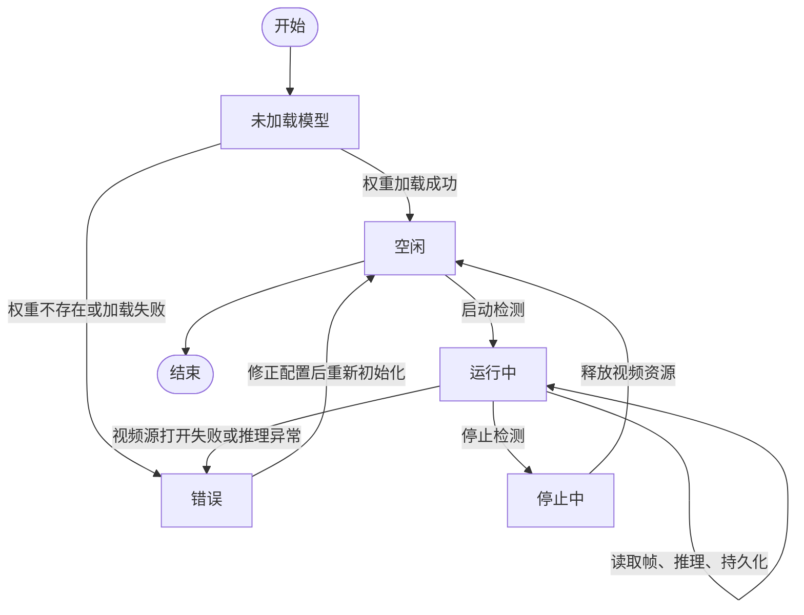
```mermaid
flowchart TD
    Start(["开始"]) --> Loading["未加载模型"]
    Loading -->|权重加载成功| Idle["空闲"]
    Loading -->|权重不存在或加载失败| Error["错误"]
    Idle -->|启动检测| Running["运行中"]
    Running -->|读取帧、推理、持久化| Running
    Running -->|停止检测| Stopping["停止中"]
    Stopping -->|释放视频资源| Idle
    Running -->|视频源打开失败或推理异常| Error
    Error -->|修正配置后重新初始化| Idle
    Idle --> End(["结束"])
```

### 6.9 系统界面截图说明

系统界面截图用于展示各功能模块的运行效果，并和第 7 章功能测试相互对应。本文展示登录认证、系统初始化、实时监控、本地推流、历史检索和统计分析等页面，截图内容见表 6-1。

| 图号 | 截图名称 | 对应页面/组件 | 截图内容 |
| --- | --- | --- | --- |
| 图 6-2 | 登录界面截图 | `LoginView.vue` | 管理员登录入口、密码输入与登录按钮 |
| 图 6-3 | 系统初始化界面截图 | `SetupView.vue` | MySQL 连接配置、测试连接、初始化按钮 |
| 图 6-4 | 实时监控主页面截图 | `DashboardView.vue` | 监控大屏、系统状态、核心功能入口 |
| 图 6-5 | 视频检测界面截图 | `LocalStreamer.vue` | 浏览器本地视频推流后的检测框画面 |
| 图 6-6 | 历史物品检索截图 | `SearchView.vue` | 中文关键词检索、最后出现时间、快照结果 |
| 图 6-7 | 统计分析页面截图 | `StatsView.vue` | 类别频次图、时间线图和检测概览 |

表 6-1 系统界面截图说明

图 6-2 为系统登录界面。系统采用单管理员模式，用户输入管理员密码后，后端签发 JWT Token。前端在后续受保护接口请求和客户端推流连接中携带该 Token，以限制未认证用户执行检测控制、检索、统计和初始化操作。


图 6-3 为系统初始化界面。首次部署时，用户在该页面填写 MySQL 主机、端口、用户名、密码和数据库名称。系统提供连接测试和初始化建表，减少命令行配置数据库的操作。


图 6-4 为系统实时监控主页面。该页面集中显示系统运行状态、实时监控入口、历史检索入口和统计分析入口，是用户进入系统后的主操作界面。


图 6-5 为视频检测界面。用户选择本地视频并启动检测后，前端通过 WebSocket 将视频帧发送给后端。后端完成 YOLO 推理，返回带检测框和类别标签的画面，浏览器端即可完成视频检测演示。


图 6-6 为历史物品检索界面。用户可以按物品类别或中文关键词查询历史检测记录。系统返回对应物品最近出现的时间、位置和快照信息，用于回答“物品最后出现在哪里”。


图 6-7 为统计分析界面。系统按类别和时间聚合检测记录，并通过图表展示物品出现频次和变化趋势。用户可以据此观察家庭场景中常见物品的出现规律。


## 7 实验与分析

### 7.1 功能验证

系统功能验证围绕视频接入、实时检测、历史检索、统计分析和安全控制展开，覆盖以下内容：

1. 网络流模式：用户输入 RTSP/RTMP/HTTP 地址后，后端打开视频源并返回 MJPEG 标注画面，同时通过 WebSocket 推送检测列表。
2. 本地摄像头模式：浏览器获取摄像头权限后，以约 5 FPS 推送帧至后端；后端返回标注图，并同步前端检测面板。
3. 本地视频模式：用户选择本地视频文件后，系统沿用 WebSocket 推流链路完成检测演示。
4. 历史检索：系统按类别保存最后出现位置，支持中文关键词查询，返回快照、时间和归一化坐标。
5. 统计分析：系统按日期、小时和类别累计检测次数，并在前端展示总量和类别分布。
6. 安全控制：启动/停止检测、状态查询、检索、统计和客户端推流等接口已接入 JWT 鉴权；实时画面流和状态广播在当前版本中作为同域展示接口使用，代码层面未单独校验 Token。

### 7.2 测试用例图与测试用例设计

系统测试覆盖功能正确性、接口稳定性、数据持久化、安全鉴权和部署可用性。以下测试用例用于记录系统运行结果，执行时可把界面截图、接口返回、数据库记录和日志输出作为证据材料。


```mermaid
flowchart TD
    T["系统测试用例"]
    T --> A["认证与初始化测试"]
    T --> B["视频接入测试"]
    T --> C["检测推理测试"]
    T --> D["历史检索测试"]
    T --> E["统计分析测试"]
    T --> F["安全与异常测试"]
    T --> G["部署与运维测试"]

    A --> A1["密码正确登录"]
    A --> A2["密码错误拒绝"]
    A --> A3["数据库连接测试"]
    A --> A4["初始化建表"]

    B --> B1["RTSP 或 HTTP 网络流启动"]
    B --> B2["本地摄像头推流"]
    B --> B3["本地视频推流"]
    B --> B4["停止检测并释放资源"]

    C --> C1["YOLO 权重加载"]
    C --> C2["返回检测框和类别"]
    C --> C3["ByteTrack 生成 Track ID"]
    C --> C4["无目标帧处理"]

    D --> D1["中文关键词查询"]
    D --> D2["最后出现位置查询"]
    D --> D3["历史记录分页"]
    D --> D4["时间范围筛选"]

    E --> E1["今日检测总量"]
    E --> E2["类别频次排行"]
    E --> E3["小时级时间线"]

    F --> F1["未登录访问拒绝"]
    F --> F2["WebSocket Token 无效拒绝"]
    F --> F3["错误视频源提示"]

    G --> G1["Docker 构建启动"]
    G --> G2["后端健康检查"]
    G --> G3["前端健康检查"]
    G --> G4["快照定时清理"]
```

| 编号 | 测试模块 | 测试用例 | 输入/操作 | 预期结果 |
| --- | --- | --- | --- | --- |
| TC-01 | 认证 | 管理员登录成功 | 输入正确 `ADMIN_PASSWORD` | 返回 JWT Token，进入系统首页 |
| TC-02 | 认证 | 管理员登录失败 | 输入错误密码 | 返回 401 或错误提示，不签发 Token |
| TC-03 | 初始化 | 数据库连接测试 | 输入 MySQL host、port、user、password、dbname | 返回连接成功或明确错误信息 |
| TC-04 | 初始化 | 数据库建表 | 点击初始化按钮 | 创建三张核心业务表，系统状态为已初始化 |
| TC-05 | 网络流检测 | 启动 RTSP/HTTP 流 | 输入合法流地址并启动检测 | 后端进入运行状态，前端显示检测画面 |
| TC-06 | 本地推流 | 浏览器摄像头推流 | 授权摄像头并启动检测 | WebSocket 建连成功，返回标注帧和检测列表 |
| TC-07 | 本地视频 | 本地文件推流 | 选择视频文件并启动检测 | 系统按固定帧率推送帧并返回检测结果 |
| TC-08 | 持久化 | 检测记录写入 | 检测到稳定目标 | `detection_records` 新增记录，必要时保存快照 |
| TC-09 | 检索 | 中文关键词查询 | 输入“笔记本”“手机”等关键词 | 返回对应英文类别的最后出现位置 |
| TC-10 | 统计 | 类别频次查询 | 打开统计页 | 返回最近 N 天类别排行和图表数据 |
| TC-11 | 安全 | 未携带 Token 访问保护接口 | 直接请求检测/统计接口 | 返回未授权错误 |
| TC-12 | 运维 | 快照清理 | 设置保留天数并等待清理线程 | 超期快照被删除，未超期快照保留 |
| TC-13 | 部署 | Docker 健康检查 | 启动 compose 服务 | 前后端 healthcheck 均为 healthy |

根据系统联调和功能验证结果，各测试用例的执行情况如下：TC-01 在输入正确管理员密码后能够正常返回 JWT Token，并进入系统首页，说明认证流程和前端登录跳转逻辑有效；TC-02 在输入错误密码时能够拒绝访问并给出错误提示，未签发 Token，说明系统能够阻止非法登录；TC-03 在填写数据库连接参数后能够返回明确的连接状态，错误配置也能反馈失败原因，便于后续排查；TC-04 执行初始化后能够创建检测记录、最后出现位置和统计数据等核心业务表，系统状态能够切换为已初始化。

视频接入和检测推理相关用例中，TC-05 使用合法 RTSP/HTTP 视频流地址后，后端能够进入检测运行状态，前端可显示实时检测画面；TC-06 在浏览器授权摄像头后能够建立 WebSocket 连接，并持续返回标注帧和检测结果；TC-07 选择本地视频文件后，系统能够按照设定帧率推送视频帧，检测结果能够随画面同步更新；TC-08 在连续检测到稳定目标后，系统能够向 `detection_records` 写入记录，并在需要时保存目标快照，说明检测结果具备持久化能力。

检索、统计、安全和运维相关用例中，TC-09 输入“笔记本”“手机”等中文关键词后，系统能够完成中英文类别映射，并返回目标最后出现位置；TC-10 打开统计页面后能够获取最近时间范围内的类别频次排行和图表数据，统计结果与检测记录保持一致；TC-11 在未携带 Token 访问受保护接口时返回未授权结果，说明接口鉴权机制生效；TC-12 设置快照保留时间后，清理线程能够删除超期文件并保留有效快照；TC-13 启动 Docker Compose 服务后，前端和后端健康检查均能通过，说明系统具备基本部署可用性。整体来看，上述测试用例均达到预期结果，系统主要功能链路能够稳定闭环。性能压力测试、不同摄像头实测 FPS、长时间运行稳定性和浏览器兼容性数据，需要结合具体硬件环境进一步统计。

### 7.3 模型效果分析

YOLO11s 的总体指标能支撑系统原型，但它不是单向变好。和 YOLO11n 相比，Recall 从 0.5230 升到 0.6144，mAP@0.5 从 0.6013 升到 0.6552；Precision 却从 0.6964 降到 0.6775。这个结果更像是模型把判定边界放宽了：多抓到了一些原先漏掉的目标，也多带进来一部分误检。本文倾向于接受这个取舍，因为历史检索里“没记下来”比“多记一条待筛记录”更麻烦。

类别层面有几个异常点。`book` 的 AP@0.5 只有 0.2541，远低于 `laptop` 的 0.8163 和 `tv` 的 0.8161。推测这和书籍的摆放方式有关：书脊密集、尺寸小、纹理重复，YOLO 在 640 输入下很难把单本书从背景里分出来。`toaster` 的 AP@0.5 为 0.5580，看上去不算最低，但验证集只有 9 个实例，不排除样本偶然性抬高或压低指标的可能性。

mAP@0.5:0.95 为 0.4849，低于 mAP@0.5 的 0.6552。也就是说，模型在“框到大概位置”时表现尚可，但 IoU 阈值收紧后，边界框质量下降。后续如果继续训练，优先方向不应只是增加轮次，而应补充真实家庭视角数据、提高小目标样本占比，并尝试 800 或 1024 输入尺寸。显存会先成为限制。

### 7.4 工程效果分析

工程结果里最关键的不是检测框画出来了，而是检测框之后还有记录。服务端拉流可以拿到 ByteTrack 的 `track_id`，因此能用 3 帧确认过滤短时误检；浏览器推流绕开了家庭网络的内网穿透问题，但每帧独立推理，不能维持跨帧身份。这两个模式不是互相替代。一个适合固定摄像头长期跑，一个适合临时接入和演示。

数据库三张表的分工基本成立。`DetectionRecord` 保存明细，`ObjectLastSeen` 用来快速回答最后位置，`DetectionStat` 给统计图表供数。这里仍有一个隐患：`object_last_seen` 当前按 `object_class` 做唯一约束。多摄像头同时检测到两台电视时，后写入的记录会覆盖前一个房间的位置。这个问题在单摄像头演示里不暴露，扩展到多房间时必须改成 `(camera_id, object_class)`。

推流链路还有延迟压力。前端每 200 ms 发送一帧，理论上约 5 FPS；如果后端 CPU 推理单帧耗时超过 200 ms，WebSocket 消息会排队。本文当前用 3 秒写库间隔和 5 秒快照间隔减轻数据库与磁盘压力，但它不能解决模型推理慢的问题。后续要么降低推帧频率，要么上 GPU/ONNX/TensorRT。

### 7.5 不足与改进方向

当前系统仍有以下不足：

1. 训练数据主要来自 COCO，缺少固定高位监控视角、夜间低光照、运动模糊和半遮挡样本。
2. 浏览器推流模式采用无状态单帧推理，没有跨帧 TrackID，连续出现的同一物品仍可能被写成多条记录。
3. `object_last_seen` 当前以 `object_class` 作为唯一约束，多摄像头同类物品会互相覆盖。
4. 快照预览没有叠加历史边界框坐标，用户打开截图后仍要自己找目标区域。
5. 前端 ECharts 与 Element Plus 尚未按需加载，生产包体积还有压缩空间。

后续工作可以先做三件事：采集 3000 至 5000 张真实家庭视角图片做微调；把推流链路改成带短时缓存的跟踪流程；在数据库中加入 `room_id` 或 `camera_id` 联合约束。再往后才考虑自然语言检索。

## 8 总结与展望

本文实现了一套基于 YOLO 的智能家居视觉感知与历史物品检索系统。系统使用 YOLO11s 检测 20 类家居物品，并用 FastAPI、OpenCV、ByteTrack、MySQL、Vue 3 和 WebSocket 串起实时检测、历史位置记录、快照保存、中文检索、统计分析、登录鉴权和容器化部署。当前结果说明，这套系统可以把家庭视频流中的一部分物品转成可查询记录。

本文的工作主要在系统集成。目标检测负责把物品从画面里找出来，ByteTrack 和 3 帧确认负责减少抖动，3 秒写库间隔和 5 秒快照间隔负责控制存储压力，浏览器推流负责绕开家庭网络接入限制。几个模块拼在一起后，用户才能从“看录像”转到“查记录”。

但模型和系统都还有边界。`book` 这类小而密集的目标表现差，推流模式没有 TrackID，多摄像头场景的数据库约束也需要重做。下一步应优先采集真实家庭数据，扩展钥匙、钱包、眼镜等找物类别，再考虑 ONNX/TensorRT 加速、多摄像头房间语义和自然语言检索。

## 参考文献

[1] Jocher G, Chaurasia A, Qiu J. Ultralytics YOLOv8[EB/OL]. 2023. https://github.com/ultralytics/ultralytics/blob/main/docs/en/models/yolov8.md.

[2] Ultralytics. Ultralytics YOLO11 Model Card[EB/OL]. https://huggingface.co/Ultralytics/YOLO11.

[3] Zhao Y, Yang D, Cao S, Cai B, Maryamah M, Solihin M I. Object detection in smart indoor shopping using an enhanced YOLOv8n algorithm[J]. IET Image Processing, 2024, 18(14): 4745-4759. DOI: 10.1049/ipr2.13284.

[4] Pokuciński S, Mrozek D. Object Detection with YOLOv5 in Indoor Equirectangular Panoramas[J]. Procedia Computer Science, 2023, 225: 2420-2428.

[5] Zhang Y, Sun P, Jiang Y, Yu D, Weng F, Yuan Z, et al. ByteTrack: Multi-Object Tracking by Associating Every Detection Box[C]//European Conference on Computer Vision. 2022.

[6] Ultralytics. Multi-Object Tracking with Ultralytics YOLO[EB/OL]. https://github.com/ultralytics/ultralytics/blob/main/docs/en/modes/track.md.

[7] MDN Web Docs. MediaDevices: getUserMedia() method[EB/OL]. https://developer.mozilla.org/en-US/docs/Web/API/MediaDevices/getUserMedia.

[8] MDN Web Docs. WebSocket[EB/OL]. https://developer.mozilla.org/en-US/docs/Web/API/WebSocket.

[9] 郭磊, 王邱龙, 薛伟, 郭济. 基于改进YOLOv5的小目标检测算法[J]. 电子科技大学学报, 2022, 51(2): 251-258. DOI: 10.12178/1001-0548.2021235.

[10] 章程军, 胡晓兵, 牛洪超. 基于改进YOLOv5的车辆目标检测研究[J]. 四川大学学报(自然科学版), 2022, 59(5): 053001. DOI: 10.19907/j.0490-6756.2022.053001.

[11] 赵畅. 基于YOLOv5改进的人脸检测算法的研究与实现[D]. 长春: 吉林大学, 2022.

[12] 王选. 基于深度学习的水下复杂环境目标检测研究[D]. 成都: 电子科技大学, 2022.

[13] Ren S, He K, Girshick R, Sun J. Faster R-CNN: Towards Real-Time Object Detection with Region Proposal Networks[J]. IEEE Transactions on Pattern Analysis and Machine Intelligence, 2017, 39(6): 1137-1149.

[14] Redmon J, Divvala S, Girshick R, Farhadi A. You Only Look Once: Unified, Real-Time Object Detection[C]//IEEE Conference on Computer Vision and Pattern Recognition. 2016: 779-788.

[15] Lin T Y, Maire M, Belongie S, Hays J, Perona P, Ramanan D, et al. Microsoft COCO: Common Objects in Context[C]//European Conference on Computer Vision. 2014: 740-755.

[16] Wang A, Chen H, Liu L, Chen K, Lin Z, Han J, Ding G. YOLOv10: Real-Time End-to-End Object Detection[C]//Advances in Neural Information Processing Systems. 2024.

[17] Feng Y, Huang J, Du S, Ying S, Yong J H, Li Y, et al. Hyper-YOLO: When Visual Object Detection Meets Hypergraph Computation[J]. IEEE Transactions on Pattern Analysis and Machine Intelligence, 2025, 47(4): 2388-2401. DOI: 10.1109/TPAMI.2024.3524377.

[18] Cheng T, Song L, Ge Y, Liu W, Wang X, Shan Y. YOLO-World: Real-Time Open-Vocabulary Object Detection[C]//IEEE/CVF Conference on Computer Vision and Pattern Recognition. 2024: 16901-16911. DOI: 10.1109/CVPR52733.2024.01599.

[19] Chen Y, Yuan X, Wang J, Wu R, Li X, Hou Q, Cheng M M. YOLO-MS: Rethinking Multi-Scale Representation Learning for Real-time Object Detection[J]. IEEE Transactions on Pattern Analysis and Machine Intelligence, 2025. DOI: 10.1109/TPAMI.2025.3538473.

[20] Zhao Y, Lv W, Xu S, Wei J, Wang G, Dang Q, Liu Y, Chen J. DETRs Beat YOLOs on Real-time Object Detection[C]//IEEE/CVF Conference on Computer Vision and Pattern Recognition. 2024: 16965-16974. DOI: 10.1109/CVPR52733.2024.01605.

[21] 林德铝, 刘畅, 陈琦, 等. 基于低秩分解的YOLO轻量化目标检测模型[J]. 机车电传动, 2024(1): 138-144. DOI: 10.13890/j.issn.1000-128X.2024.01.120.

[22] Wojke N, Bewley A, Paulus D. Simple Online and Realtime Tracking with a Deep Association Metric[C]//IEEE International Conference on Image Processing. 2017: 3645-3649.
