# 基于 YOLO 的智能家居视觉感知与历史物品检索系统

## 摘要

随着家庭摄像头、边缘计算设备和智能家居应用的普及，居住空间中的视觉数据规模持续增长。然而，现有家居监控系统多以视频文件为主要存储对象，物品类别、出现时间、空间位置和关键帧快照等信息未能形成结构化记录，导致用户在查找遥控器、手机、书籍等日常物品时仍需依赖人工回放。针对家庭场景中“可看见但难检索”的问题，本文设计并实现了一套基于 YOLO 的智能家居视觉感知与历史物品检索系统。系统以 YOLO11 为目标检测模型，从 COCO 2017 中抽取 20 类常见室内物品构建 SmartHome-COCO 数据集；服务端基于 FastAPI、OpenCV、Ultralytics 和 SQLAlchemy 实现视频接入、模型推理、数据持久化与快照管理；前端基于 Vue 3、Element Plus 和 ECharts 实现实时监控、历史检索、统计分析和初始化配置等功能。

本文的重点不局限于目标检测结果的实时展示，而是进一步将检测结果转化为可查询、可追溯的历史记录。服务端拉流链路调用 YOLO `track` 接口并结合 ByteTrack 保留目标 ID，在业务层设置 3 帧连续确认、3 秒写库间隔和 5 秒快照间隔，以减少短时误检和重复写入；浏览器推流链路通过 `getUserMedia` 或本地视频读取画面，每 200 ms 推送一帧 640×480 JPEG 图像，由后端完成单帧推理。实验结果表明，YOLO11s 在 SmartHome-COCO 验证集上取得 Precision 0.6775、Recall 0.6144、mAP@0.5 0.6552、mAP@0.5:0.95 0.4849。与 YOLO11n 相比，YOLO11s 的 Recall、mAP@0.5 和 mAP@0.5:0.95 分别提高 0.0914、0.0539 和 0.0465，但权重文件大小由 15.2 MB 增加至 54.4 MB，CPU 复评耗时由 109.7 s 增加至 275.7 s。综合历史检索场景对漏检更敏感的特点，本文选择 YOLO11s 作为系统生产推理模型。

**关键词：** 智能家居；目标检测；YOLO11；ByteTrack；WebSocket；历史物品检索

## Abstract

With the increasing deployment of home cameras, edge devices, and smart home applications, visual data in residential environments is growing rapidly. However, most home monitoring systems still store visual information primarily as video files, while object category, timestamp, spatial location, and key-frame snapshots are not organized as structured and searchable records. As a result, users often have to replay videos manually when locating daily objects such as remote controls, mobile phones, or books. To address this problem, this thesis designs and implements a YOLO-based smart home visual perception and historical object retrieval system. YOLO11 is adopted as the detection model, and a SmartHome-COCO dataset is constructed by selecting 20 common indoor object classes from COCO 2017. The backend uses FastAPI, OpenCV, Ultralytics, and SQLAlchemy to support video access, model inference, data persistence, and snapshot management, while the frontend uses Vue 3, Element Plus, and ECharts to provide real-time monitoring, historical retrieval, statistical analysis, and initialization configuration.

The system focuses not only on real-time visualization of detection results, but also on transforming detected objects into searchable historical records. In the server-side stream-pulling pipeline, the YOLO `track` interface is combined with ByteTrack to preserve object IDs across frames. The application layer further applies 3-frame confirmation, a 3-second database writing interval, and a 5-second snapshot interval to reduce transient false detections and duplicate records. In the browser-side stream-pushing pipeline, `getUserMedia` or a local video source provides 640×480 JPEG frames every 200 ms through WebSocket, and the backend performs single-frame inference. Experimental results on the SmartHome-COCO validation set show that YOLO11s achieves 0.6775 precision, 0.6144 recall, 0.6552 mAP@0.5, and 0.4849 mAP@0.5:0.95. Compared with YOLO11n, YOLO11s improves recall, mAP@0.5, and mAP@0.5:0.95 by 0.0914, 0.0539, and 0.0465, respectively, while increasing the weight file size from 15.2 MB to 54.4 MB and the CPU validation time from 109.7 s to 275.7 s. Considering that missed detections have a greater impact on historical retrieval, YOLO11s is selected as the production inference model.

**Keywords:** smart home; object detection; YOLO11; ByteTrack; WebSocket; historical object retrieval

## 1 绪论

本章主要说明本文的研究背景、研究意义、相关研究现状以及主要工作。首先从智能家居视频数据难以检索的问题出发，分析目标检测技术在家庭场景中的应用价值；随后梳理国内外目标检测、室内视觉感知、多目标跟踪和 Web 视频接入相关研究；最后概括本文围绕智能家居视觉感知与历史物品检索所完成的主要工作。

### 1.1 研究背景与意义

智能家居设备的发展使家庭空间中的视觉采集能力显著增强，但视频数据的可检索性仍然不足。传统监控系统主要完成画面采集、录像存储和回放展示，缺少对物品类别、出现时间、空间位置和关键帧快照的结构化组织。以遥控器、手机、书籍等日常物品为例，用户主要关注物品最后出现的时间、位置和图像证据，而不是完整视频片段本身。

目标检测技术为家庭视频内容结构化提供了基础。Faster R-CNN 等两阶段检测器具有较好的检测精度，但流程较长，在连续视频分析中容易受到实时性约束<sup>[13]</sup>。YOLO 将检测任务建模为单阶段回归，可通过一次前向传播输出边界框和类别概率，更适合实时帧处理<sup>[14]</sup>。Ultralytics YOLOv8 和 YOLO11 进一步整合训练、验证、推理和跟踪接口，降低了中小规模视觉应用的工程实现成本<sup>[1-2]</sup>。

基于上述背景，本文将目标检测、多目标跟踪、浏览器推流、数据库持久化和前端检索功能结合起来，构建面向智能家居场景的视觉感知与历史物品检索系统。系统在模型输出边界框后继续保存快照、更新时间和最后出现位置，使用户能够通过类别或关键词查询物品历史记录，从而将家庭视频由单纯的回放材料转化为可检索的数据资源。

### 1.2 国内外研究现状

目标检测、室内视觉感知、多目标跟踪和 Web 视频接入共同构成本文研究的技术基础。围绕智能家居物品检测与历史检索需求，国内外相关研究可从以下几个方面展开。

#### 1.2.1 实时目标检测算法研究

目标检测研究首先关注检测器的速度与精度。两阶段检测器在离线图像检测中具有一定优势，但连续视频流更强调推理延迟和部署成本；YOLO 系列通过单阶段回归方式提升了实时检测能力，因此被广泛应用于安防、机器人和室内导航等场景。YOLOv8 的 anchor-free split head 与 YOLO11 的 n、s、m、l、x 多尺度模型为不同算力条件下的工程部署提供了选择，其中 YOLO11n 约 2.6M 参数，YOLO11s 约 9.4M 参数<sup>[1-2]</sup>。这类研究主要回答单帧检测精度与速度问题，对检测结果的长期保存和二次检索讨论相对不足。

#### 1.2.2 检测器结构改进与开放词汇检测研究

另一类研究侧重检测器结构改进。YOLOv10 通过一致双分配训练和无 NMS 推理减少后处理开销，Hyper-YOLO 利用超图计算描述跨位置视觉关系，YOLO-MS 强调多尺度表示，RT-DETR 则展示了端到端目标检测的另一类技术路线<sup>[16-17,19-20]</sup>。上述工作提升了检测模型本身的表达能力，但家庭找物任务还涉及类别开放性和系统闭环问题。例如钥匙、钱包、眼镜等常见找物对象未必包含在固定数据集中，YOLO-World 的开放词汇检测提供了可扩展方向<sup>[18]</sup>，但仍需与家庭场景中的数据管理、权限控制和视频接入链路结合。

#### 1.2.3 室内复杂场景目标检测研究

室内视觉感知研究主要处理复杂场景下的检测稳定性问题。小目标、遮挡、低光照和全景畸变均会影响检测效果。Zhao 等针对智能室内购物场景改进 YOLOv8n，通过 C2f-ParNet、CARAFE 和 WIoUv3 提高中小型物体检出率<sup>[3]</sup>；Pokuciński 与 Mrozek 对室内等距矩形全景图像中的畸变、高分辨率和光照不连续问题进行了研究<sup>[4]</sup>。国内关于小目标增强、注意力机制、复杂环境检测和轻量化压缩的研究也与此相近<sup>[9-12,21]</sup>。总体来看，相关研究多集中于模型或数据层，较少延伸到检测结果的用户侧检索过程。

#### 1.2.4 多目标跟踪与 Web 视频接入研究

多目标跟踪与 Web 视频接入研究为检测结果的连续化和系统化提供了支撑。单帧检测只能给出当前帧中的目标类别与位置，难以表达物品在连续视频中的状态变化。Deep SORT 利用外观特征缓解遮挡后的身份切换问题，但额外特征提取会增加计算开销<sup>[22]</sup>；ByteTrack 同时关联高、低置信度检测框，在 MOT17 上取得 80.3 MOTA 和 77.3 IDF1，适合与 YOLO 等实时检测器结合<sup>[5-6]</sup>。在 Web 接入方面，服务端拉取 RTSP/RTMP/HTTP 流适用于固定摄像头，但家庭网络中的 NAT 和设备权限会限制公网访问；浏览器 `getUserMedia` 与 WebSocket 能够支持本地设备主动推流，但其本身只解决采集与传输问题<sup>[7-8]</sup>。

#### 1.2.5 研究述评

综上，现有研究在目标检测精度提升、轻量化部署、复杂室内环境适应、多目标跟踪和浏览器视频接入等方面已形成较为丰富的成果，但多数工作仍以模型性能或单一链路实现为主要关注点。对于智能家居找物场景，仅完成实时检测并不能充分满足用户需求，检测结果还需要被转换为带有时间、位置、类别和快照信息的结构化记录。基于此，本文关注检测、跟踪、浏览器推流和数据库检索之间的衔接，以弥补家庭物品检测结果难以沉淀为可查询历史记录的问题。

### 1.3 本文主要工作

本文围绕智能家居视觉感知与历史物品检索完成以下工作：

1. 构建 SmartHome-COCO 数据集处理流程，从 COCO 2017 中提取 20 类常见室内物品，并转换为 YOLO 训练格式。
2. 基于 Ultralytics YOLO11 完成模型训练、验证和生产权重接入，整理训练日志中的总体指标。
3. 设计 FastAPI 后端推理引擎，实现网络流拉取、YOLO 检测、ByteTrack 跟踪、快照保存、MySQL 持久化和统计汇总。
4. 设计浏览器 WebSocket 推流链路，使本地摄像头或本地视频能够按帧传输至云端推理服务。
5. 设计 Vue 3 前端大屏，实现实时检测展示、历史物品检索、中文关键词查询、统计图表、登录鉴权和系统初始化配置。
6. 使用 Docker Compose 组织前端和后端服务，加入管理员登录、受保护接口鉴权、快照生命周期管理和健康检查。

## 2 相关技术基础

本章介绍系统实现所依赖的关键技术。针对物品检测、连续帧目标关联和浏览器视频接入三个核心环节，分别说明 YOLO 目标检测算法、ByteTrack 多目标跟踪方法以及 WebSocket 推流与浏览器媒体采集机制，为后续系统需求分析、总体设计和功能实现提供技术基础。

### 2.1 YOLO 目标检测算法

目标检测要同时判断类别和定位边界框。Faster R-CNN 等两阶段方法先生成候选区域，再对候选区域做分类与回归，精度高，但流程偏长<sup>[13]</sup>。YOLO 把检测任务改成单阶段回归，由一个神经网络直接从整幅图像预测边界框和类别概率，实时视频中更容易落地<sup>[14]</sup>。

本文采用 Ultralytics YOLO11 作为目标检测模型。YOLO11 提供多种模型规模，可根据算力条件和精度要求选择部署方案<sup>[2]</sup>。项目中保留 YOLO11n 和 YOLO11s 两类训练权重，生产配置实际加载 `results-01/runs/train_smarthome_s/weights/best.pt`，即 YOLO11s 权重。与 YOLO11n 相比，YOLO11s 的参数量和权重文件更大，但具有更强的特征表达能力。考虑到历史物品检索对漏检较为敏感，本文使用 YOLO11s 作为生产推理模型。

从工程调用角度看，YOLO11 检测模型可拆成五步：输入预处理、骨干特征提取、颈部特征融合、检测头输出和后处理。输入图像先缩放到统一尺寸并归一化；骨干网络提取多尺度语义特征；颈部网络融合高层、低层信息，兼顾大目标语义和小目标细节；检测头输出边界框坐标、类别概率和置信度；最后经 NMS 或跟踪器关联得到检测结果。本文使用的 YOLO11 抽象调用流程如图 2-1 所示，该图用于说明系统逻辑，并不对应官方逐层网络结构。

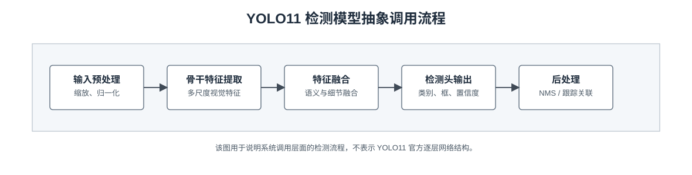

图 2-1 YOLO11 抽象调用流程图

### 2.2 多目标跟踪与 ByteTrack

在视频场景中，同一物品通常会连续出现在多帧画面中。若将每一帧检测结果均写入数据库，记录数量会快速增加；若仅依据单帧结果，又难以判断目标是否稳定出现。ByteTrack 的核心思路是关联全部检测框，而不是仅保留高置信度检测框。该方法先利用高置信度检测框完成第一轮匹配，再利用低置信度检测框恢复被遮挡或模糊的轨迹，从而减少轨迹碎片<sup>[5]</sup>。

本系统在服务端拉流模式下调用 `model.track(..., tracker="bytetrack.yaml", persist=True)`，使检测结果包含 `track_id`。应用层继续维护 `track_id -> 连续出现帧数` 的内存计数。只有目标连续出现帧数达到阈值，系统才将其写入持久化流程。该策略能够过滤部分单帧误检，并减轻短暂遮挡对历史记录的干扰。

### 2.3 WebSocket 推流与浏览器媒体采集

家庭摄像头通常位于内网环境中，公网服务器直接拉取 RTSP 流时可能面临可达性问题。本文因此设计了浏览器客户端推流模式。前端通过 `navigator.mediaDevices.getUserMedia` 请求摄像头权限，或读取本地视频文件；随后按固定分辨率将视频帧绘制到 Canvas，再使用 `canvas.toBlob` 编码为 JPEG。前端通过 WebSocket 将二进制帧发送到后端 `/api/video/ws/push` 接口，后端完成单帧 YOLO 推理，返回带检测框的 Base64 图像和结构化检测列表。

该链路不要求摄像头暴露公网地址，并能够复用浏览器已有的设备权限机制。其限制在于每一帧推理相互独立，无法自然获得跨帧 TrackID。因此，系统在推流模式下通过写库节流和快照间隔控制数据库压力与磁盘占用。

## 3 系统需求分析

本章从用户使用场景和系统运行约束出发，对智能家居视觉感知与历史物品检索系统进行需求分析。首先明确系统需要支持的实时检测、视频接入、历史检索、统计分析和安全访问等功能；其次给出实时性、可部署性、可维护性和数据安全性等非功能需求；最后通过用例、业务流程和数据流分析，为后续总体设计确定边界和依据。

### 3.1 功能需求

系统面向智能家居场景，需要完成以下功能：

1. 实时物品检测：识别家庭画面中的椅子、沙发、电视、笔记本电脑、鼠标、遥控器、手机、书籍等 20 类物品。
2. 视频接入：支持网络流地址输入，也支持浏览器本地摄像头和本地视频文件推流。
3. 历史记录：将检测类别、置信度、归一化边界框、时间戳、摄像头标识和快照路径写入数据库。
4. 最后出现位置：维护每类物品最近一次出现的位置和快照，并提供快速查询。
5. 统计分析：按日期、小时和类别聚合检测次数，并以图表展示。
6. 系统初始化：首次部署后，用户可通过图形化页面配置 MySQL 连接并创建数据表。
7. 安全访问：通过管理员密码登录和 JWT Token 保护关键接口及 WebSocket 推流接口。

### 3.2 非功能需求

系统还应满足以下要求：

1. 实时性：视频流推理、检测结果返回和前端渲染应保持可交互，启动、停止和查询操作需要及时给出状态反馈。
2. 可部署性：前后端、推理服务和持久化目录可通过 Docker Compose 组织。
3. 可维护性：配置、路由、数据库模型、推理引擎和前端组件分模块管理。
4. 数据安全性：数据库密码不写入代码仓库；公网环境下，关键接口必须经过鉴权。
5. 存储可控性：检测快照需要生命周期清理机制，避免长时间运行后占满磁盘。

### 3.3 系统用例分析

从用户角色看，当前系统采用单管理员模式，主要参与者是“管理员/家庭用户”。从外部系统看，浏览器摄像头、网络摄像头或视频流、YOLO 推理引擎、MySQL 数据库共同构成业务闭环。核心用例包括登录认证、系统初始化、启动检测、客户端推流、实时监控、历史检索、统计分析和快照清理，系统用例关系如图 3-1 所示。

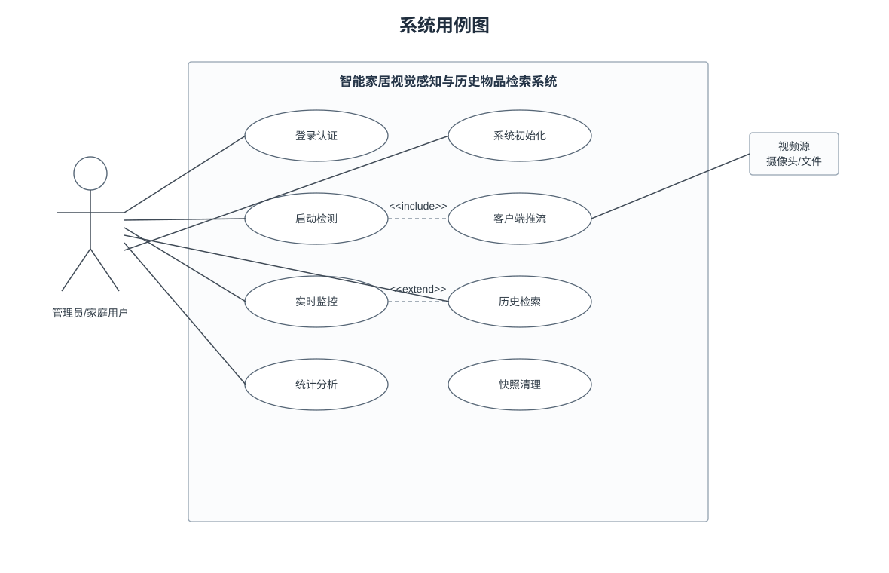

图 3-1 系统用例图

### 3.4 业务流程分析

业务流程从登录认证开始。用户访问页面后，前端首先检查本地是否存在 JWT Token；若不存在 Token，则页面停留在登录入口。用户输入管理员密码后，后端校验环境变量 `ADMIN_PASSWORD`，校验通过后签发 24 小时有效的 Token。认证失败时，系统拒绝进入检测流程，并限制历史检索和统计接口的访问。

登录完成后，用户需要选择视频来源。系统将输入源划分为 RTSP/RTMP/HTTP 网络流、本地摄像头和本地视频文件三类。网络流采用后端拉流方式，用户提交地址后，FastAPI 将地址交由 OpenCV `VideoCapture` 打开；若地址无法访问，前端显示错误状态，后端不启动推理线程。本地摄像头和本地视频采用浏览器推流方式，前端先申请设备权限或读取文件，再将画面绘制到 640×480 的 Canvas，并以 200 ms 为间隔截取帧图像。帧图像被编码为 JPEG 后，经 WebSocket 发送至 `/api/video/ws/push` 接口。

两条检测链路的主要差异体现在跟踪机制上。网络流由后端连续读取帧，调用 YOLO11 的 `track` 接口并接入 ByteTrack，检测结果包含 `track_id`。系统要求同一 `track_id` 连续出现 3 帧后才进入写库流程；当目标短暂消失时，计数先递减而非立即清空。浏览器推流链路仅执行单帧 `predict`，不产生跨帧 ID，因此更适合快速接入和演示，不适合判断同一物品的连续出现状态。

检测完成后，后端将模型输出转换为业务字段，包括英文类别、中文类别、置信度、像素框、归一化中心点、宽高和时间戳。随后系统绘制检测框并将结果返回给前端，前端同步刷新视频画面、检测列表、FPS 和当前物品数。该过程将实时画面中的检测结果同步转化为数据库中的可查询记录。

系统不对每一帧检测结果进行持久化，而是设置 3 秒数据库写入间隔和 5 秒快照间隔。达到持久化条件时，后端保存一张带检测框的快照，并向 `detection_records` 写入检测明细；同一类别的最后出现位置写入 `object_last_seen`；按日期、小时和类别累加的统计数据写入 `detection_stats`。未达到写库间隔时，系统仅返回实时检测结果。该策略会舍弃部分高频重复帧，但能够避免短时间内产生大量重复记录。

检索流程以数据库记录为数据来源。用户在历史检索页输入“笔记本”等中文关键词时，后端先将中文关键词映射为 `laptop` 等英文类别，再查询 `object_last_seen` 和 `detection_records`。统计页读取 `detection_stats`，并按类别和小时生成图表。由此，实时检测、历史检索和统计分析通过三张核心数据表形成连续的数据链路。整体业务流程如图 3-2 所示。

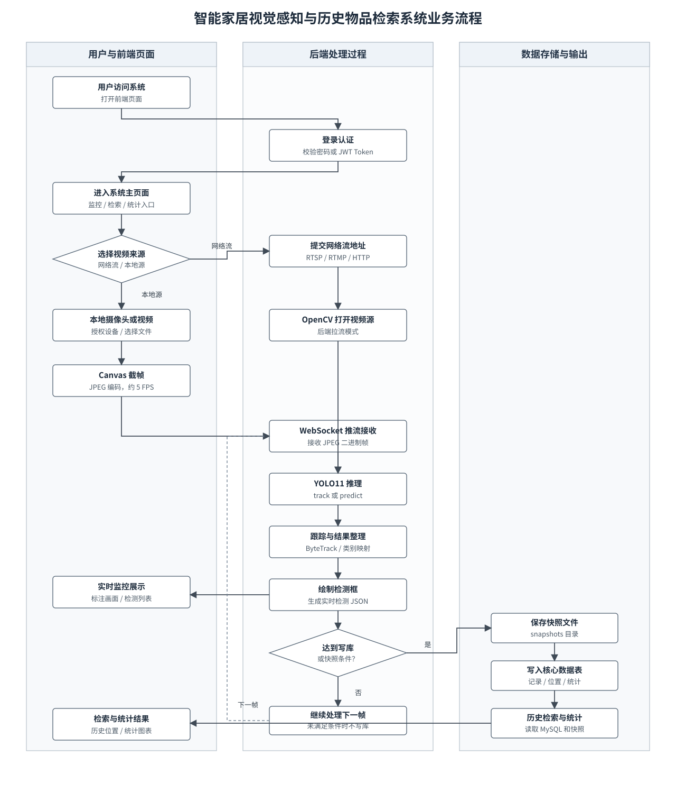

图 3-2 系统业务流程图

### 3.5 数据流分析

数据流分析关注系统内部“数据如何产生、加工、存储和输出”，而不是软件模块之间的调用关系。按照软件工程中数据流图（Data Flow Diagram，DFD）的表达方式，本文将外部实体、处理过程、数据存储和数据流分别表示，并采用自顶向下、逐层细化的方式说明系统边界与内部加工过程。其中，顶层数据流图用于描述系统与外部实体之间的数据交换，0 层数据流图用于概括系统内部的主要加工，1 层数据流图则进一步展开关键处理细节。

系统顶层数据流图如图 3-3 所示。在该层次中，智能家居视觉感知与历史物品检索系统被视为一个整体处理过程。用户向系统提交登录信息、查询条件、初始化配置和检测控制命令；视频源向系统提供网络视频流、摄像头帧或本地视频帧；系统向用户返回认证结果、实时检测画面、历史检索结果和统计分析结果。

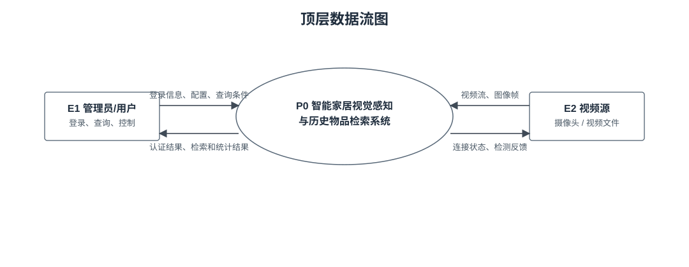

图 3-3 系统顶层数据流图

在 0 层数据流图中，系统整体处理过程被抽象为“系统配置与鉴权”“视频感知处理”“历史检索与统计服务”三个主要加工过程。该层次只说明系统主数据流的方向：用户首先完成认证和初始化配置，视频源进入视频感知处理过程并形成结构化检测数据，检测数据库和快照文件库为后续检索统计提供数据支撑。系统 0 层数据流图如图 3-4 所示。

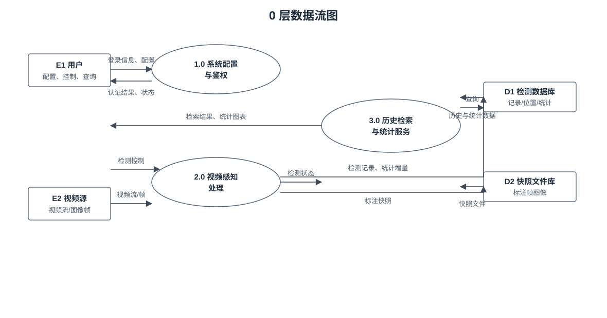

图 3-4 系统 0 层数据流图

在 1 层数据流图中，0 层中的“视频感知处理”和“历史检索与统计服务”被进一步细化。视频感知处理包括视频接入与帧预处理、模型检测与跟踪、检测结果整理、结果持久化与快照保存等处理环节；历史检索与统计服务包括关键词解析、历史记录查询、统计聚合读取和快照访问。该层次用于说明非结构化视频帧如何被转换为数据库记录和可视化查询结果。系统 1 层数据流图如图 3-5 所示。

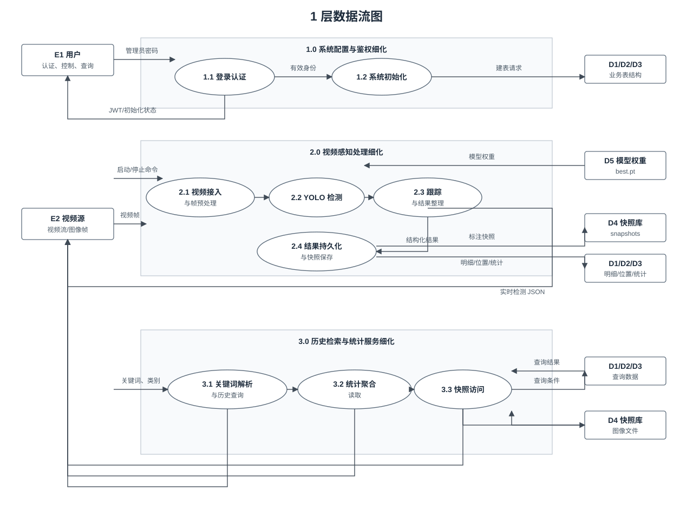

图 3-5 系统 1 层数据流图

## 4 系统总体设计

本章在需求分析的基础上给出系统总体设计方案。系统采用前后端分离的 B/S 架构，围绕数据层、算法层、后端服务层、前端展示层和部署层展开设计，并进一步说明后端模块、前端模块、功能结构、技术架构和数据库结构之间的关系，为第 5 章模型训练和第 6 章系统详细设计与实现提供整体框架。

### 4.1 总体架构

系统采用前后端分离的 B/S 架构，可划分为数据层、算法层、后端服务层、前端展示层和部署层。

数据层包括 SmartHome-COCO 数据集和 MySQL 数据库。前者用于模型训练，后者保存检测记录、最后出现位置和统计汇总。算法层包括 YOLO11 目标检测模型、ByteTrack 跟踪器和 OpenCV 图像处理逻辑。后端服务层基于 FastAPI，提供认证、检测、视频、统计、初始化和快照访问接口。前端展示层基于 Vue 3，提供实时监控大屏、历史检索页、统计分析页、登录页和初始化页。部署层使用 Dockerfile 与 Docker Compose 组织服务，并由 Nginx 托管前端静态资源、代理后端接口。

系统总体架构如图 4-1 所示。该架构从前端展示、后端服务、算法处理、数据存储和部署运行五个层面描述系统组成，体现了视频输入、模型推理、数据持久化和用户检索之间的关系。

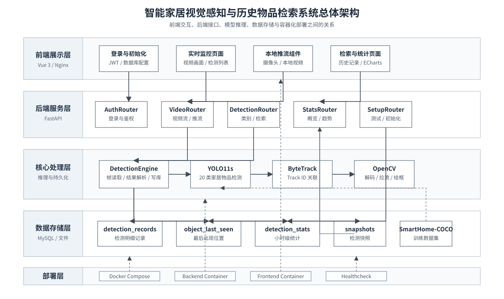

图 4-1 系统总体架构图

### 4.2 后端模块设计

后端包含以下模块：

1. `detection_engine.py`：系统核心推理引擎，负责模型加载、视频源打开、帧循环、YOLO 推理、ByteTrack 跟踪、检测框绘制、快照保存和数据库写入。
2. `models.py`：定义 `DetectionRecord`、`ObjectLastSeen` 和 `DetectionStat` 三张核心数据表。
3. `routers/video.py`：提供 MJPEG 视频流、实时检测 WebSocket、客户端推流 WebSocket、启动检测和停止检测接口。
4. `routers/detection.py`：提供类别列表、中文关键词检索、最后出现位置查询和历史记录分页查询接口。
5. `routers/stats.py`：提供概览统计、类别分布和时间分布接口。
6. `auth.py`：实现单管理员登录、JWT 签发、受保护 HTTP 接口依赖和客户端推流 WebSocket Token 校验。
7. `snapshot_cleaner.py`：后台定时清理超过保留天数的快照文件。

系统核心数据表的用途和关键字段如表 4-1 所示。

表 4-1 核心数据表说明

| 表名 | 作用 | 关键字段 |
| --- | --- | --- |
| `detection_records` | 保存每次检测记录 | `object_class`、`confidence`、`bbox_x/y/w/h`、`track_id`、`snapshot_path`、`detected_at` |
| `object_last_seen` | 保存每类物品最后出现位置 | `object_class`、`last_bbox_x/y/w/h`、`last_snapshot_path`、`last_seen_at`、`total_count` |
| `detection_stats` | 保存小时级统计 | `stat_date`、`stat_hour`、`object_class`、`detection_count` |

### 4.3 前端模块设计

前端以 Vue 3 单页应用形式实现，主要页面如下：

1. `DashboardView.vue`：实时监控大屏，展示 FPS、当前物品数、今日累计检测、活跃物品种类、视频画面和检测列表。
2. `LocalStreamer.vue`：浏览器本地摄像头和本地视频推流组件，负责采集帧、编码 JPEG、发送 WebSocket、接收推理结果图。
3. `SearchView.vue`：历史物品检索页面，支持类别筛选、中文关键词查询和快照查看。
4. `StatsView.vue`：统计分析页面，使用 ECharts 展示类别分布和时间趋势。
5. `SetupView.vue`：系统初始化页面，用于配置数据库连接并完成建表。
6. `LoginView.vue`：管理员登录页面，登录后将 JWT Token 保存到本地，用于后续接口请求。

前端与后端的交互统一放在 `api/` 目录中的封装模块里，便于维护接口地址、Token 注入和异常处理逻辑。

### 4.4 系统功能结构设计

系统功能按“基础配置、视频感知、历史检索、统计展示、系统安全与运维”划分。基础配置处理数据库初始化和模型参数；视频感知接入不同视频来源并完成推理；历史检索查询最后出现位置和明细记录；统计展示把检测数据转成图表；安全与运维负责认证、快照清理和健康检查。系统功能结构如图 4-2 所示。

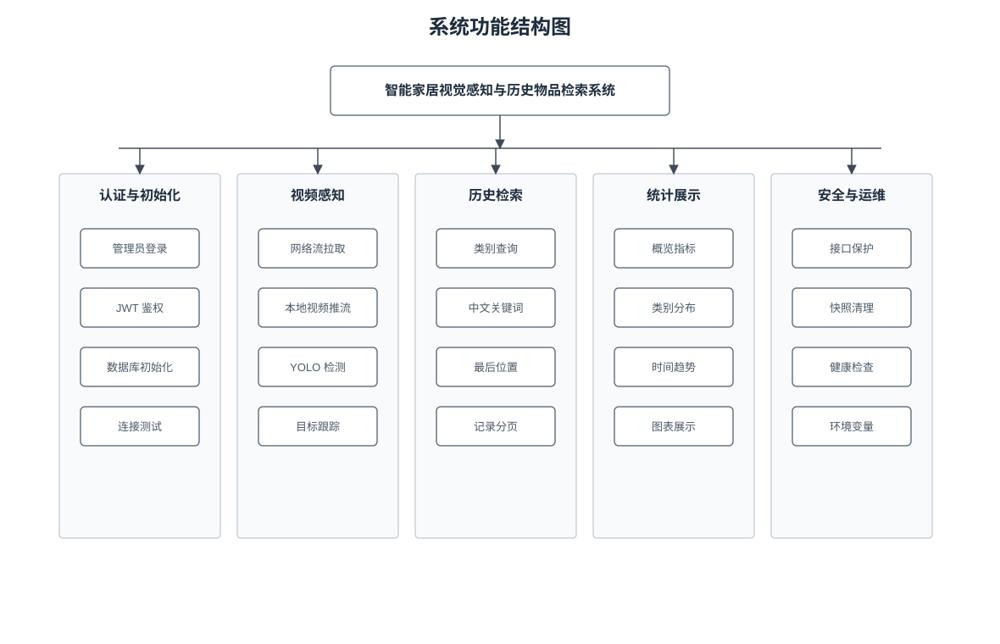

图 4-2 系统功能结构图

### 4.5 技术架构设计

系统采用前后端分离和容器化部署。前端由 Vue 3 构建单页应用，生产环境中由 Nginx 提供静态资源服务，并代理 `/api`、`/snapshots` 和 WebSocket 请求。后端由 FastAPI 提供 REST API、MJPEG 和 WebSocket 服务。推理部分调用 Ultralytics YOLO 与 OpenCV，持久化部分通过 SQLAlchemy 访问 MySQL。训练与评估脚本位于 `model_training/`，数据集处理脚本位于 `data_pipeline/`。系统技术架构如图 4-3 所示。

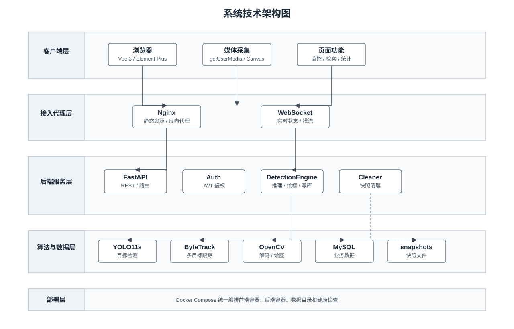

图 4-3 系统技术架构图

### 4.6 数据库设计

数据库围绕三类数据组织：检测明细、最后出现位置、统计聚合。`detection_records` 保存每一次识别结果，便于追溯；`object_last_seen` 保存每个类别的最新位置，便于快速回答“某物品最后出现在哪里”；`detection_stats` 保存小时级聚合结果，前端图表读取时不必重新扫描明细表。当前系统是单摄像头演示场景，`object_last_seen.object_class` 设置为唯一字段。若扩展到多摄像头，唯一约束应改为 `(camera_id, object_class)`。

系统数据库 E-R 图如图 4-4 所示，三张核心业务表分别承担检测明细、最后出现位置和统计聚合职责。

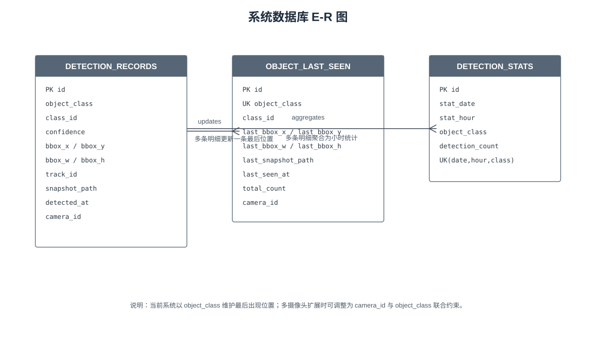

图 4-4 系统数据库 E-R 图

数据库表结构图如图 4-5 所示。为进一步说明各字段含义和约束关系，表 4-2 至表 4-4 分别给出了 `detection_records`、`object_last_seen` 和 `detection_stats` 的字段说明。

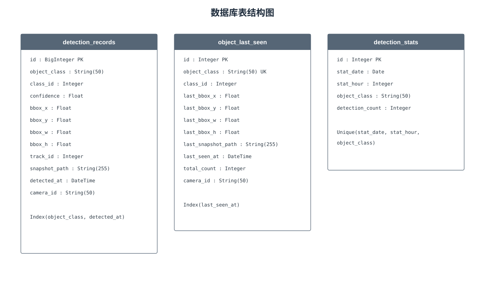

图 4-5 数据库表结构图

表 4-2 detection_records 表字段说明

| 字段 | 类型 | 约束/说明 |
| --- | --- | --- |
| `id` | BigInteger | 主键，自增 |
| `object_class` | String(50) | 物品英文类别，建立索引 |
| `class_id` | Integer | YOLO 类别编号 |
| `confidence` | Float | 检测置信度 |
| `bbox_x`、`bbox_y` | Float | 归一化边界框中心点坐标 |
| `bbox_w`、`bbox_h` | Float | 归一化边界框宽度和高度 |
| `track_id` | Integer | ByteTrack 跟踪编号，可为空 |
| `snapshot_path` | String(255) | 截帧快照路径，可为空 |
| `detected_at` | DateTime | 检测时间，建立类别-时间联合索引 |
| `camera_id` | String(50) | 摄像头标识 |

表 4-3 object_last_seen 表字段说明

| 字段 | 类型 | 约束/说明 |
| --- | --- | --- |
| `id` | Integer | 主键，自增 |
| `object_class` | String(50) | 物品英文类别，当前为唯一约束 |
| `class_id` | Integer | YOLO 类别编号 |
| `last_bbox_x`、`last_bbox_y` | Float | 最近一次出现的归一化边界框中心点坐标 |
| `last_bbox_w`、`last_bbox_h` | Float | 最近一次出现的归一化边界框宽度和高度 |
| `last_snapshot_path` | String(255) | 最近一次出现快照路径 |
| `last_seen_at` | DateTime | 最近一次出现时间，建立索引 |
| `total_count` | Integer | 累计出现次数 |
| `camera_id` | String(50) | 摄像头标识 |

表 4-4 detection_stats 表字段说明

| 字段 | 类型 | 约束/说明 |
| --- | --- | --- |
| `id` | Integer | 主键，自增 |
| `stat_date` | Date | 统计日期 |
| `stat_hour` | Integer | 统计小时 |
| `object_class` | String(50) | 物品英文类别 |
| `detection_count` | Integer | 检测次数 |
| `(stat_date, stat_hour, object_class)` | UniqueConstraint | 防止同一小时同一类别重复聚合 |

## 5 数据集构建与模型训练

本章围绕目标检测模型的训练过程展开，说明 SmartHome-COCO 数据集的构建方法、YOLO11s 模型选择与结构、训练配置以及训练与验证结果。数据集构建部分重点说明类别选择、标注格式转换和数据规模；模型说明部分明确本文采用的具体模型及其在系统中的作用；模型训练部分说明训练参数、推理配置和部署权重选择；结果分析部分通过总体指标、类别 AP 和不同模型规格对比，评估模型是否能够支撑系统原型运行。

### 5.1 SmartHome-COCO 数据集构建

SmartHome-COCO 并非重新采集的数据集，而是基于 COCO 2017 筛选得到的家居场景子集。处理脚本仅保留包含目标类别的图像，`iscrowd=True` 的实例不参与转换。本文选取 20 类物品：

`chair`、`couch`、`potted plant`、`bed`、`dining table`、`toilet`、`tv`、`laptop`、`mouse`、`remote`、`keyboard`、`cell phone`、`microwave`、`oven`、`toaster`、`sink`、`refrigerator`、`book`、`clock`、`vase`。

SmartHome-COCO 采用 YOLO 标注格式组织，转换后的数据规模如表 5-1 所示。

表 5-1 SmartHome-COCO 数据集规模

| 数据划分 | 图片数量 | 标签文件数量 | 目标实例数量 |
| --- | ---: | ---: | ---: |
| 训练集 | 44166 | 44166 | 154967 |
| 验证集 | 1899 | 1899 | 6962 |

数据集存在类别分布不均衡现象。`chair`、`book`、`dining table` 的实例较多，而 `toaster` 样本较少，验证集中仅包含 9 个实例。后续类别 AP 的差异与该长尾分布具有直接关系。

数据处理脚本 `data_pipeline.py` 采用固定流程执行。脚本首先检查 `coco2017/annotations`、`train2017`、`val2017` 是否存在，再使用 `pycocotools` 读取 `instances_train2017.json` 和 `instances_val2017.json`；随后按 20 个类别获取图像 ID，去重后复制图像。每个 COCO 标注框 `[x_min, y_min, width, height]` 被转换为 YOLO 格式 `[class_id, center_x, center_y, width, height]`，坐标保留 6 位小数。输出目录固定为 `data_pipeline/SmartHome_COCO/images/train`、`images/val`、`labels/train` 和 `labels/val`。类别顺序由 `TARGET_CLASSES` 指定，并与后端 `config.py` 中的 `CLASS_NAMES` 保持一致。

数据集构建流程如图 5-1 所示。该流程的关键在于保持类别编号一致：若训练阶段第 7 类对应 `tv`，后端映射也必须将第 7 类解释为 `tv`，否则会造成检测结果显示错误。

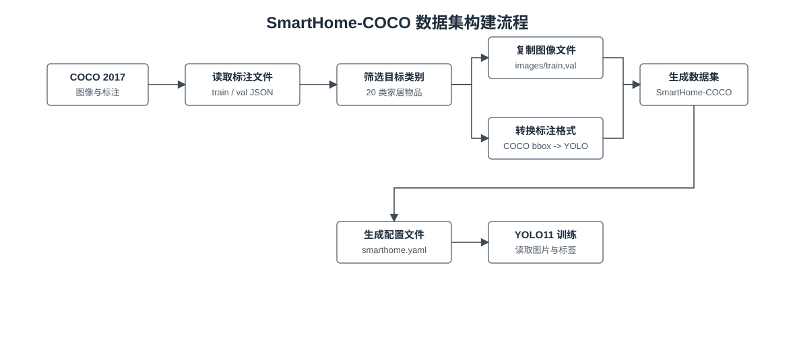

图 5-1 SmartHome-COCO 数据集构建流程图

为检查数据集类别覆盖与目标尺寸分布，训练过程生成了标签分布图，如图 5-2 所示。该图可用于观察各类别实例数量、目标中心点分布和边界框宽高分布，从而判断训练数据是否存在明显长尾或标注异常。


图 5-2 SmartHome-COCO 标签分布图

训练阶段的批次样例如图 5-3 所示。该图将多张训练图像及其标注框组合显示，用于确认图片读取、类别映射和 YOLO 标注格式是否正确。


图 5-3 YOLO11 训练批次样例图

### 5.2 YOLO11s 模型选择与结构说明

本文采用 Ultralytics YOLO11s 作为智能家居物品检测模型。YOLO11 系列提供 n、s、m、l、x 等不同规模模型，其中 YOLO11n 参数量较小、推理开销较低，适合算力受限场景；YOLO11s 参数量和权重文件较大，但特征表达能力更强。由于本文系统需要将检测结果进一步写入历史记录，漏检会导致物品最后出现位置缺失，因此模型选择时更关注召回率和 mAP 表现。结合第 5.4 节的复评结果，本文最终使用 YOLO11s 权重作为生产推理模型。

从系统训练与部署角度看，本文使用的 YOLO11s 模型由输入预处理、骨干特征提取、特征融合和检测头输出等部分构成。输入图像统一缩放至 640×640 后送入网络；骨干网络提取不同尺度的视觉特征；特征融合部分整合高层语义与低层细节；检测头输出边界框、类别概率和置信度。训练时，检测头按照 SmartHome-COCO 的 20 类家居物品重新适配；部署时，后端根据模型输出的类别编号映射为英文类别和中文显示名称，并进一步写入检测记录、最后出现位置和统计表。

本文使用的模型配置如表 5-2 所示。

表 5-2 YOLO11s 模型配置

| 项目 | 配置 |
| --- | --- |
| 基础模型 | YOLO11s |
| 初始权重 | `yolo11s.pt` |
| 输入尺寸 | 640×640 |
| 检测类别数 | 20 |
| 类别来源 | SmartHome-COCO |
| 生产权重 | `results-01/runs/train_smarthome_s/weights/best.pt` |
| 后端推理接口 | Ultralytics `predict` / `track` |
| 跟踪器 | ByteTrack |

上述模型并非仅用于离线评估，而是直接接入第 6 章所述系统后端。服务端拉流模式调用 `track` 接口保留目标 ID，浏览器推流模式调用 `predict` 接口完成单帧检测。两种模式共享同一套类别映射和阈值配置，保证训练结果、推理结果和前端展示之间保持一致。

### 5.3 模型训练配置

训练脚本使用 Ultralytics `YOLO` Python API。模型从 `yolo11s.pt` 预训练权重开始，训练配置为 `epochs=100`、`imgsz=640`、`batch=16`、`device="0,1"`、`workers=4`、`save_period=10`、`amp=True`。没有使用梯度累加；如果单卡显存不足，脚本注释中给出的处理方式是把 `batch` 从 16 降到 8。训练结果写入 `results-01/runs/train_smarthome_s`，部署时加载其中的 `weights/best.pt`。

推理配置写在后端 `config.py` 中：`CONFIDENCE_THRESHOLD=0.25`、`IOU_THRESHOLD=0.5`、`INPUT_SIZE=640`、`DEVICE="0"`。拉流跟踪器为 `bytetrack.yaml`，目标连续出现 3 帧后才允许持久化；数据库写入最小间隔为 3 秒，快照保存最小间隔为 5 秒，快照默认保留 7 天。训练和部署用同一套类别顺序，避免出现“模型检出第 11 类，前端显示成另一个物品”的错误。

模型训练与验证流程如图 5-4 所示。训练阶段读取 `data_pipeline/smarthome.yaml`；复评阶段的脚本 `model_training/val.py` 使用 `data_pipeline/smarthome_coco.yaml`，以 `imgsz=640`、`batch=16` 运行，并保存 JSON、混淆矩阵、PR 曲线和 F1 曲线。

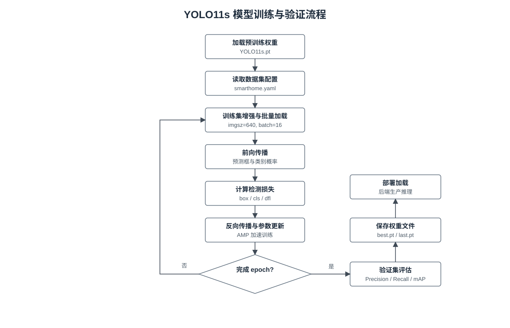

图 5-4 YOLO11s 模型训练与验证流程图

### 5.4 训练结果

根据 `results-01/runs/train_smarthome_s/results.csv`，训练日志记录至第 66 轮。第 66 轮也是 mAP@0.5 与 mAP@0.5:0.95 的最高轮次，主要指标如表 5-3 所示：

表 5-3 YOLO11s 训练日志最高轮次指标

| 指标 | 数值 |
| --- | ---: |
| Precision | 0.67572 |
| Recall | 0.61442 |
| mAP@0.5 | 0.65508 |
| mAP@0.5:0.95 | 0.48428 |

训练日志显示，第 66 轮达到本次训练中的最高 mAP 记录，其中 mAP@0.5 为 0.65508，mAP@0.5:0.95 为 0.48428。从第 56 轮到第 66 轮，mAP@0.5 增加 0.00702，mAP@0.5:0.95 增加 0.00696，验证集 box loss 下降 0.00303，指标提升幅度已趋于平缓。由于现有日志记录至第 66 轮，本文按该轮次作为当前训练结果进行分析。

复评在本地 CPU 环境运行 `model_training/val.py`。输入为 SmartHome-COCO 验证集，共 1899 张图片、6962 个实例；验证参数为 `imgsz=640`、`batch=16`、`save_json=True`、`plots=True`。复评结果如表 5-4 所示：

表 5-4 YOLO11s 验证集复评结果

| 指标 | 数值 |
| --- | ---: |
| Precision | 0.6775 |
| Recall | 0.6144 |
| mAP@0.5 | 0.6552 |
| mAP@0.5:0.95 | 0.4849 |

验证阶段生成混淆矩阵、归一化混淆矩阵、PR 曲线、F1 曲线和验证集预测样例。为避免只依赖单一指标评价模型，本文结合类别混淆、阈值变化和样例预测结果进行观察。图 5-5 和图 5-6 分别展示原始混淆矩阵和归一化混淆矩阵，用于分析类别间误检情况。


图 5-5 YOLO11s 混淆矩阵


图 5-6 YOLO11s 归一化混淆矩阵

在混淆矩阵之外，PR 曲线和 F1 曲线能够反映置信度阈值变化对模型表现的影响。如图 5-7 所示，PR 曲线用于观察查准率与召回率之间的关系；如图 5-8 所示，F1 曲线用于辅助判断当前置信度阈值设置是否合理。


图 5-7 YOLO11s PR 曲线


图 5-8 YOLO11s F1 曲线

验证集预测样例如图 5-9 所示。该图用于观察模型在真实验证图像上的检测框位置、类别显示和多目标识别效果，可与表格指标共同说明模型的实际检测表现。


图 5-9 YOLO11s 验证集预测样例

YOLO11s 每类 AP 指标如表 5-5 所示。

表 5-5 YOLO11s 各类别 AP 指标

| 类别 | AP@0.5 | AP@0.5:0.95 |
| --- | ---: | ---: |
| chair | 0.5471 | 0.3584 |
| couch | 0.6917 | 0.5365 |
| potted plant | 0.5130 | 0.3142 |
| bed | 0.6897 | 0.5269 |
| dining table | 0.5541 | 0.4130 |
| toilet | 0.8459 | 0.6796 |
| tv | 0.8161 | 0.6336 |
| laptop | 0.8163 | 0.6838 |
| mouse | 0.7661 | 0.5930 |
| remote | 0.5364 | 0.3406 |
| keyboard | 0.7350 | 0.5585 |
| cell phone | 0.5615 | 0.3952 |
| microwave | 0.8180 | 0.6692 |
| oven | 0.6537 | 0.4655 |
| toaster | 0.5580 | 0.3906 |
| sink | 0.6419 | 0.4285 |
| refrigerator | 0.7859 | 0.6466 |
| book | 0.2541 | 0.1373 |
| clock | 0.7516 | 0.5307 |
| vase | 0.5679 | 0.3967 |

类别级结果差异较明显。`toilet` 的 AP@0.5 为 0.8459，`laptop` 为 0.8163，`microwave` 为 0.8180，这类目标形态相对固定，且在图像中通常具有较清晰的外观特征。`book` 的 AP@0.5 仅为 0.2541，是所有类别中的最低值。可能原因包括：书籍在 COCO 图像中常成排摆放，边界框较为密集；单本书与书架背景纹理相似；小尺寸书脊在 640 输入分辨率下容易丢失细节。`toaster` 的验证实例仅有 9 个，虽然 AP@0.5 达到 0.5580，但该结果受样本量影响较大，不宜作过度解释。

本文进一步运行 `model_training/benchmark.py`，在同一验证集上比较 YOLO11n 与 YOLO11s，结果如表 5-6 所示：

表 5-6 YOLO11n 与 YOLO11s 复评对比

| 指标 | YOLO11n | YOLO11s |
| --- | ---: | ---: |
| 参数量 | 2.59M | 9.44M |
| 文件大小 | 15.2 MB | 54.4 MB |
| Precision | 0.6964 | 0.6775 |
| Recall | 0.5230 | 0.6144 |
| mAP@0.5 | 0.6013 | 0.6552 |
| mAP@0.5:0.95 | 0.4384 | 0.4849 |
| 评估耗时 | 109.7s | 275.7s |

对比结果显示，YOLO11s 的 Precision 为 0.6775，低于 YOLO11n 的 0.6964；但其 Recall 从 0.5230 提升至 0.6144，说明 YOLO11s 能够检出更多目标，同时也引入了一定数量的误检。考虑到历史检索场景更关注目标是否被记录，本文选择 YOLO11s 作为生产模型。其代价是 CPU 复评耗时由 109.7 s 增加至 275.7 s，权重文件由 15.2 MB 增加至 54.4 MB。若后续采用 GPU、TensorRT 或 ONNX Runtime 部署，绝对耗时会发生变化，但在相同 CPU 环境下，YOLO11s 的计算开销仍显著高于 YOLO11n。

## 6 系统详细设计与实现

本章在总体设计的基础上进一步说明系统关键功能的详细设计与实现过程。内容包括服务端拉流检测、浏览器客户端推流、历史检索与统计、安全鉴权与部署，以及核心类、时序、活动状态和系统界面等设计内容。通过对关键流程和核心模块的说明，展示目标检测结果如何在系统中完成解析、绘制、持久化和前端展示。

### 6.1 服务端拉流检测流程

服务端拉流检测面向 RTSP、RTMP、HTTP 视频流和后端可访问的视频文件，设计目标是在后端持续读取视频帧、完成 YOLO11s 检测与 ByteTrack 跟踪，并将稳定目标写入历史记录。该流程的输入为视频源地址或文件路径，输出包括标注后的实时画面、结构化检测列表、检测记录、最后出现位置和统计数据。

服务端拉流模式由 `DetectionEngine.start()` 启动。系统先判断输入源是网络流还是视频文件，再使用 OpenCV `VideoCapture` 打开视频源。每一帧进入模型前不单独做人工裁剪，推理阶段统一使用 `imgsz=640`。核心调用如下：

```python
results = self.model.track(
    frame,
    conf=config.CONFIDENCE_THRESHOLD,
    iou=config.IOU_THRESHOLD,
    imgsz=config.INPUT_SIZE,
    tracker=config.TRACKER_TYPE,
    persist=True,
    verbose=False
)
```

`_parse_results()` 读取 `boxes.cls`、`boxes.conf`、`boxes.xyxy` 和 `boxes.id`，整理出类别 ID、英文类别、中文类别、置信度、像素坐标、归一化中心点与宽高、`track_id`。`_draw_detections()` 在帧上写入边界框、中文标签、置信度和 FPS。MJPEG 输出使用 JPEG 质量 80；客户端推流回传图像使用 JPEG 质量 75。

在详细设计上，服务端拉流检测流程分为四个阶段：第一阶段负责打开视频源并维护运行状态；第二阶段负责逐帧调用 YOLO11s 与 ByteTrack，得到带有类别、置信度、边界框和 TrackID 的检测结果；第三阶段负责将模型输出转换为业务字段，并绘制前端可展示的检测画面；第四阶段根据稳定帧数、写库间隔和快照间隔决定是否持久化。该划分使模型推理、结果转换和业务写库相互隔离，便于后续调整阈值或替换检测模型。

持久化流程不直接按帧写入。系统维护每个 `track_id` 的计数；目标在当前帧消失时，计数递减，减至 0 后再删除。该策略能够容忍 25 FPS 视频中的单帧漏检。目标达到 `TRACK_PERSIST_FRAMES=3` 后才允许进入写库流程。写库全局最小间隔为 `DB_WRITE_INTERVAL=3` 秒，快照最小间隔为 `SNAPSHOT_INTERVAL=5` 秒。数据库操作由 `daemon=True` 的后台线程执行，避免单次 MySQL 写入阻塞下一帧推理。

模型推理结果到业务数据的转换流程如图 6-1 所示。YOLO 输出的原始张量先经过类别映射、坐标归一化、中文名称补全、跟踪 ID 读取、稳定性判断和节流控制，再进入 `detection_records`、`object_last_seen` 和 `detection_stats`。

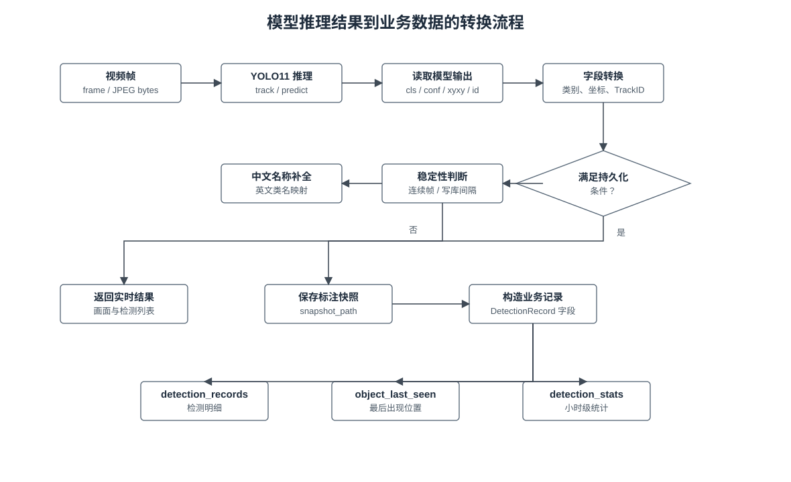

图 6-1 模型推理结果到业务数据的转换流程图

### 6.2 客户端推流检测流程

客户端推流检测用于处理服务器无法直接访问用户本地摄像头或本地视频文件的情况。该模式的设计目标是由浏览器完成设备授权、视频采集和帧编码，再通过 WebSocket 将图像帧推送至后端推理接口。与服务端拉流模式相比，客户端推流降低了家庭内网接入难度，但由于后端接收的是独立图像帧，默认不维护跨帧 TrackID。

客户端推流模式由 `LocalStreamer.vue` 实现。摄像头模式调用 `navigator.mediaDevices.getUserMedia({ video: { width: 640, height: 480 } })`；本地视频模式读取用户选择的视频文件，并交给 `<video>` 元素播放。采集定时器固定为 200 ms，也就是约 5 FPS。每次采集时，前端把画面绘制到 640×480 Canvas，再以 JPEG 质量 0.75 编码为 Blob，经 WebSocket 二进制消息发送给后端。

后端 `/api/video/ws/push` 接口首先读取 query 参数中的 JWT Token。Token 无效时，系统拒绝建立连接。收到 JPEG 字节后，`infer_single_frame()` 使用 `cv2.imdecode` 完成解码，再调用 `model.predict(conf=0.25, iou=0.5, imgsz=640)` 执行推理。推流模式不调用 `track`，以避免与拉流引擎的跟踪状态混用。该模式的不足在于缺少 TrackID，所有检出物品只能按类别进行节流写库，因此更适合临时演示和公网接入，不适合精细轨迹分析。

### 6.3 历史检索与统计实现

历史检索与统计模块的设计目标是将实时检测产生的结果转化为可查询、可汇总的数据服务。历史检索侧重回答“某类物品最后出现在哪里”，统计分析侧重回答“不同类别物品在不同时间段出现了多少次”。因此，系统在数据库层将检测明细、最后出现位置和小时级统计拆分为三张表，既保留原始记录，又提高常用查询效率。

历史检索围绕 `object_last_seen` 和 `detection_records` 两张表实现。用户可按英文类别或中文关键词查询物品最后出现位置。例如输入“笔记本”时，后端先在中文映射表中匹配 `laptop`，再查询该类别在 `object_last_seen` 中的最新记录。历史记录接口支持按类别、起止时间和分页参数查询 `detection_records`，便于展示某类物品在一段时间内的出现轨迹。

统计模块通过 `detection_stats` 表维护小时级聚合数据。每次写入检测记录时，后端同步更新当前日期、当前小时和当前类别对应的检测次数。前端统计页以图表形式展示类别分布和时间趋势，便于用户观察不同时间段内的物品出现频次。

### 6.4 安全与部署实现

安全与部署模块的设计目标是保证系统在本地或服务器环境中能够完成基本访问控制、配置隔离和容器化运行。由于系统涉及摄像头画面、历史快照和数据库连接信息，后端需要对检测控制、历史检索、统计分析、系统初始化和客户端推流等关键接口进行鉴权，同时避免将数据库密码等敏感信息写入代码仓库。

系统加入单管理员 JWT 鉴权。登录接口校验环境变量 `ADMIN_PASSWORD` 指定的管理员密码并签发 Token；启动检测、停止检测、状态查询、历史检索、统计分析和系统初始化等受保护 HTTP 接口通过 `Authorization: Bearer <token>` 访问；客户端推流接口 `/api/video/ws/push` 通过 query 参数传递 Token，并调用 `verify_ws_token()` 校验。当前代码中的 MJPEG 实时画面接口和实时状态广播 WebSocket 主要服务同域前端展示，接口内部未单独校验 Token。若部署到公网，应在反向代理层增加访问控制，或在接口中补充鉴权。数据库密码处理上，系统优先读取 `DB_PASSWORD` 环境变量；初始化页面输入的密码只保存在运行时内存，避免继续向 JSON 文件明文写入敏感信息。

部署方面，系统使用 `Dockerfile.backend`、`Dockerfile.frontend` 和 `docker-compose.yml`。后端容器挂载 `backend/data` 与 `backend/snapshots`，用于持久化配置和快照。前端容器由 Nginx 托管，监听 `10080` 端口。Compose 文件为前后端配置 healthcheck：后端访问 `/api/health` 检查服务状态，前端通过 `wget --spider` 检查 Nginx 静态服务是否可用。

本文系统的完整代码已托管至 GitHub 仓库，作为项目源码、训练脚本、前后端实现和部署配置的统一存储位置。仓库地址为：`https://github.com/xez014/yolo-smarthome`。

### 6.5 核心类与模块关系设计

系统后端采用按模块组织的设计。`DetectionEngine` 是运行时核心单例对象；路由层负责输入校验和接口暴露；模型层负责数据库实体映射；认证模块负责 Token 生成与验证。前端页面通过 API 封装模块访问后端，实时推流组件通过 WebSocket 与视频路由交互。为避免单张类图过于拥挤，本文将后端模块关系和核心数据实体分开表示。后端模块关系如图 6-2 所示。

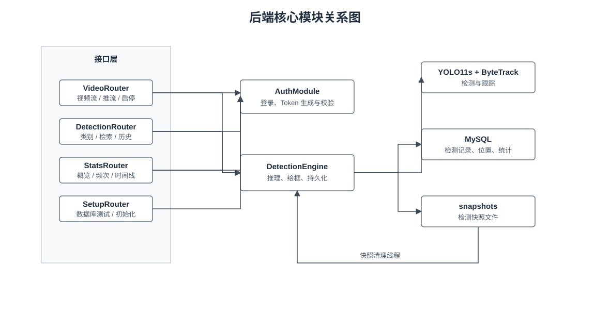

图 6-2 后端核心模块关系图

核心数据实体关系如图 6-3 所示。`DetectionRecord` 保存检测明细，`ObjectLastSeen` 由检测明细更新得到，`DetectionStat` 由检测明细聚合得到。

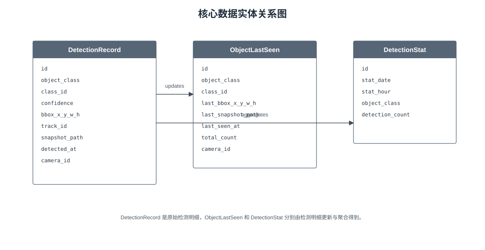

图 6-3 核心数据实体关系图

### 6.6 关键时序设计

客户端推流模式体现了本系统的主要交互过程。对用户而言，该过程表现为选择摄像头或本地视频后启动检测，系统持续在页面中返回带检测框的画面；对系统内部而言，该过程是一条由浏览器、WebSocket 接口、检测引擎、YOLO11 模型、数据库和快照目录共同参与的连续处理链路。该模式并不要求后端主动访问用户家庭摄像头，而是由浏览器将已获授权的视频帧主动推送至服务器，因此能够绕开公网服务器难以直接访问家庭内网摄像头的问题，也更适合临时演示和普通用户的本地设备接入。客户端推流时序如图 6-4 所示。

在时序上，前端首先完成用户交互和视频采集：用户点击启动检测后，`LocalStreamer` 组件调用 `getUserMedia` 获取摄像头画面，或读取用户选择的本地视频文件。随后前端携带登录后获得的 JWT Token 建立 WebSocket 连接，后端在连接建立阶段完成身份校验，避免未登录用户直接推送视频帧。连接通过后，前端不直接上传完整视频文件，而是以约 200 ms 一次的频率从 Canvas 中截取当前帧，将其编码为 JPEG 二进制数据发送到后端，从而兼顾实时交互、网络传输开销和服务器推理压力。

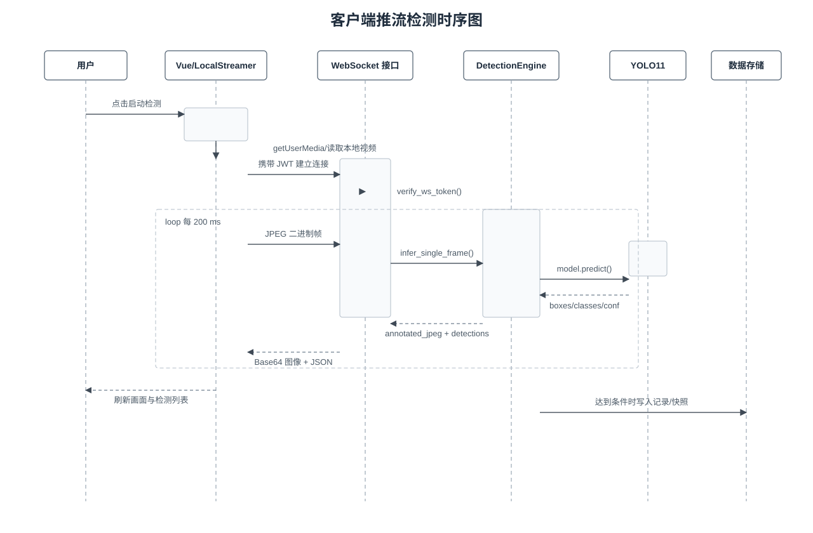

图 6-4 客户端推流检测时序图

后端收到单帧图像后，首先将 JPEG 字节解码为可供 OpenCV 和模型处理的图像矩阵，再交由 `DetectionEngine` 调用 YOLO11 模型进行推理。模型返回目标类别、置信度和边界框坐标后，检测引擎将其转换为前端可读的检测列表，并在图像上绘制标注框。处理完成后，WebSocket 接口将标注后的图像以 Base64 形式返回给前端，同时返回结构化检测 JSON，前端据此刷新实时画面和检测结果列表。该流程本质上是按帧循环执行“接收、推理、绘制、返回”的处理过程。

为降低高频视频帧对数据库写入性能的影响，系统未立即保存每一帧检测结果，而是设置写库间隔和快照保存间隔。仅当达到持久化条件时，检测引擎才将检测记录写入 `detection_records`，更新 `object_last_seen` 中对应物品的最后出现位置，并同步累计统计数据；当达到快照间隔时，系统还会将当前标注帧保存到 `snapshots` 目录，供历史检索页面展示。该设计在实时响应和存储控制之间取得平衡，既保证前端画面及时返回，也避免历史数据因重复帧过多而快速膨胀。

### 6.7 活动图设计

从系统内部活动看，检测流程首先判断用户选择的视频来源，而不是直接调用模型。如果输入源为网络流，系统由后端通过 OpenCV 进行拉流；如果输入源为本地摄像头或本地视频，则由浏览器先截帧，再通过 WebSocket 推送至后端。该设计将不同视频入口分别处理，同时使后续推理、绘框和结果返回复用同一套逻辑，避免系统结构因视频来源差异而过度分散。

单轮检测从开始到结束的活动过程如图 6-5 所示。每一帧进入系统后，首先判断帧是否有效；无效帧不进入推理阶段，系统返回错误提示或等待下一帧。有效帧进入 YOLO11 推理阶段。对于后端拉流模式，系统结合 ByteTrack 生成 Track ID，用于判断同一目标是否连续出现；对于浏览器推流模式，系统主要处理单帧检测结果。最后，系统根据写库条件决定是否保存快照和写入 MySQL；未达到条件时，仅将实时画面和检测列表返回给前端，以保证页面响应及时。

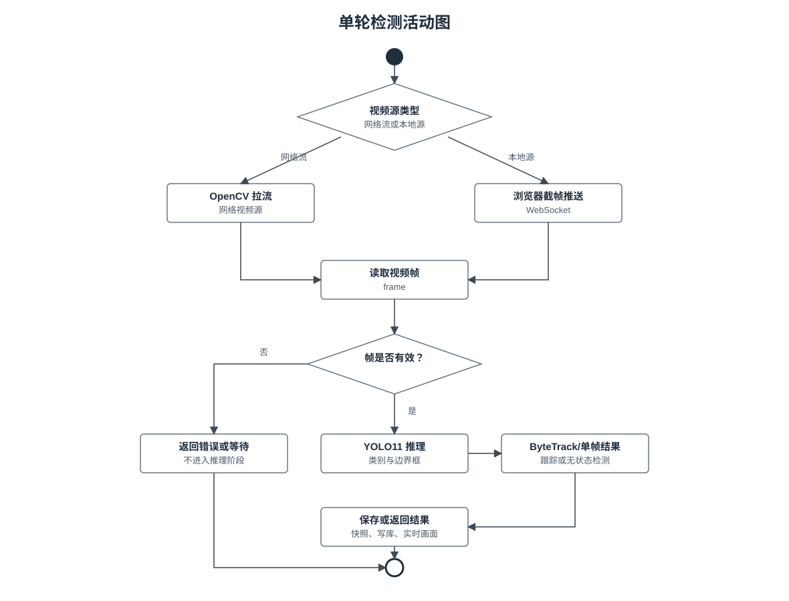

图 6-5 单轮检测活动图

### 6.8 状态图设计

推理引擎状态图用于说明系统在不同运行阶段的状态转换，如图 6-6 所示。系统启动初期，模型权重尚未加载完成，因此先处于“未加载模型”状态；若权重文件存在并加载成功，则进入“空闲”状态，表示系统已完成准备并等待用户启动检测。若权重路径错误、模型文件缺失或加载失败，系统进入“错误”状态，提示用户修正配置，避免继续执行后续检测流程。

当用户点击启动检测后，系统从“空闲”切换至“运行中”。在该状态下，后端循环读取视频帧、调用模型推理，并按条件保存快照和写入数据库。用户点击停止检测时，系统先进入“停止中”状态，完成视频源释放、后台线程退出和实时状态清空后，再回到“空闲”状态。该设计用于保证摄像头、视频流和推理状态得到正常释放，避免后续启动时出现资源占用或状态显示异常等问题。

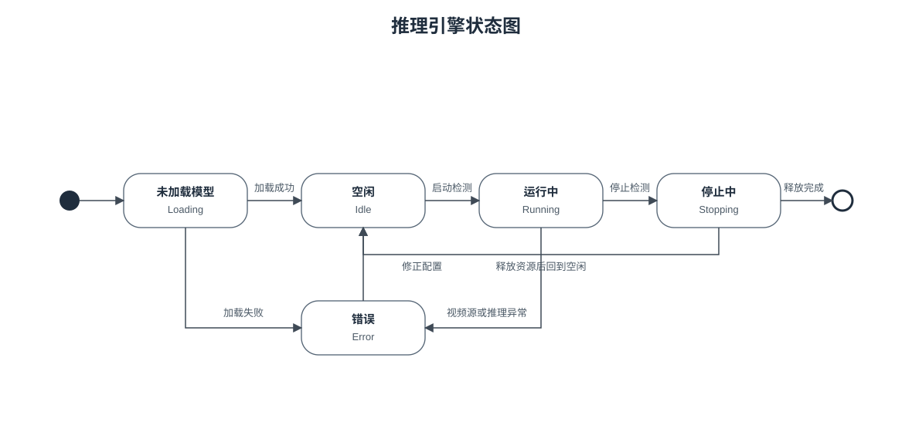

图 6-6 推理引擎状态图

### 6.9 系统界面截图说明

系统界面截图用于展示各功能模块的运行效果，并和第 7 章功能测试相互对应。本文展示登录认证、系统初始化、实时监控、本地推流、历史检索和统计分析等页面，截图内容见表 6-1。

表 6-1 系统界面截图说明

| 图号 | 截图名称 | 对应页面/组件 | 截图内容 |
| --- | --- | --- | --- |
| 图 6-7 | 登录界面截图 | `LoginView.vue` | 管理员登录入口、密码输入与登录按钮 |
| 图 6-8 | 系统初始化界面截图 | `SetupView.vue` | MySQL 连接配置、测试连接、初始化按钮 |
| 图 6-9 | 实时监控主页面截图 | `DashboardView.vue` | 监控大屏、系统状态、核心功能入口 |
| 图 6-10 | 视频检测界面截图 | `LocalStreamer.vue` | 浏览器本地视频推流后的检测框画面 |
| 图 6-11 | 历史物品检索截图 | `SearchView.vue` | 中文关键词检索、最后出现时间、快照结果 |
| 图 6-12 | 统计分析页面截图 | `StatsView.vue` | 类别频次图、时间线图和检测概览 |

系统登录界面如图 6-7 所示。系统采用单管理员模式，用户输入管理员密码后，后端签发 JWT Token。前端在后续受保护接口请求和客户端推流连接中携带该 Token，以限制未认证用户执行检测控制、检索、统计和初始化操作。


图 6-7 登录界面截图

系统初始化界面如图 6-8 所示。首次部署时，用户在该页面填写 MySQL 主机、端口、用户名、密码和数据库名称。系统提供连接测试和初始化建表，减少命令行配置数据库的操作。


图 6-8 系统初始化界面截图

系统实时监控主页面如图 6-9 所示。该页面集中显示系统运行状态、实时监控入口、历史检索入口和统计分析入口，是用户进入系统后的主操作界面。


图 6-9 实时监控主页面截图

视频检测界面如图 6-10 所示。用户选择本地视频并启动检测后，前端通过 WebSocket 将视频帧发送给后端。后端完成 YOLO 推理，返回带检测框和类别标签的画面，浏览器端即可完成视频检测演示。


图 6-10 视频检测界面截图

历史物品检索界面如图 6-11 所示。用户可按物品类别或中文关键词查询历史检测记录。系统返回对应物品最近出现的时间、位置和快照信息，用于定位物品最后出现的位置。


图 6-11 历史物品检索界面截图

统计分析界面如图 6-12 所示。系统按类别和时间聚合检测记录，并通过图表展示物品出现频次和变化趋势，便于观察家庭场景中常见物品的出现规律。


图 6-12 统计分析页面截图

## 7 实验与分析

本章对系统功能、模型效果和工程实现效果进行验证与分析。功能验证部分检查视频接入、实时检测、历史检索、统计分析和安全控制等主要链路；测试用例部分整理系统联调过程中的输入、操作和预期结果；模型效果分析部分结合验证集指标说明 YOLO11s 的检测性能；工程效果分析和不足总结则进一步讨论当前系统在部署、推流、数据库设计和长期运行方面的表现与限制。

### 7.1 功能验证

系统功能验证围绕视频接入、实时检测、历史检索、统计分析和安全控制展开，覆盖以下内容：

1. 网络流模式：用户输入 RTSP/RTMP/HTTP 地址后，后端打开视频源并返回 MJPEG 标注画面，同时通过 WebSocket 推送检测列表。
2. 本地摄像头模式：浏览器获取摄像头权限后，以约 5 FPS 推送帧至后端；后端返回标注图，并同步前端检测面板。
3. 本地视频模式：用户选择本地视频文件后，系统沿用 WebSocket 推流链路完成检测演示。
4. 历史检索：系统按类别保存最后出现位置，支持中文关键词查询，返回快照、时间和归一化坐标。
5. 统计分析：系统按日期、小时和类别累计检测次数，并在前端展示总量和类别分布。
6. 安全控制：启动/停止检测、状态查询、检索、统计和客户端推流等接口已接入 JWT 鉴权；实时画面流和状态广播在当前版本中作为同域展示接口使用，代码层面未单独校验 Token。

### 7.2 测试用例图与测试用例设计

系统测试覆盖功能正确性、接口稳定性、数据持久化、安全鉴权和部署可用性。系统测试用例的分类结构如图 7-1 所示，后续表格用于记录系统运行结果，执行时可把界面截图、接口返回、数据库记录和日志输出作为证据材料。

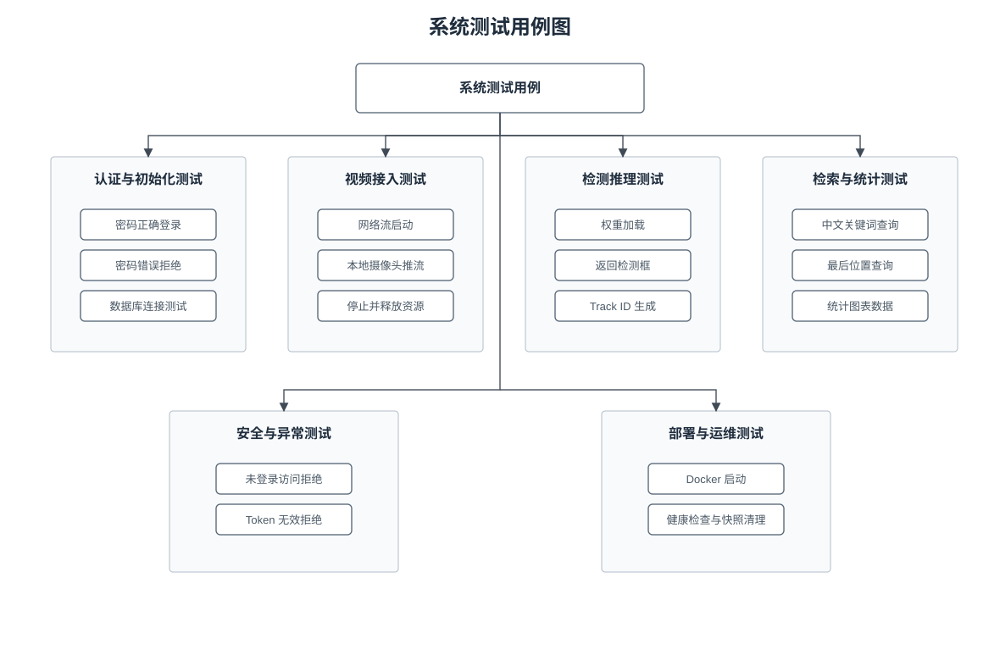

图 7-1 系统测试用例图

表 7-1 系统测试用例设计

| 编号 | 测试模块 | 测试用例 | 输入/操作 | 预期结果 |
| --- | --- | --- | --- | --- |
| TC-01 | 认证 | 管理员登录成功 | 输入正确 `ADMIN_PASSWORD` | 返回 JWT Token，进入系统首页 |
| TC-02 | 认证 | 管理员登录失败 | 输入错误密码 | 返回 401 或错误提示，不签发 Token |
| TC-03 | 初始化 | 数据库连接测试 | 输入 MySQL host、port、user、password、dbname | 返回连接成功或明确错误信息 |
| TC-04 | 初始化 | 数据库建表 | 点击初始化按钮 | 创建三张核心业务表，系统状态为已初始化 |
| TC-05 | 网络流检测 | 启动 RTSP/HTTP 流 | 输入合法流地址并启动检测 | 后端进入运行状态，前端显示检测画面 |
| TC-06 | 本地推流 | 浏览器摄像头推流 | 授权摄像头并启动检测 | WebSocket 建连成功，返回标注帧和检测列表 |
| TC-07 | 本地视频 | 本地文件推流 | 选择视频文件并启动检测 | 系统按固定帧率推送帧并返回检测结果 |
| TC-08 | 持久化 | 检测记录写入 | 检测到稳定目标 | `detection_records` 新增记录，必要时保存快照 |
| TC-09 | 检索 | 中文关键词查询 | 输入“笔记本”“手机”等关键词 | 返回对应英文类别的最后出现位置 |
| TC-10 | 统计 | 类别频次查询 | 打开统计页 | 返回最近 N 天类别排行和图表数据 |
| TC-11 | 安全 | 未携带 Token 访问保护接口 | 直接请求检测/统计接口 | 返回未授权错误 |
| TC-12 | 运维 | 快照清理 | 设置保留天数并等待清理线程 | 超期快照被删除，未超期快照保留 |
| TC-13 | 部署 | Docker 健康检查 | 启动 compose 服务 | 前后端 healthcheck 均为 healthy |

根据系统联调和功能验证结果，各测试用例的执行情况如下：TC-01 在输入正确管理员密码后能够正常返回 JWT Token，并进入系统首页，说明认证流程和前端登录跳转逻辑有效；TC-02 在输入错误密码时能够拒绝访问并给出错误提示，未签发 Token，说明系统能够阻止非法登录；TC-03 在填写数据库连接参数后能够返回明确的连接状态，错误配置也能反馈失败原因，便于后续排查；TC-04 执行初始化后能够创建检测记录、最后出现位置和统计数据等核心业务表，系统状态能够切换为已初始化。

视频接入和检测推理相关用例中，TC-05 使用合法 RTSP/HTTP 视频流地址后，后端能够进入检测运行状态，前端可显示实时检测画面；TC-06 在浏览器授权摄像头后能够建立 WebSocket 连接，并持续返回标注帧和检测结果；TC-07 选择本地视频文件后，系统能够按照设定帧率推送视频帧，检测结果能够随画面同步更新；TC-08 在连续检测到稳定目标后，系统能够向 `detection_records` 写入记录，并在需要时保存目标快照，说明检测结果具备持久化能力。

检索、统计、安全和运维相关用例中，TC-09 输入“笔记本”“手机”等中文关键词后，系统能够完成中英文类别映射，并返回目标最后出现位置；TC-10 打开统计页面后能够获取最近时间范围内的类别频次排行和图表数据，统计结果与检测记录保持一致；TC-11 在未携带 Token 访问受保护接口时返回未授权结果，说明接口鉴权机制生效；TC-12 设置快照保留时间后，清理线程能够删除超期文件并保留有效快照；TC-13 启动 Docker Compose 服务后，前端和后端健康检查均能通过，说明系统具备基本部署可用性。整体来看，上述测试用例均达到预期结果，系统主要功能链路能够稳定闭环。性能压力测试、不同摄像头实测 FPS、长时间运行稳定性和浏览器兼容性数据，需要结合具体硬件环境进一步统计。

### 7.3 模型效果分析

为更清晰地呈现模型效果，表 7-2 汇总了 YOLO11n 与 YOLO11s 的主要对比指标、类别表现差异和定位质量结论。该表与第 5.4 节的训练结果相对应，用于从系统应用角度说明模型取舍。

表 7-2 模型效果综合分析表

| 分析维度 | 具体结果 | 说明 |
| --- | --- | --- |
| 总体 Precision | YOLO11n 为 0.6964，YOLO11s 为 0.6775 | YOLO11s 查准率略低，引入部分误检 |
| 总体 Recall | YOLO11n 为 0.5230，YOLO11s 为 0.6144 | YOLO11s 召回率更高，更适合减少历史记录漏写 |
| mAP@0.5 | YOLO11n 为 0.6013，YOLO11s 为 0.6552 | YOLO11s 在宽松 IoU 阈值下整体检测效果更好 |
| mAP@0.5:0.95 | YOLO11n 为 0.4384，YOLO11s 为 0.4849 | YOLO11s 在多阈值综合评价下仍具有优势 |
| 表现较好类别 | `toilet` 0.8459，`laptop` 0.8163，`tv` 0.8161 | 形态较稳定、目标边界较清晰的类别更容易检测 |
| 表现较弱类别 | `book` AP@0.5 为 0.2541 | 小目标、密集排列和纹理重复会降低检测效果 |
| 部署代价 | YOLO11s 权重 54.4 MB，CPU 复评 275.7 s | 精度与召回提升以更高计算开销为代价 |
| 系统取舍 | 采用 YOLO11s | 历史检索场景更关注目标是否被记录 |

YOLO11s 的总体指标能够支撑系统原型运行，但其提升并非体现在所有指标上。与 YOLO11n 相比，YOLO11s 的 Recall 从 0.5230 提升至 0.6144，mAP@0.5 从 0.6013 提升至 0.6552；但 Precision 从 0.6964 降至 0.6775。该结果说明 YOLO11s 在提高召回率的同时引入了部分误检。考虑到历史检索场景中漏检会直接导致物品最后出现记录缺失，本文接受该精度与召回率之间的取舍。

类别层面存在若干明显差异。`book` 的 AP@0.5 仅为 0.2541，显著低于 `laptop` 的 0.8163 和 `tv` 的 0.8161。该现象可能与书籍摆放方式有关：书脊密集、目标尺寸小、纹理重复，导致 YOLO 在 640 输入分辨率下难以将单本书从背景中分离出来。`toaster` 的 AP@0.5 为 0.5580，但验证集中仅有 9 个实例，因此该指标可能受到样本偶然性的影响。

mAP@0.5:0.95 为 0.4849，低于 mAP@0.5 的 0.6552，说明模型在较宽松 IoU 阈值下具有一定检测能力，但在 IoU 阈值收紧后，边界框定位质量仍有提升空间。后续训练不宜仅依赖增加训练轮次，而应优先补充真实家庭视角数据，提高小目标样本占比，并尝试 800 或 1024 输入尺寸。需要注意的是，提高输入尺寸会相应增加显存需求。

### 7.4 工程效果分析

从工程效果看，系统的关键价值在于将检测框进一步转化为可检索记录。服务端拉流模式能够获取 ByteTrack 的 `track_id`，因此可以通过 3 帧确认机制过滤部分短时误检；浏览器推流模式能够绕开家庭网络的内网穿透问题，但每帧独立推理，无法维持跨帧身份。两种模式并非互相替代关系，前者更适合固定摄像头长期运行，后者更适合临时接入和演示。

数据库三张核心表的职责划分较为清晰。`DetectionRecord` 保存检测明细，`ObjectLastSeen` 用于快速查询物品最后出现位置，`DetectionStat` 为统计图表提供聚合数据。但当前设计仍存在限制：`object_last_seen` 以 `object_class` 作为唯一约束。当多摄像头同时检测到同类物品时，后写入记录会覆盖前一位置。该问题在单摄像头演示中不明显，但扩展到多房间场景时，应将唯一约束调整为 `(camera_id, object_class)` 或引入房间维度。

推流链路仍存在延迟压力。前端每 200 ms 发送一帧，理论帧率约为 5 FPS；若后端 CPU 单帧推理耗时超过 200 ms，WebSocket 消息可能出现排队。本文通过 3 秒写库间隔和 5 秒快照间隔减轻数据库与磁盘压力，但该策略不能解决模型推理耗时问题。后续可通过降低推帧频率、部署 GPU 推理、采用 ONNX Runtime 或 TensorRT 加速等方式改进。

### 7.5 不足与改进方向

当前系统仍有以下不足：

1. 训练数据主要来自 COCO，缺少固定高位监控视角、夜间低光照、运动模糊和半遮挡样本。
2. 浏览器推流模式采用无状态单帧推理，没有跨帧 TrackID，连续出现的同一物品仍可能被写成多条记录。
3. `object_last_seen` 当前以 `object_class` 作为唯一约束，多摄像头同类物品会互相覆盖。
4. 快照预览未叠加历史边界框坐标，用户打开截图后仍需自行定位目标区域。
5. 前端 ECharts 与 Element Plus 尚未按需加载，生产包体积还有压缩空间。

后续工作可优先从三个方面展开：采集 3000 至 5000 张真实家庭视角图片进行微调；将推流链路改造为带短时缓存的跟踪流程；在数据库中加入 `room_id` 或 `camera_id` 联合约束。在此基础上，再进一步扩展自然语言检索能力。

## 8 总结与展望

本章对全文工作进行总结，并结合实验结果和系统实现情况提出后续改进方向。总结部分概括本文完成的系统设计、模型训练和功能实现；展望部分围绕真实家庭数据采集、更多找物类别扩展、推理加速、多摄像头支持和自然语言检索等方向说明进一步研究空间。

本文设计并实现了一套基于 YOLO 的智能家居视觉感知与历史物品检索系统。系统使用 YOLO11s 检测 20 类家居物品，并结合 FastAPI、OpenCV、ByteTrack、MySQL、Vue 3 和 WebSocket，实现实时检测、历史位置记录、快照保存、中文检索、统计分析、登录鉴权和容器化部署。实验与联调结果表明，该系统能够将家庭视频流中的部分物品目标转化为可查询记录。

本文工作的重点在于目标检测能力与应用系统链路的结合。目标检测模块负责从画面中定位物品，ByteTrack 与 3 帧确认机制用于降低短时误检影响，3 秒写库间隔和 5 秒快照间隔用于控制存储压力，浏览器推流链路用于缓解家庭网络接入受限的问题。通过上述模块协同，系统实现了从视频回放到结构化检索的功能转化。

同时，当前模型与系统仍存在一定局限。`book` 等小而密集的目标检测效果较差，浏览器推流模式缺少 TrackID，多摄像头场景下的数据库约束仍需调整。后续研究应优先采集真实家庭数据，扩展钥匙、钱包、眼镜等找物类别，并进一步探索 ONNX/TensorRT 加速、多摄像头房间语义建模和自然语言检索等方向。

## 参考文献

[1] Jocher G, Chaurasia A, Qiu J. Ultralytics YOLOv8[EB/OL]. 2023. https://github.com/ultralytics/ultralytics/blob/main/docs/en/models/yolov8.md.

[2] Ultralytics. Ultralytics YOLO11 Model Card[EB/OL]. https://huggingface.co/Ultralytics/YOLO11.

[3] Zhao Y, Yang D, Cao S, Cai B, Maryamah M, Solihin M I. Object detection in smart indoor shopping using an enhanced YOLOv8n algorithm[J]. IET Image Processing, 2024, 18(14): 4745-4759. DOI: 10.1049/ipr2.13284.

[4] Pokuciński S, Mrozek D. Object Detection with YOLOv5 in Indoor Equirectangular Panoramas[J]. Procedia Computer Science, 2023, 225: 2420-2428.

[5] Zhang Y, Sun P, Jiang Y, Yu D, Weng F, Yuan Z, et al. ByteTrack: Multi-Object Tracking by Associating Every Detection Box[C]//European Conference on Computer Vision. 2022.

[6] Ultralytics. Multi-Object Tracking with Ultralytics YOLO[EB/OL]. https://github.com/ultralytics/ultralytics/blob/main/docs/en/modes/track.md.

[7] MDN Web Docs. MediaDevices: getUserMedia() method[EB/OL]. https://developer.mozilla.org/en-US/docs/Web/API/MediaDevices/getUserMedia.

[8] MDN Web Docs. WebSocket[EB/OL]. https://developer.mozilla.org/en-US/docs/Web/API/WebSocket.

[9] 郭磊, 王邱龙, 薛伟, 郭济. 基于改进YOLOv5的小目标检测算法[J]. 电子科技大学学报, 2022, 51(2): 251-258. DOI: 10.12178/1001-0548.2021235.

[10] 章程军, 胡晓兵, 牛洪超. 基于改进YOLOv5的车辆目标检测研究[J]. 四川大学学报(自然科学版), 2022, 59(5): 053001. DOI: 10.19907/j.0490-6756.2022.053001.

[11] 赵畅. 基于YOLOv5改进的人脸检测算法的研究与实现[D]. 长春: 吉林大学, 2022.

[12] 王选. 基于深度学习的水下复杂环境目标检测研究[D]. 成都: 电子科技大学, 2022.

[13] Ren S, He K, Girshick R, Sun J. Faster R-CNN: Towards Real-Time Object Detection with Region Proposal Networks[J]. IEEE Transactions on Pattern Analysis and Machine Intelligence, 2017, 39(6): 1137-1149.

[14] Redmon J, Divvala S, Girshick R, Farhadi A. You Only Look Once: Unified, Real-Time Object Detection[C]//IEEE Conference on Computer Vision and Pattern Recognition. 2016: 779-788.

[15] Lin T Y, Maire M, Belongie S, Hays J, Perona P, Ramanan D, et al. Microsoft COCO: Common Objects in Context[C]//European Conference on Computer Vision. 2014: 740-755.

[16] Wang A, Chen H, Liu L, Chen K, Lin Z, Han J, Ding G. YOLOv10: Real-Time End-to-End Object Detection[C]//Advances in Neural Information Processing Systems. 2024.

[17] Feng Y, Huang J, Du S, Ying S, Yong J H, Li Y, et al. Hyper-YOLO: When Visual Object Detection Meets Hypergraph Computation[J]. IEEE Transactions on Pattern Analysis and Machine Intelligence, 2025, 47(4): 2388-2401. DOI: 10.1109/TPAMI.2024.3524377.

[18] Cheng T, Song L, Ge Y, Liu W, Wang X, Shan Y. YOLO-World: Real-Time Open-Vocabulary Object Detection[C]//IEEE/CVF Conference on Computer Vision and Pattern Recognition. 2024: 16901-16911. DOI: 10.1109/CVPR52733.2024.01599.

[19] Chen Y, Yuan X, Wang J, Wu R, Li X, Hou Q, Cheng M M. YOLO-MS: Rethinking Multi-Scale Representation Learning for Real-time Object Detection[J]. IEEE Transactions on Pattern Analysis and Machine Intelligence, 2025. DOI: 10.1109/TPAMI.2025.3538473.

[20] Zhao Y, Lv W, Xu S, Wei J, Wang G, Dang Q, Liu Y, Chen J. DETRs Beat YOLOs on Real-time Object Detection[C]//IEEE/CVF Conference on Computer Vision and Pattern Recognition. 2024: 16965-16974. DOI: 10.1109/CVPR52733.2024.01605.

[21] 林德铝, 刘畅, 陈琦, 等. 基于低秩分解的YOLO轻量化目标检测模型[J]. 机车电传动, 2024(1): 138-144. DOI: 10.13890/j.issn.1000-128X.2024.01.120.

[22] Wojke N, Bewley A, Paulus D. Simple Online and Realtime Tracking with a Deep Association Metric[C]//IEEE International Conference on Image Processing. 2017: 3645-3649.
